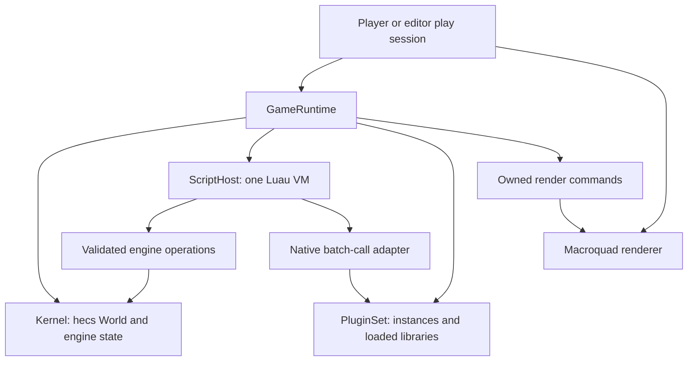

# ADR-001: Luau scripting and the native plugin API

**Status:** D1-D8 accepted; Phases 0 and 1 complete on Windows MSVC; later phases unstarted.
**Date:** 2026-09-05.
**Decider:** Project owner.
**Baseline:** `539659e` (Player, bundle discovery, built-in capture).

This plan tracks the accepted architecture and its phased implementation. The
implementation record below defines what exists; later API names, signatures,
and contracts remain proposals until implemented and verified.

## Context and fixed requirements

The Player currently discovers `game/main.luau` beside its executable, renders
startup states, and supports unattended PNG capture. The shared library now also
contains an optional headless Luau host. The Player has no game execution yet;
ECS systems, frame accumulation, rendering bindings, and plugins remain later work.

Preserve the shared editor/Player kernel, primarily Luau-authored games, and a
C-compatible native plugin interface. Use `hecs` 0.11.1 and `mlua` 0.12.1 with
`luau-jit`; retain Macroquad 0.4.16 and Kira 0.12.4 for their respective services.
Use `tot` 0.1.0 from its GitHub repository for structured game data and
`libloading` 0.9.0 for runtime native-library loading. Save handling belongs to
game scripts; general filesystem and data-conversion utilities may support it.
The C API is initially a plugin interface into a running Protogine instance;
embedding the whole engine into another application is a separate capability.

## Decisions to settle

| ID | Status | First step | Alternative and consequence |
| --- | --- | --- | --- |
| D1 | Accepted 2026-09-05 | One `main.luau` module with init/update/draw callbacks first | Entity-attached scripts immediately also require attachment data, ordering, and per-entity lifecycle rules |
| D2 | Accepted 2026-09-05 | Luau-callable native batch computation with synchronous input/result buffers; command buffers remain a future option | Direct ECS queries/mutations immediately require a much larger stable component and borrowing contract |
| D3 | Accepted 2026-09-05 | One runtime thread; fixed 60 Hz gameplay `update`, with `draw` at the presentation frame rate | Separate variable-rate and fixed-rate update callbacks provide more presentation hooks but require explicit ownership and ordering rules |
| D4 | Accepted 2026-09-05 | First native target to verify: `x86_64-pc-windows-msvc` | Supporting more targets immediately requires matching SDK, loader, dependency, and JIT evidence |
| D5 | Accepted 2026-09-05 | Source modules, explicit native plugin declarations, complete runtime restart | Bytecode distribution, automatic DLL discovery, and live reload each add separate compatibility/lifetime contracts |
| D6 | Accepted 2026-09-05 | Use tot for `game/game.tot`; depend on `tot` 0.1.0 from GitHub | Do not use TOML for the manifest or substitute the sibling checkout as the normal dependency |
| D7 | Accepted 2026-09-05 | Scripts own saves; engine may provide filesystem, tot parsing/formatting, and JSON/YAML/TOML export utilities | Engine-owned save schemas, slots, migrations, and save timing are outside the engine contract |
| D8 | Accepted 2026-09-05 | Use `libloading` 0.9.0 for runtime C API plugins | The loader supplies library/symbol access; Protogine still defines ABI and lifetime rules |

The accepted decisions establish the initial authoring model, native buffer
scope, first target, distribution/restart approach, dependencies, and save
ownership. Command buffers are retained as a future design option, not part of
the first implementation. D3 is accepted and implementation is authorized.
Finalize detailed callback signatures, ABI rules, and limits in each phase,
recording evidence and resolving incompatibilities before advancing.

The tot declaration is implemented; libloading remains for Phase 4:

```toml
tot = { git = "https://github.com/totlang/tot", rev = "2f407897f985654cdbb6201ad01ba05216a6e3d7", version = "=0.1.0" }
libloading = "=0.9.0"
```

The tot revision is the inspected GitHub HEAD on the date above, with package
version 0.1.0. Verify it in Phase 0 and commit the resolved `Cargo.lock`; the
version constraint checks the package version, not a Git tag. `../tot` is a
source reference for development, not the shipped dependency source. The TOML
syntax above is for Cargo's own manifest; game manifests use tot.

## Proposed ownership and dependency boundaries



- `GameRuntime` owns a kernel, VM, plugin instances, lifecycle state, and clock.
  The Player owns window/input polling and rendering; the editor later drives
  the same runtime interface. Constructing or testing a runtime needs no window.
- Start with modules in the existing library: `kernel`, `runtime`, `scripting`,
  `plugins`, and renderer-independent draw command types. Add modules as needed
  by each phase, rather than creating empty subsystems upfront.
- Keep `mlua` behind a `scripting` feature and the loader behind `native-plugins`.
  The Player enables scripting when it can actually run games. The no-graphics
  runtime test configuration must exercise real Luau and kernel code.
- Rust owns `hecs::World`. Lua references, plugin pointers, and graphics handles
  are not kernel component storage. A later standalone plugin API crate may
  contain only ABI definitions, without dependencies on the engine or VM.
- Run game callbacks, engine systems, and native calls on the runtime thread.
  Never keep a `hecs` query/reference or a Rust dynamic borrow alive across a
  call into game code.

## Luau authoring contract

The entry module runs once and returns a table. Optional fields `init`, `update`,
`draw`, and `shutdown` must be functions when present; other field names are
reserved until the table schema is defined. Top-level code may define state and
require modules, but cannot mutate the world or draw.

Illustrative API, not executable against the current Player:

```luau
local x = 16

return {
    init = function(ctx)
        ctx.log("Game started")
    end,
    update = function(ctx, dt)
        x += 24 * dt
    end,
    draw = function(ctx, alpha)
        ctx.draw.clear(0.08, 0.10, 0.13, 1)
        ctx.draw.rect(x, 32, 16, 16, 0.4, 0.8, 0.7, 1)
    end,
}
```

| Phase | Callable operations | Result |
| --- | --- | --- |
| Module loading | Project-local `require`, standard Luau utilities | Validated callback table |
| `init(ctx)` | Log, engine state creation, native calls, enabled data/filesystem utilities | Called once after all required plugins initialize |
| `update(ctx, dt)` | Input reads, world reads/writes, native calls, enabled data/filesystem utilities | One simulation tick |
| Engine systems | Rust systems over hecs | Complete the tick after the game callback |
| `draw(ctx, alpha)` | Read world/input, append draw commands, log | One owned draw list; no world mutation |
| `shutdown(ctx)` | Bounded cleanup/logging and enabled data/filesystem utilities | Called once after successful init on orderly shutdown |

Context objects are valid only for their callback. Retaining one in a Lua table
must yield an ordinary script error when used later, never a stale reference.
Use safe scoped bindings or checked callback-generation tokens; prove the chosen
mechanism before publishing the API. Callbacks may not yield or reenter another
game callback in this first version.

World operations borrow the kernel briefly and release it before returning to
Luau. Reads return owned values; enumeration returns a snapshot of opaque entity
handles, not a borrowed ECS iterator. Writes during init/update are immediate and
visible to later reads in the same callback. Engine systems run afterward.

World-mutating calls from `draw` fail. Scripts must also avoid advancing their
own gameplay state in `draw`; the engine cannot enforce purity of Lua upvalues.
Draw commands contain owned data and are cleared each frame. Validate numeric
inputs and command counts before they reach graphics APIs.

Entity handles are engine-owned userdata with session identity and generation
validation. Never expose a raw entity pointer or encode a 64-bit handle in a Lua
floating-point number. A stale handle, a handle from a stopped session, or a
despawned entity produces a script error. The initial component API should expose
only concrete types needed by the sample game, rather than arbitrary Rust types.

### Time, input, and snapshots

D3 selects a fixed-step simulation, covering gameplay as well as any future
physics. `update(ctx, dt)` advances one tick with `dt = 1/60`; Rust engine systems
then complete that tick. `draw(ctx, alpha)` runs once per presented frame, at the
rate allowed by rendering, VSync, or a frame cap. The simulation rate does not
cap drawing at 60 FPS.

For example, at a steady 120 FPS there are roughly two draws per simulation tick;
at 30 FPS there are roughly two simulation ticks before each draw. Each frame
polls input, runs zero or more due ticks, then draws once. Ticks advance fixed
amounts of simulation time; they are not separate threads or a guarantee of
exactly spaced wall-clock execution. The overload policy below bounds catch-up.

This corresponds to the fixed-update timing concept in Godot/Unity. In this
initial proposal, Protogine's `update` is the fixed gameplay callback; there is
no additional variable-rate gameplay update callback. Keep gameplay changes in
the tick and use interpolation between stored simulation states for smooth
rendering. `alpha` is the fractional progress between ticks, not elapsed seconds.
Providing alpha alone does not store or interpolate those states automatically.
A later frame-update hook for camera/UI/presentation state remains possible,
with its mutation permissions and execution order defined separately.

- Fixed tick duration: `1/60` second. Interactive frames accumulate at most
  250 ms of wall time and execute at most five ticks. On overload, discard whole
  excess ticks and retain only the fractional remainder; record overloads.
- Held input is sampled for each tick. Press/release edges wait for the next
  tick, are consumed once, and are not repeated across catch-up ticks.
- Pass the remaining fractional tick as draw interpolation `alpha`. Specify
  order explicitly whenever behavior depends on entity traversal; hecs query
  order is not a gameplay ordering contract.
- For game capture, propose exactly one tick per captured-mode render frame,
  neutral input, `alpha = 0`, and a documented fixed engine RNG seed. Frame N
  observes N completed ticks after init. Existing startup screens still perform
  no simulation. Input replays and seed overrides can follow separately.
- A selected capture frame alone is not a deterministic simulation. Verify the
  clock/input/RNG rules with headless state assertions and repeated screenshots.
  Do not promise identical floating-point or raster results across platforms.

### Modules, resource access, and failures

- Keep `game/main.luau` as the entry point and ship source in this milestone.
  Load text chunks with bundle-relative source names for tracebacks. Do not
  accept arbitrary precompiled bytecode as interchangeable game data.
- Provide project-local `require` through mlua's Luau resolver API. Propose
  `require("./module")` relative to the importing module, `.luau` files only,
  canonical-path caching once per VM, and an explicit error for cyclic imports.
  Define path normalization/case rules and test symlink/junction escape, absolute
  paths, parent traversal, missing modules, and failed-module cache cleanup.
- Keep an explicit standard-library/host-API allowlist. Provide deliberate
  filesystem utilities as described below; do not expose process execution,
  network, raw VM pointers, or script-selected DLL loading in this milestone.
- Treat the game as one trust domain. Luau sandboxing protects its environment;
  an enabled native plugin executes trusted code in the process. VM interruption
  cannot stop a native function that does not return.
- Before execution, specify and test VM memory, callback deadline, import depth,
  draw-command, and buffer limits. Starting values to evaluate: 64 MiB VM heap,
  1 second for load/init/shutdown, 100 ms per update/draw, import depth 64,
  10,000 draw commands/frame, and 16 MiB combined native buffers/call. These are
  development guardrails to validate, not measured performance targets.
- Phase 1 resolves allocation-error behavior: Luau may catch allocation errors
  while the VM heap cap remains enforced. Those errors are recoverable; uncaught
  allocation errors fault the session. Host-detected deadline/source/import/log
  failures latch a fault outside Lua. Do not infer a latched allocation-failure
  signal from mlua's public memory-limit API; it supplies no such notification.
- An uncaught Lua exception, invalid callback result, or deadline faults the
  session. Recoverable API errors may be handled by game code; host-detected
  deadline, resource-limit, or native contract failures latch a fault outside
  Lua so `pcall` cannot clear it. Stop updates and show source/callback context;
  do not retry each frame.
  Do not claim transactional rollback: immediate world writes and Lua upvalues
  may already have changed. Discard the failed session before running it again.
- Init failure skips script shutdown and tears down initialized host resources.
  After a runtime fault, skip further game callbacks; normal stop calls shutdown
  once under its deadline. Cleanup failure must not prevent host-owned teardown.

### Structured data, filesystem utilities, and script-owned saves

- Parse the optional `game/game.tot` manifest with the Rust tot library and
  validate its versioned schema separately. Keep `game/main.luau` as the bundle
  discovery marker; this manifest does not introduce a new required startup file.
- Scripts decide what to save, the file layout and format, when to write, and
  how to restore or migrate it. Do not add engine save slots, automatic ECS/VM
  serialization, migration policy, or a special save lifecycle callback.
- Propose general read/write/list/create-directory and atomic-replacement
  helpers, plus tot parse/format and `tot-export` utilities for JSON, YAML, and
  TOML. These are reusable data services, not an engine persistence framework.
  A platform data-directory helper can supply a writable location without
  choosing the game's save schema or naming rules.
- Before exposing filesystem access, define path resolution, permitted roots,
  byte limits, text/binary behavior, and I/O errors. Distinguish read-only bundle
  data from writable locations; do not depend on the process working directory.
  These host-access details are proposals, separate from script ownership of
  saves. Synchronous I/O can stall a tick; scripts control when they use it.
- Proposed access phases are init/update and orderly shutdown; draw performs no
  filesystem writes. A game must not rely solely on shutdown to save: faults and
  process termination can skip that callback. The engine does not save for it.
- The inspected tot 0.1.0 library exposes parse/format and JSON export. YAML/TOML
  conversion is currently in `tot-cli`, not a reusable `tot-export` crate. Treat
  `tot-export` as the requested capability, not an assumed dependency. Before
  implementing those formats, select small in-process adapters or a reusable
  upstream library if one becomes available; do not invoke the CLI per game call
  or change the sibling repository as part of this plan.
- Freeze the Luau value mapping before publishing the utilities. Preserve or
  explicitly reject arbitrary-size integers, integer/float distinctions, null
  versus absent values, and empty arrays versus objects. TOML cannot represent
  null and has narrower integer limits; conversion errors or explicit lossy
  options must be visible to the script. Do not silently claim all-format
  round trips. File replacement failure must preserve the previous file, and
  filesystem helpers must report failures rather than claiming a save succeeded.

## C plugin API: proposed first contract

### Discovery and lifetime

When native plugins are introduced, add an optional, versioned `game/game.tot`
manifest with an explicit ordered list of plugin IDs and bundle-relative library
paths. A game without a manifest remains a script-only bundle. A declared plugin
is required: missing, duplicate, incompatible, or failed entries fail startup.
Do not scan directories and load every DLL encountered.

Use `libloading` 0.9.0 behind the loader module. Its library/symbol lifetime
support does not replace Protogine's descriptor, instance, and teardown rules.

Resolve libraries from the canonical bundle root. Use absolute library paths and
target-specific safe dependency lookup. Absolute primary-library paths alone do
not establish dependency DLL lookup policy; verify a packaged dependency fixture
on Windows before declaring portable export support.

Load and validate all declarations before initializing them in manifest order.
Initialize the VM only after required plugins are ready. On partial startup
failure, shut down successfully initialized instances in reverse order. A failed
plugin init must clean its own allocations and publish no usable instance.

On normal teardown: stop game callbacks, run bounded script shutdown, destroy
script references and the VM while libraries remain loaded, call plugin shutdown
in reverse order, then release libraries. No live reload, background callbacks,
or retained host buffers. Internal parallel computation is allowed only when all
workers join before a native call returns.

### Batch data versus engine command buffers

The initial native buffers carry computation inputs and results. For example,
one call supplies tile costs and 64 path requests; the plugin returns offsets
and path points in an output buffer. Batching amortizes FFI and marshaling costs
over many items. The Luau wrapper handles the byte layout for ordinary scripts.

The proposed execution order is synchronous:

```text
update(ctx, dt)
  -> native call with batch inputs
  <- batch results
  -> script applies results through engine operations
engine systems
draw(ctx, alpha) -> render command list
```

No engine system runs in the middle of that native call. The plugin neither
submits ECS mutations nor receives implicit access to world storage. It may
parallelize its computation internally, but must join its workers before return.

A command buffer instead holds deferred operations such as spawn, despawn, or
set-position. The runtime would flush it at named points between systems, making
it a possible way to integrate future script/plugin systems. That is a separate
scheduling and mutation contract: define command order, read visibility, entity
ID reservation, validation/failure behavior, and the flush points before adopting
it. Merely passing bytes across the C ABI does not establish those semantics.

The owner confirmed synchronous batch buffers for the first milestone and asked
to retain command buffers as a future option. Immediate script world operations
remain the proposed mutation contract. A future command buffer could coexist
with batch computation; adding one must explicitly revise the immediate-write
contract above. The
existing proposed render command list only defers drawing, not world mutation.

### ABI shape and ownership

Propose one exported bootstrap symbol, `protogine_plugin_query`, followed by a
versioned function table. Use an engine-owned ABI version independent of the
engine package version. The bootstrap accepts requested ABI, destination size,
and a host-allocated descriptor destination. Exact C declarations are a Phase 4
deliverable, not a published header in this draft.

| Surface | Required contract |
| --- | --- |
| Host/plugin tables | ABI version and struct size prefix; C layout; fixed-width status/flag fields; explicit reserved fields |
| Function declarations | Namespaced plugin/function IDs, pointer, and a documented buffer schema/version |
| Instance | Opaque plugin-owned state from successful init; exactly one matching shutdown |
| Host services | Initially logging only; valid on the runtime thread during a host-initiated call |
| Input | Read-only byte span owned by host; valid only until the call returns |
| Output | Host-allocated byte span with capacity and returned length; caller retains ownership |
| Errors | Fixed-width status plus bounded UTF-8 diagnostic written into host-owned storage |

The initial Luau adapter can accept input/output `buffer` values through an API
such as `ctx.native.call(plugin_id, function_id, input, output) -> written_bytes`.
Use host-owned scratch storage across FFI first; copy results back only after a
successful, validated return. Do not expose pointers into VM-managed buffers or
silently perform one FFI call per element. A Luau wrapper gives each native
function a useful typed authoring interface.

No automatic retry after an insufficient-output-buffer error: a stateful call
must not accidentally execute twice. Require error returns to leave instance
state unchanged, and ignore output data on failure. Validate returned lengths.
If a shim catches a panic or a plugin violates its return contract, fault and
discard the session; do not imply that native state was rolled back.
Use byte-defined encodings (for example little-endian fields), not packed casts
or alignment assumptions. Benchmark the complete path including copies before
adding zero-copy or direct ECS access.

Use `extern "C"`, `#[repr(C)]`, explicit lengths, and opaque pointers where
needed. Do not pass Rust collections, references, trait objects, `hecs::Entity`,
or `lua_State` across the ABI. Freeze calling convention, integer widths,
alignment, required table prefix, null/zero-length rules, and string encoding in
the header. A C ABI is compatible only for the declared target/platform ABI.

No Rust panic, C++ exception, or Lua longjmp may cross the boundary. Catch Rust
panics in SDK/host shims where unwinding is enabled and translate them to status;
abort-mode panics and native memory corruption remain process failures. A loader
cannot validate arbitrary foreign pointers or undo DLL initializer side effects.

The first ABI accepts an exact version and required table layout. Future
append-only extensions require explicit size negotiation and compatibility tests;
struct size alone does not promise compatibility. Keep libraries alive for every
descriptor, function pointer, and instance reference. Registration is closed
before game init, and native code cannot reenter the VM.

### Alternatives and consequences

- **Expose Luau's C stack API:** Convenient for existing Lua bindings, but couples
  plugins to VM internals/version and undermines an engine-owned ABI. Defer.
- **Expose hecs storage directly:** Avoids some copying, but freezes internal
  layouts and makes borrowing, structural changes, and lifetime rules public.
  Prefer a future explicit batch/query API if measurements justify it.
- **Function tables over exported engine symbols:** Slightly more bootstrap code,
  but supplies explicit version negotiation and the same host contract in Player
  and editor. This is the proposed starting point.
- **Batch buffers before a universal variant/value system:** Less ergonomic at
  the lowest level, but a smaller stable interface and measurable copying costs.
  Typed Luau wrappers supply ordinary game-facing functions.

## Implementation phases and stop gates

Each phase is a reviewable slice. Update this plan with decisions, exact commands,
evidence, and outstanding limits before advancing. Do not expand to entity script
scheduling or direct ECS plugins implicitly while implementing the smaller APIs.

| Phase | Deliverable | Exit evidence / stop gate |
| --- | --- | --- |
| 0. Feasibility and contract freeze | Implement accepted D3 and freeze initial lifecycle details; compile exact hecs/mlua versions and Luau JIT; verify tot Git pin/API and specify module/limit policies | Tiny typed-Luau call with verified JIT execution, error traceback, interrupt and allocation-limit probes (including JIT loops and `pcall`); parse a tot manifest fixture; verify native C/C++ toolchain and target; stop on any required-version mismatch |
| 1. Shared scripting host | One VM, entry table, resolver, lifecycle and fault state; headless runtime tests | Init exactly once; normal/failed teardown; invalid callback shapes, import cycles/escapes, infinite loop, allocation failure, and stale context; no graphics dependency |
| 1a. Script data utilities | tot bindings, filesystem helpers, script-owned save/load example; choose exporter adapters before adding JSON/YAML/TOML support | Freeze path/value/conversion contracts; test null/large integers/empty collections, unsupported target values, denied I/O, and failed replacement preserving the old file; a script round-trips its chosen save data without engine save semantics |
| 2. Kernel-facing API | Fixed ticks/input, opaque entity handles, minimal concrete components, immediate mutation rules | Spawn/read/change/despawn; stale and cross-session rejection; no borrows across callbacks; catch-up edges consumed once; fixed-input state replay |
| 3. Scripted Player and captures | Renderer-independent clear/rectangle commands, sample game, real runtime in Player | Sample source changes work without rebuilding engine; sample moves a visible tile; copied Player runs outside repo; same seeded state and screenshot repeat; first-frame text still correct |
| 4. C ABI and loader | Dependency-light SDK definitions, generated C header, tot plugin manifest, `libloading` 0.9.0, version negotiation and teardown | Independently compile a C plugin against only the header; assert layout in C and Rust; test malformed/unsupported manifest, wrong ABI/size, missing symbol/DLL/dependency, duplicate IDs, failed init, reverse teardown, and missing required plugin |
| 5. Luau/native integration | Buffer adapter, typed Luau wrapper, one useful batch computation | Compare pure-Luau/native results; invalid lengths/capacity/status; failed call cannot publish output; both Player and headless host use the same bridge; published benchmark method includes copying |

Phase 4 should choose and pin the header-generation tool; the loader is fixed
at `libloading` 0.9.0.
Keep Rust ABI definitions as the header's source of truth and check regeneration
for drift. Do not invent arbitrary API symbols beyond the reviewed bootstrap and
minimum tables just to fill out an SDK.

For the first performance example, propose a tile-grid pathfinding batch or
distance-field computation. Pick one fixture and output contract before building
it. Record release-build median/tail timings and crossover batch sizes on a named
machine, including Lua marshaling and buffer copies. Correctness is mandatory;
if the native path has no useful measured advantage, report that result and
revisit the workload/adapter rather than advertising an unmeasured speedup.

### Compatibility and verification

Preserve current no-bundle and inaccessible-bundle startup captures, existing
capture controls, PNG dimensions, and configuration/write error codes. When real
game execution exists, propose exit code `3` for load/script/plugin faults; saving
a diagnostic screenshot must not turn such a failure into success. Explicitly
test this addition alongside current startup-only capture behavior.

Run the repository's fmt/check/test/clippy/release checks for implementation
changes. Add no-graphics scripting and plugin configurations as they become real,
and run the built-in GPU capture test when presentation changes. Keep C compiler,
loader, JIT, graphics, and unverified platform limits explicit in phase reports.

Audio, full tile-map authoring, editor UI, entity script attachments, asynchronous
scripts, custom plugin components, direct ECS buffer views, plugin hot reload,
compiled bundle archives, and engine embedding remain later work. Save schemas
and migration remain game-script responsibilities, not deferred engine features.

## Evidence checked for this draft

- Local baseline: Rust 1.95.0, host `x86_64-pc-windows-msvc`; clang/clang-cl and
  gcc are discoverable. Initial planning did not build mlua/JIT or a C plugin.
  Subsequent Phase 0/1 build and execution evidence is recorded below. The initial
  Player and capture checks belong to baseline `539659e`.
- The published [mlua feature list](https://docs.rs/crate/mlua/latest/features)
  identifies 0.12.1 and `luau-jit`. Its
  [VM API](https://docs.rs/mlua/latest/mlua/struct.Lua.html) supplies custom Luau
  require, scoped bindings, sandbox, memory-limit, and interrupt mechanisms.
  Verify the exact selected build's behavior in Phase 0; docs availability is not
  local execution proof. These `latest` links showed 0.12.1 on the date above.
- [Luau embedding guidance](https://luau.org/sandbox/) explains source/bytecode
  trust, restricted standard libraries, and the limits of interrupting native
  calls. These constraints motivate engine-owned module and plugin loading.
- [hecs World](https://docs.rs/hecs/0.11.1/hecs/struct.World.html) documents dynamic
  borrow checks, arbitrary query order, and entity reuse; the runtime must supply
  ordering and session-handle rules.
- [Godot processing](https://docs.godotengine.org/en/stable/tutorials/scripting/idle_and_physics_processing.html)
  and [Unity fixed updates](https://docs.unity3d.com/6000.0/Documentation/Manual/fixed-updates.html)
  distinguish frame callbacks from fixed simulation steps. They explain the
  timing analogy for D3, not a requirement to copy either engine's full API.
- The inspected local tot checkout is clean and matches GitHub HEAD
  `2f407897f985654cdbb6201ad01ba05216a6e3d7`, verified with `git ls-remote`.
  Its [Cargo manifest](https://github.com/totlang/tot/blob/2f407897f985654cdbb6201ad01ba05216a6e3d7/Cargo.toml)
  declares version 0.1.0. The
  [library API](https://github.com/totlang/tot/blob/2f407897f985654cdbb6201ad01ba05216a6e3d7/src/lib.rs)
  and [CLI converters](https://github.com/totlang/tot/blob/2f407897f985654cdbb6201ad01ba05216a6e3d7/cli/src/convert.rs)
  establish the current parser/export split. Phase 0 now parses a manifest fixture
  through this Git dependency; script data bindings remain Phase 1a.
- [libloading](https://github.com/nagisa/rust_libloading)
  documents unsafe loading, initializer execution, symbol typing, and library
  lifetime. Version 0.9.0 is selected, not yet a project dependency.
- The [Rust FFI guidance](https://doc.rust-lang.org/nomicon/ffi.html) is the
  reference for ABI layout, ownership, callback lifetimes, and unwinding rules.

## Implementation record: Phases 0 and 1

The shared `scripting` feature now provides `ScriptHost`, independent of graphics.
It loads a game directory, validates one plain callback table, and supports
Loaded -> Running -> Stopped or terminal Faulted state. The sample in
`examples/games/lifecycle` runs through `examples/script_host.rs`. The Player
continues to show startup states; integration is Phase 3.

Contracts finalized in this slice:

- `init()` runs once; `update()` passes `dt = 1/60`; `draw(alpha)` validates finite
  `[0, 1)` interpolation; `shutdown()` runs once after successful init on an
  orderly stop. No callbacks after a fault, implicit script execution on drop,
  callback return values, or public coroutine API. `ctx.log` is the first host
  operation and its scoped function expires after each call.
- Require uses mlua's Luau resolver with canonical bundle-root validation and
  canonical file cache keys. Extensionless relative path segments select UTF-8
  `.luau` files; aliases, dotted segments, directory init modules, and escaping
  junctions/symlinks are rejected. A file and same-named directory are ambiguous.
  Modules return one value. Cycles are errors; failed results are not cached;
  compiled source and successful values persist until the VM is replaced.
  Bundle files are assumed stable during execution, not concurrently hostile.
- Limits: 64 MiB VM heap; 1 second load/init/shutdown execution; 100 ms update/draw;
  256 KiB/source; 256 compiled modules; 64 active imports including main;
  4 KiB/log message and 64 KiB/log bytes per callback including separators.
  VM interrupts cannot preempt I/O, compiler/JIT work, or a native call; module
  preparation is checked when control returns to the VM/host. The VM heap budget
  does not cover all host/codegen allocations.
- VM allocation failures are catchable and may be handled by scripts while the
  heap cap remains enforced. Uncaught failures fault the host. Host-detected
  deadline/source/import/log failures are latched and cannot be cleared by pcall.
- Deadline cancellation uses a private Rust unwind payload and mlua's
  `catch_rust_panics(false)` option. mlua transports it through protected VM
  errors and resumes it at the Rust boundary, where only that payload is caught.
  Unexpected Rust panics continue unwinding. Scripting rejects `panic=abort`.
  An interrupt yield alone was experimentally insufficient: a nested protected
  loop in `__tostring` exceeded the independent watchdog. The current host exits
  this fixture within its callback deadline. No Rust panic crosses the future
  plugin C ABI; this mechanism is internal to the mlua embedding boundary.

Verified evidence:

- Exact dependencies compile: hecs 0.11.1, mlua 0.12.1 (`luau-jit`), tot 0.1.0
  from the pinned GitHub revision. Cargo resolves mlua-sys 0.12.0 and
  luau0-src 0.21.0+luau736. `Cargo.lock` records these sources.
- `tests/scripting_feasibility.rs` proves native Luau execution via the public
  `lua_incustomexecution` API, with JIT disabled as a negative control. It checks
  tracebacks, VM allocation failure, actual native-frame interruption, and the
  production host's protected-call, import, and metamethod cancellation.
  Each potentially runaway fixture has an independent 10-second process timeout.
- `tests/scripting.rs` covers lifecycle/fault transitions, callback schema,
  fixed dt, invalid alpha, stale context functions, import caching/retry/cycles,
  entry execution exactly once, source stability, captured host helpers, Windows case aliases and junction
  escape. The sample prints ticks at 0.016667, 0.033333, and 0.050000 seconds.
- The C and C++ fixture compiled and ran successfully on
  `x86_64-pc-windows-msvc` using clang with `-std=c11` and `-x c++ -std=c++17`:
  `tests/fixtures/native_toolchain.c`, outputs `target/phase0/c-probe.exe` and
  `target/phase0/cpp-probe.exe`. This checks the toolchain and elementary layout,
  not a plugin ABI or dynamic loader, which remain Phase 4.

Completed checks on 2026-09-05:

```text
cargo fmt --all -- --check
cargo check --workspace --all-targets
cargo check --workspace --all-targets --all-features
cargo test --workspace
cargo test --workspace --no-default-features
cargo test --workspace --no-default-features --features scripting
cargo clippy --workspace --all-targets -- -D warnings
cargo clippy --workspace --all-targets --all-features -- -D warnings
cargo build --release --bin protogine-player
cargo test --release --no-default-features --features scripting --test scripting --test scripting_feasibility
cargo run --example script_host --no-default-features --features scripting -- examples/games/lifecycle
```

All passed. The final scripting tests pass in debug and release: 13 behavioral
tests and 17 isolated feasibility/resource probes. Existing bundle and Player
unit tests pass; the opt-in GPU smoke test was not rerun because this slice does
not change Player rendering or capture. Other native platforms are unverified.

Next slice: Phase 1a data/filesystem utilities, then Phase 2 kernel-facing APIs
and frame/input timing. Do not imply that passing a constant dt implements a
real-time accumulator or that invoking draw supplies a renderer.
