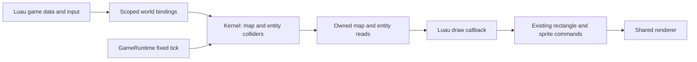

# Engine-owned tilemaps and solid-tile collision

**Status:** Draft for review; implementation unstarted. All T1-T8 decisions and
new limits below are proposals, not accepted contracts or execution evidence.
**Date:** 2026-09-07. **Inspected baseline:** `e87a243`.
**Backlog:** [TODO.md](TODO.md). Completed predecessor contracts:
[scripting/C API](docs/implementation/SCRIPTING_C_API_PLAN.md) and
[PNG/sprites](docs/implementation/PNG_SPRITE_PLAN.md).

## Outcome and scope

A shipped Luau game installs a tile grid in the shared kernel, gives an entity
a rectangular tile collider, and sets velocity from input. Fixed systems move
it to the first blocking tile without crossing a wall, including when one tick
would travel across several tiles. The Player and headless runtime use exactly
the same map, mutations and collision solver. Images may still be loading or
unloaded while collision remains usable.

Include one finite orthogonal map, tile IDs with solid/non-solid definitions,
owned map queries, individual cell edits, optional entity AABBs, swept axis
movement, and migration of the existing sprite room. Luau still chooses art,
draw order, animation, controls and game data format. Collision applies only
to entities explicitly given a collider.

Exclude multiple simultaneous maps/layers, streaming/chunks, infinite maps,
isometric/hex grids, tile-map rendering commands, editor UI, cameras,
autotiling, navigation/pathfinding, entity-entity collision, triggers/events,
slopes, one-way platforms, gravity, rotation and general rigid-body physics.
No new crate, feature flag, native ABI entry, manifest field or save format is
needed. Revisit these exclusions only through a separate design decision.

## Inspected baseline and compatibility

| Current surface | Contract this work must account for |
| --- | --- |
| [Kernel](src/kernel.rs) | Entities have finite f64 world-pixel position and pixels/second velocity. `fixed_update` validates every candidate before committing any integration; live entity cap is 16,384. |
| [Runtime](src/runtime.rs) | Each successful 60 Hz update is followed by one fixed-system pass. A stopped/failed callback skips systems; a system error faults the session before `completed_ticks` advances. |
| [World bindings](src/scripting/world.rs) | Immediate init/update writes; owned reads in every callback; scoped functions, generation/session validation, 4,096 attempted world calls per callback, no VM work under kernel borrows. |
| [Sprite sample](examples/games/sprites/main.luau) and [room](examples/games/sprites/room.luau) | Luau owns a 30x17 grid, 32-pixel tiles and a 32x32 character. It tries X then Y in two-pixel endpoint steps and checks four integer pixel corners. No ECS entity currently represents the character. |
| [Sample tests](tests/sprites_sample.rs) | Spawn is (448,256); holding Right stops at x=640; 30 ticks Right plus 30 Down reach (508,316). Animation is driven by held movement intent, including walking against a wall. |
| [Live sprite probe](tools/run_sprites_probe.ps1) | Injects a log at the end of update, currently after Luau movement. It requires adaptation when movement happens later in fixed systems. |

Preserve all existing behavior for entities without colliders, including finite
f64 coordinates/velocities outside the proposed tile geometry domain. Keep
`EntitySnapshot`'s existing shape; expose map/collider inspection separately.
The new opted-in collider contract narrows valid placement for those entities.
Do not reinterpret every entity's position as a sprite corner.

Retain asset service/publication order, zero-tick behavior, catch-up/input edge
rules, draw publication, renderer lifetime, and native teardown. No collision
work runs from `draw`, asset advance/drain, or a refused lifecycle call.

## Proposed decisions to freeze before production implementation

| ID | Proposed first milestone | Trade-off / revisit trigger |
| --- | --- | --- |
| T1 | One optional map owned directly by `Kernel`, using dense row-major storage outside hecs. No map handle registry. | Simple room lifecycle; simultaneous maps, independent layers or streaming require a later identity/ownership design. |
| T2 | Zero-based tile coordinates, positive integer tile dimensions, integer world origin, u16 tile IDs; ID 0 is empty and non-solid. Solid flags are map definitions, independent of images. | Rectangular grids and negative origins work; tileset art and authored file schema remain script responsibilities. |
| T3 | Optional axis-aligned collider per entity, with local offset and size; outside the installed map is solid. | Existing entities stay unrestricted; no selectable boundary modes or body-body response yet. |
| T4 | Sweep X fully, then sweep Y from the resolved X position. Clamp displacement at the first wall; preserve requested velocity. | Stable wall sliding with an explicit axis preference; this is an axis-separated path, not continuous diagonal time-of-impact physics. |
| T5 | `set_position` remains an immediate teleport. For a collider, reject an overlapping/out-of-map destination; do not sweep the teleport path or depenetrate. | Teleporting across walls to a free destination is intentional. Scripts use velocity for ordinary collision-aware movement. |
| T6 | Map replacement, cell edits and collider attachment/resize must preserve non-overlap or refuse atomically. Clear the map only when no colliders remain. | No automatic ejection or silent collision disabling. Room transitions remove colliders, replace the map, position entities, then reattach in one callback. |
| T7 | Extend `ctx.world`; map and collider calls share its attempt budget, with additional bounded tile-work accounting. | Keeps one kernel mutation boundary; bulk reads prevent ordinary tile drawing from requiring one world call per cell. |
| T8 | Migrate the existing sprite sample to kernel position/velocity and authoritative map reads; retain its art, input, timing and expected positions. | Proves replacement of script collision without introducing a second sample/renderer. |

Phase 0 must record the disposition of these decisions and confirm the numerical
and workload limits below. Any unresolved rule is a named stop gate for the
dependent phase, not permission to invent different gameplay during coding.

## Ownership and proposed data/API model

Add dependency-free `src/tilemap.rs` for checked grid types/storage and
`src/collision.rs` for pure geometry/sweep helpers, integrated by `src/kernel.rs`.
These are proposed new files. Keep VM conversions in the scripting layer, using
the existing `EngineContext` and its single shared world counter. Split binding
code into `src/scripting/tilemap.rs` if needed without duplicating that context.
`GameRuntime` remains the only owner of callback/system ordering.

The kernel owns `Option<TileMap>` and optional `TileCollider` hecs components.
A map contains immutable dimensions/origin/solid definitions and mutable cell
IDs. A collider contains `offset_x`, `offset_y`, `width`, `height` in world pixels.
Its box is `[position.x + offset_x, left + width)` by
`[position.y + offset_y, top + height)`. Edge contact is allowed; positive-area
overlap is blocked. Bodies do not block each other or inherit image dimensions.

Proposed Luau API, all beneath `ctx.world`:

| Call | Result / mutation |
| --- | --- |
| `set_tilemap(desc)` | Validate/copy a complete description and atomically install or replace the map; no return value. |
| `clear_tilemap()` | Remove a map only if no colliders exist; succeeds if already absent. |
| `tilemap_info()` | Owned `{columns, rows, tile_width, tile_height, origin_x, origin_y}` or nil if absent. |
| `tile(column, row)` | Numeric tile ID; requires a map and in-bounds integer indices. |
| `tile_solid(column, row)` | Boolean; requires a map, returns true outside its bounds. |
| `tiles_region(column, row, columns, rows)` | Owned flat row-major array of IDs from a wholly in-bounds positive rectangle, at most 4,096 cells. |
| `set_tile(column, row, id)` | Immediate single-cell change, refused if it would overlap a collider. |
| `set_tile_collider(entity, options)` | Attach/replace the collider; nil removes it. Requires an installed map when attaching. |
| `tile_collider(entity)` | Owned `{offset_x, offset_y, width, height}` or nil; validates the entity even if no collider is attached. |

`desc` has exactly the info fields above plus `solids` and `cells`; all are
required. `solids` is a dense plain array of 1..1,024 booleans: element `i`
defines tile ID `i`. ID 0 is implicitly non-solid. `cells` is a dense plain array
of exactly `columns * rows` integer IDs in `0..#solids`.
Collider options require exactly the four collider fields. No defaults, numeric
strings, truthy substitutes, metatables, unexpected fields, holes or hash keys.
Use raw bounded key inspection and stop on the first unexpected key. A bounded
array scan must prove both required indices and absence of extra keys; `#` alone
does not prove density. Copy primitives, never retain caller tables.

Tile `(column,row)` occupies world rectangle
`[origin_x + column * tile_width, origin_x + (column+1) * tile_width)` and its Y
equivalent. Use mathematical floor for negative world-to-cell conversion, never
integer truncation toward zero. Luau arrays are one-based:
`cells[row * columns + column + 1]`; tile coordinates remain zero-based.
No implicit pixel-to-index coercion in tile calls.
Column/row arguments must be exact signed 32-bit integers before range checks;
only `tile_solid` accepts indices outside the installed grid. Reject larger
numbers without narrowing, wrapping or scanning toward the requested index.

Only init/update may mutate; draw/shutdown may read. Standalone `ScriptHost`
continues to omit `ctx.world`. Rust kernel entry points enforce the same bounds
and placement invariants; a Lua wrapper is not the only validation layer.
Existing entity handles supply collider identity, including stop/fault/reuse
refusal. Map calls always address the current map; retained owned reads are
snapshots, never live aliases. Despawn releases collider capacity. Stop makes
map/collider access inactive and releases map/scratch storage; normal shutdown
may read them before stop, while faults invoke no shutdown callback.

## Movement, edits and numerical rules

Per successful tick:

1. Existing input/asset publication precedes the Luau update. All accepted world
   and map writes are visible to later calls in that callback.
2. After the callback, collect candidate positions in stable entity-ID order.
   Uncollided entities retain `position + velocity * FIXED_DT` exactly.
3. For each collider, compute requested displacement in world pixels. Sweep X
   across every crossed tile boundary and every row overlapped by the box;
   clamp at the first solid tile face or map boundary. Sweep Y using the resolved
   X and every column now overlapped. A zero axis displacement performs no sweep.
4. Validate all candidates and the full-pass work budget before committing any
   positions. A failure preserves the post-callback state of every entity; it
   does not roll back earlier successful script writes. Runtime then uses its
   existing `systems` fault/teardown path and does not count the tick.
5. Draw and the next update read the committed positions. Velocity remains the
   requested value, even when blocked, so holding it continues to press the wall.

Inspect crossed grid faces, not just endpoint corners and not pixel-by-pixel
substeps. Clip travel to the finite map boundary before converting grid indices
or enumerating candidates, so a huge finite velocity has bounded work. Include
a solid face already touching the leading edge when moving into it; movement
away or tangent must remain free. Enumerate the full perpendicular span, which
also handles boxes larger than a tile. An interior solid tile cannot hide between
four clear corners. X-first corner behavior is part of the contract, not a
floating-point tie-break or ECS iteration artifact.

Use half-open intervals: overlap is `a_min < b_max && a_max > b_min` on both
axes. Do not copy the sample's `size - 1` integer-corner test into the engine and
do not use a fixed epsilon that opens gaps or admits penetration. Bound all
geometry before checked integer conversion. A clamped position must reconstruct
an AABB on the free side of the blocking face despite f64 rounding; Phase 0 must
prove the chosen outward-rounding/representable-position rule with adjacent-f64
fixtures before freezing it. Reject degenerate/unrepresentable boxes. This is a
specific numerical stop gate, not a claim of cross-platform bitwise determinism.

Installation/replacement validates every existing collider against the candidate
map before swap, including dimensions, extent limits and boundary containment.
Cell edits validate against every potentially overlapping body before changing
the ID; an empty/non-solid edit can never introduce overlap. Attaching/resizing
or teleporting checks all covered cells, not the sweep. Failed calls preserve
the old map, cell, collider and position. Reads never observe a partial map.
There is no pending edit queue, automatic recovery from embedded bodies, contact
callback, collision event history or implicit velocity reset.

## Proposed bounds and failure behavior

These are initial ceilings to validate in Phase 0, not measured performance.

| Resource | Proposed bound |
| --- | --- |
| Map dimensions | Each 1..1,024 cells; product at most 262,144, checked before allocation. |
| Tile dimensions | Each integer 1..1,024 world pixels; square tiles are not required. |
| Geometry domain | Integer map origin and every map/collider world-box edge within +/-2^24 world pixels. Collider offsets are finite within +/-4,096 pixels; entity position remains finite and need not itself lie inside the map. |
| Collider extent | Each dimension at least 1/256 pixel and at most four map tiles on its axis; a box can overlap up to five cells per axis. |
| Storage | u16 cells: at most 512 KiB per map plus 1,024 solid flags. At most one old map and one candidate during replacement; no hidden per-cell entities. |
| Live colliders | At most 1,024, within the existing 16,384 total entity limit. |
| World calls | Existing 4,096 attempts per callback, shared with new calls; malformed and wrong-phase calls count before conversion. |
| Region output | At most 4,096 IDs/call and 262,144 returned IDs/callback, charged before output allocation. |
| Callback tile work | At most 1,048,576 units, including copied/validated input elements, visited cells and body candidates checked for edits. Repeated rejected requests also consume work already performed. |
| Fixed-pass tile work | At most 4,194,304 visited-cell/body-check units across the whole tick; no counter reset per entity. |
| Integration scratch | One bounded reusable candidate buffer for at most 16,384 entities, reserve before evaluation; no allocations per tile. Record exact bytes after the candidate type is chosen. |

Inputs beyond the static schema/geometry limits, absent maps, bad handles and
overlapping placements are recoverable call errors. World-attempt, aggregate
tile-work/output and live-collider budget exhaustion latch outside `pcall`, as
the entity/world budgets already do. Fixed-system budget/invariant failures
fault the session atomically. Keep errors bounded and free of retained caller
tables, map-sized diagnostics or heap allocations proportional to rejected text.

Use checked size arithmetic and fallible reservations for new large buffers.
Allocation refusal before publication leaves the prior state intact and is
recoverable in a callback; a system candidate-allocation failure is a systems
fault. Include old+candidate+conversion staging in memory accounting; do not
promise that the VM's heap limit bounds Rust storage. Owned Lua output is charged
to the VM; Rust inspection returns bounded owned regions. No kernel/hecs/RefCell
borrow survives VM conversion, VM allocation, deadline checking or user code.

Check the existing host deadline before/after kernel operations and between
input/output conversion batches of at most 256 work units. For map installation,
prepare an owned candidate and bounded collider-placement snapshot, release the
kernel borrow, and validate in batches with checks before the final swap. The
callback is synchronous and validation runs no user code, so nothing may mutate
the kernel between preparation and commit. Cell/collider/placement edits use the
same prepare/check/commit principle without copying the whole map. Rust-only
entry points enforce the deterministic bounds without a VM deadline. A latched
failure prevents the prepared mutation from publishing. Keep the existing exact
VM interrupt checks. Fixed systems
run outside the callback deadline and use their own deterministic work cap plus
independent process watchdogs in stress tests; do not reset or extend script time
to accommodate a large map. Instrument memory/work in tests and measure release
p50/p95/max; none of these ceilings is a real-time guarantee.

## Sample migration and authoring boundary

Keep `room.luau` as the sample's authored source. Convert its legend/rows into a
stable numeric ID palette and row-major description once in init; preserve its
existing malformed-row/unknown-symbol diagnostics. Install the map, spawn at
(448,256), attach a zero-offset 32x32 collider, and replace the private `x/y`
movement plus `solid`/`blocked` solver with entity velocity at 120 pixels/second.
Backspace teleports to the spawn, resets facing/animation, then applies the same
tick's input intent, matching current behavior. Preserve diagonal speed and
intent-driven walk animation; normalizing input or animating only actual travel
would be a separate gameplay change.

Draw reads committed kernel position and a bounded region of authoritative tile
IDs. The script maps IDs to the original PNG cells/tints and calls the existing
sprite/rectangle APIs. No second mutable collision grid survives in Luau. Add
a focused update-time tile-edit fixture proving rendered IDs and collision use
the same changed cell. Regions above 4,096 cells require bounded chunks/visible
selection; the 10,000 combined drawing-command cap remains in force.

Keep update-time image requests, independent sheet readiness, placeholder walls,
manual unload/reload and provenance intact. PNG replacement cannot alter
collision; changing authored solid definitions and restarting can, without an
engine rebuild. Map decoding from a dedicated file, general serialization and
editor workflows are separate work; scripts can already parse tot if desired.

Adapt the live probe deliberately: its old end-of-update log would now observe
pre-system position. Log the previous completed position at the next update
boundary, with the matching completed-tick label, or observe post-system state
through an existing harness boundary. Freeze the choice before updating the
probe and its assertions. Never move simulation into draw just to preserve a
log anchor. Keep a separate headless assertion of post-step kernel position.

## Phases and stop gates

| Phase | Work | Required exit evidence |
| --- | --- | --- |
| 0. Contract and feasibility | Review T1-T8; freeze API/schema, rounding and refusal semantics. Capture current sprite expectations. Prototype the numerical cases and count worst-case work/storage without adding production APIs. | Every decision has a recorded disposition; adjacent-f64, huge-velocity and maximum-footprint fixtures settle the numerical rule; measured storage/work fit chosen caps. Stop if overlap, transition semantics or budget behavior remain undefined. |
| 1. Kernel map ownership | Checked map types, install/replace/clear, info/regions/cell edits; dependency-free exports and owned inspection. | Rectangular/negative-origin indexing, malformed size/ID input, copied ownership, bounds and atomic failed replacement proven. Test core with no default features. |
| 2. Colliders and fixed systems | Optional hecs collider, placement guards, pure axis solver and bounded all-candidate commit. Extend all Phase 1 mutations to enforce collider invariants. | Sweeps/teleports/edits obey T3-T6; no-collider integration is unchanged; late failure moves no entity; max-load/watchdog and entity-order checks pass. |
| 3. Luau integration | Scoped world extensions, raw validation/copying, shared attempts and new work/output budgets; real runtime fixtures. | Phase/expiry/foreign/reused handles, malformed calls, `pcall` latching, allocation rollback, callback ordering, restart/fault and zero-tick/catch-up behavior pass headlessly. |
| 4. Sample and release proof | Replace sample collision, adapt its probe, add tile-edit/high-speed fixtures, update authoring docs and development checks. | Original room/art/control expectations preserved; collision during loading/unload, same-tick edits, 30/60/144 FPS replay, copied Player captures and injected-input probe pass. Record limits and archive the completed plan. |

Do not start the next phase with an unmet exit gate. Keep implementation slices
focused and reviewable. On completion move this plan under `docs/implementation/`,
update inbound links, and mark only delivered TODO scope complete.

## Required behavioral evidence

| Area | Positive cases and discriminating failures |
| --- | --- |
| Grid | Non-square map and tiles, negative origin, row-major IDs, ID 0, exact far edges, unknown IDs, holes/extras/metatables, overflow and invalid dimensions; mutating input/output tables does not mutate kernel data. |
| Geometry | All four approach directions, exact touching and moving away, fractional coordinates, local offsets, tiny allowed boxes and maximum footprint. Include a solid interior cell missed by corner-only checks. |
| Sweeps | Travel across multiple tiles toward a one-cell wall; nearest of two walls wins; enormous finite velocities stop at the finite boundary; diagonal corner fixture pins X-before-Y and wall sliding. |
| Mutations | Teleport across a wall to a clear cell succeeds; into a wall/outside refuses. Attach/resize, map replacement and a solid edit under a body refuse without change. Clearing with a collider refuses; detach/clear/reinstall/reattach succeeds. |
| Atomicity | A late entity overflow, injected allocation refusal or tick-work overflow preserves every post-callback position; direct `Kernel` tests can inspect this before runtime fault invalidation. Successful earlier script writes are not rolled back. |
| Runtime | Update reads old position then writes velocity/map; draw reads resolved state. No systems after a failed/stopped callback. Zero-tick frames only draw; five catch-up ticks move five times; fixed-input replay is independent of ECS insertion order and asset readiness. |
| Boundaries | Missing maps, stale/foreign/reused entities, expired functions, draw/shutdown writes, malformed calls, oversized arrays and repeated caught refusals. Exhaust limits through `pcall`/`xpcall` and verify the first latched failure plus teardown. |
| Delivery | Same sample coordinates/art/animation at 30/60/144 FPS; map edit changes draw and collision; movement remains blocked during image unload. Source/map and PNG replacements work in a copied release bundle launched from unrelated cwd. |

Use independently specified geometry/positions, not the production sweep as
the test oracle. Required negative controls: endpoint-only movement must fail
the high-speed wall test; four-corner overlap must fail the interior-cell test;
truncate-toward-zero indexing must fail the negative-origin test; Y-first must
fail the chosen corner fixture; partial integration commit must fail rollback;
a stale Luau grid must fail the tile-edit fixture; collision in draw must fail
the repeated-draw/zero-tick fixture. Each must fail at its named assertion under
an independent child-process watchdog, not merely time out or fail compilation.

Run applicable [DEVELOPMENT](docs/DEVELOPMENT.md) gates: Rust baseline, core,
scripting and release kernel/runtime/sample suites; copied Player captures and
the live sprite probe for migration. Add proposed new tilemap/collision test
targets there when implemented. Shared runtime changes also require the existing
native startup/fault/teardown suites. If input/shutdown, renderer, asset service,
SDK or deadline code changes, apply their additional native, GPU, input, header
or benchmark gates from DEVELOPMENT. A blocked graphics run remains an open
delivery gate, never headless proof of visual or key-event behavior.

For stress evidence use the proposed maximum map, 1,024 colliders and maximum
entity population in both sparse short-motion and long-sweep arrangements.
Record actual candidate bytes, visited cells/body checks, peak old/candidate
storage, release timings, machine/build and rejection boundary. Reaching a
deterministic cap must fail promptly without partial state; optimize or revise
an explicitly reviewed ceiling if ordinary sample workloads cannot fit.

## Handoff and evidence record

At each phase exit record changed paths, decision dispositions, commands and
actual results, negative-control assertion names, artifact paths/hashes,
platform/build/machine, limits and the next unmet gate. Distinguish observations
from proposed acceptance criteria and retain old measurements as historical.

Drafting evidence: read the current kernel/runtime/bindings, sprite sample,
kernel/runtime/sample tests, live probe, Cargo manifest and predecessor
contracts. This draft adds no engine behavior. No feasibility prototype,
simulation test, benchmark, Player capture or live-input run was performed
while drafting; all implementation phases remain unstarted.
