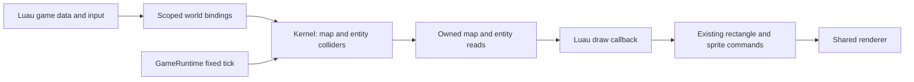

# Engine-owned tilemaps and solid-tile collision

**Status:** T1-T8 accepted on 2026-09-07 with the scope clarifications below.
M1 Phase 0 completed 2026-09-07: its API/schema, numerical and refusal contracts
are frozen with feasibility receipts in the
[Phase 0 record](docs/implementation/TILEMAP_COLLISION_PHASE0.md), which is
authoritative wherever this plan left a proposal open. M1 Phase 1 completed
2026-09-07: the kernel owns a checked map with bounded reads and cell edits. M1
Phase 2 completed 2026-09-07: entities may carry a tile collider, the swept
solver and every T5/T6 placement guard are in place, and the fixed pass resolves
all candidates before committing any. M1 Phase 3 completed 2026-09-07: a Luau
game reaches all of it through nine scoped `ctx.world` calls with copied input,
owned reads and three enforced aggregate ceilings. Phase 4 is unstarted, so the
sprite sample still runs its own collision. Later milestone designs remain to be
frozen. Acceptance is not execution evidence.
**Date:** 2026-09-07. **Inspected baseline:** `e87a243`; Phase 0 ran against `508266c`.
**Backlog:** [TODO.md](TODO.md). Completed predecessor contracts:
[scripting/C API](docs/implementation/SCRIPTING_C_API_PLAN.md) and
[PNG/sprites](docs/implementation/PNG_SPRITE_PLAN.md).

## Outcome and scope

A shipped Luau game installs a tile grid in the shared kernel, gives an entity
a rectangular tile collider, and sets velocity from input. Fixed systems move
it to the first blocking tile without crossing a wall, including when one tick
would travel across several tiles. The Player and headless runtime use exactly
the same map, mutations and collision solver. Images may still be loading or
unloaded while collision remains usable.

The first milestone (M1) includes one finite orthogonal map, tile IDs with
solid/non-solid definitions, owned map queries, individual cell edits, optional
entity AABBs, swept axis movement, and migration of the existing sprite room.
Luau still chooses art, draw order, animation, controls and game data format.
Collision applies only to entities explicitly given a collider, stored as a
`hecs` component.

**Full-plan completion also requires simultaneous maps, independent layers and
streaming.** These are core deliverables in M2-M4, not optional extensions or
work to defer beyond this plan. M1 is a valid first delivery, not completion of
the overall tilemap/collision feature. The later milestones and their unresolved
design gates are recorded under
[required core milestones](#required-core-milestones-and-full-plan-completion).

Exclude infinite maps, isometric/hex grids, tile-map rendering commands, editor
UI, cameras, autotiling, navigation/pathfinding, entity-entity collision,
triggers/events, slopes, one-way platforms, gravity, rotation and general
rigid-body physics. M3's layer order and visibility are inert rendering metadata
the engine stores and reports but never acts on; scripts still issue every
drawing command, so that milestone amends no part of this exclusion. Collision
participation is a separate explicit per-layer property, never inferred from
order or visibility, so hiding or reordering a layer cannot change movement.
That direction of coupling is fixed here; how colliders select and combine
participating layers remains M3's to define. M1 needs no new crate, feature
flag, native ABI entry, manifest field or save format. Later milestones must
review any new loading/schema needs before adding them. Revisit the remaining
exclusions only through a separate design decision.

## Inspected baseline and compatibility

| Current surface | Contract this work must account for |
| --- | --- |
| [Kernel](src/kernel.rs) | Entities have finite f64 world-pixel position and pixels/second velocity. `fixed_update` validates every candidate before committing any integration; live entity cap is 16,384. |
| [Runtime](src/runtime.rs) | Each successful 60 Hz update is followed by one fixed-system pass. A stopped/failed callback skips systems; a system error faults the session before `completed_ticks` advances. |
| [World bindings](src/scripting/world.rs) | Immediate init/update writes; owned reads in every callback; scoped functions, generation/session validation, 4,096 attempted world calls per callback, no VM work under kernel borrows. |
| [Sprite sample](examples/games/sprites/main.luau) and [room](examples/games/sprites/room.luau) | Luau owns a 30x17 grid, 32-pixel tiles and a 32x32 character. It tries X then Y in two-pixel endpoint steps and checks four integer pixel corners. No ECS entity currently represents the character. |
| [Sample tests](tests/sprites_sample.rs) | Spawn is (448,256); holding Right stops at x=640; 30 ticks Right plus 30 Down reach (508,316). Animation is driven by held movement intent, including walking against a wall. |
| [Live sprite probe](tools/run_sprites_probe.ps1) | Injects a log at the end of update, currently after Luau movement. It requires adaptation when movement happens later in fixed systems. |

Preserve all existing behavior for entities without colliders, including finite
f64 coordinates/velocities outside the proposed tile geometry domain. A session
with no installed map and no collider must keep today's allocation-free
validate-then-commit integration and gain no new failure mode. Keep
`EntitySnapshot`'s existing shape; expose map/collider inspection separately.
The new opted-in collider contract narrows valid placement for those entities.
Do not reinterpret every entity's position as a sprite corner.

Retain asset service/publication order, zero-tick behavior, catch-up/input edge
rules, draw publication, renderer lifetime, and native teardown. No collision
work runs from `draw`, asset advance/drain, or a refused lifecycle call.

## Accepted decisions

Project-owner disposition, 2026-09-07:

| ID | Status and decision | Consequence / later obligation |
| --- | --- | --- |
| T1 | Accepted for M1: one optional map owned directly by `Kernel`, using dense row-major storage outside hecs; no map handle registry. Simultaneous maps, independent layers and streaming are required core scope before this plan is done. | Deliver the small first milestone, then implement M2-M4 with explicit identity/ownership/lifecycle contracts. The single-map design is an intermediate stage. |
| T2 | Accepted: zero-based tile coordinates, positive integer tile dimensions, integer world origin, u16 tile IDs; ID 0 is empty and non-solid. Solid flags are map definitions, independent of images. | Rectangular grids and negative origins work; tileset art and authored file schema remain script responsibilities. u16 is the cell storage width, not the usable ID space: the schema below bounds live IDs by `#solids`, so a map defines at most 1,025 distinct IDs including empty. |
| T3 | Accepted: optional axis-aligned collider per entity, with local offset and size; outside the installed map is solid. The collider must be a `hecs` component. | Existing entities stay unrestricted; no selectable boundary modes or body-body response yet. Later membership rules must keep colliders in hecs. |
| T4 | Accepted: sweep X fully, then sweep Y from the resolved X position. Clamp displacement at the first wall; preserve requested velocity. | Stable wall sliding with an explicit axis preference; this is an axis-separated path, not continuous diagonal time-of-impact physics. |
| T5 | Accepted: `set_position` remains an immediate teleport. For a collider, reject an overlapping/out-of-map destination; do not sweep the teleport path or depenetrate. | Teleporting across walls to a free destination is intentional. Scripts use velocity for ordinary collision-aware movement. |
| T6 | Accepted for M1: map replacement, cell edits and collider attachment/resize preserve non-overlap or refuse atomically. Clear the map only when no colliders remain. | The global lifecycle restriction must change for T1's required core scope. M1 transitions remove colliders, replace the map, position entities, then reattach; later map/layer/streaming lifecycle rules require an explicit revision. |
| T7 | Accepted: extend `ctx.world`; map and collider calls share its attempt budget, with additional bounded tile-work accounting. | Keeps one kernel mutation boundary; bulk reads prevent ordinary tile drawing from requiring one world call per cell. |
| T8 | Accepted: migrate the existing sprite sample to kernel position/velocity and authoritative map reads; retain its art, input, timing and expected positions. | Proves replacement of script collision without introducing a second renderer. Later milestones must add evidence for their expanded scope. |

Phase 0 must implement these directions in its contract freeze and confirm the
remaining API, numerical and workload proposals below. T1-T8 need no repeat
acceptance. Any unresolved detailed rule is a named stop gate for its dependent
phase. Record later amendments explicitly rather than silently changing an
accepted direction or treating a first-milestone restriction as permanent.

## Ownership and proposed data/API model

This section through the M1 verification gates specifies the first milestone.
The map singleton, implicit current-map calls and global clear restriction are
M1 contracts only. M2 must define their API migration and map-local replacements;
do not preemptively build a multi-map registry during M1.

Add dependency-free `src/tilemap.rs` for checked grid types/storage and
`src/collision.rs` for pure geometry/sweep helpers, integrated by `src/kernel.rs`.
These are proposed new files. Keep VM conversions in the scripting layer, using
the existing `EngineContext` and its single shared world counter. Split binding
code into `src/scripting/tilemap.rs` if needed without duplicating that context.
`GameRuntime` remains the only owner of callback/system ordering.

The kernel owns `Option<TileMap>` and optional `TileCollider` hecs components.
A map contains immutable dimensions/origin/solid definitions and mutable cell
IDs. A collider contains `offset_x`, `offset_y`, `width`, `height` in world pixels.
Its box is `[position.x + offset_x, left + width)` by
`[position.y + offset_y, top + height)`. Edge contact is allowed; positive-area
overlap is blocked. Bodies do not block each other or inherit image dimensions.

Proposed Luau API, all beneath `ctx.world`:

| Call | Result / mutation |
| --- | --- |
| `set_tilemap(desc)` | Validate/copy a complete description and atomically install or replace the map; no return value. |
| `clear_tilemap()` | Remove a map only if no colliders exist; succeeds if already absent. |
| `tilemap_info()` | Owned `{columns, rows, tile_width, tile_height, origin_x, origin_y}` or nil if absent. |
| `tile(column, row)` | Numeric tile ID; requires a map and in-bounds integer indices. |
| `tile_solid(column, row)` | Boolean; requires a map, returns true outside its bounds. |
| `tiles_region(column, row, columns, rows)` | Owned flat row-major array of IDs from a wholly in-bounds positive rectangle, at most 4,096 cells. |
| `set_tile(column, row, id)` | Immediate single-cell change, refused if it would overlap a collider. |
| `set_tile_collider(entity, options)` | Attach/replace the collider; nil removes it. Requires an installed map when attaching. |
| `tile_collider(entity)` | Owned `{offset_x, offset_y, width, height}` or nil; validates the entity even if no collider is attached. |

`desc` has exactly the info fields above plus `solids` and `cells`; all are
required. `solids` is a dense plain array of 1..1,024 booleans: element `i`
defines tile ID `i`. ID 0 is implicitly non-solid. `cells` is a dense plain array
of exactly `columns * rows` integer IDs in `0..#solids`. The usable ID space is
therefore `0..#solids` and never the full u16 range; do not document or design
authoring workflows around 65,536 tile types.
Collider options require exactly the four collider fields. No defaults, numeric
strings, truthy substitutes, metatables, unexpected fields, holes or hash keys.
Use raw bounded key inspection and stop on the first unexpected key. A bounded
array scan must prove both required indices and absence of extra keys; `#` alone
does not prove density. Copy primitives, never retain caller tables.

Tile `(column,row)` occupies world rectangle
`[origin_x + column * tile_width, origin_x + (column+1) * tile_width)` and its Y
equivalent. Use mathematical floor for negative world-to-cell conversion, never
integer truncation toward zero. Luau arrays are one-based:
`cells[row * columns + column + 1]`; tile coordinates remain zero-based.
No implicit pixel-to-index coercion in tile calls.
Column/row arguments must be exact signed 32-bit integers before range checks;
only `tile_solid` accepts indices outside the installed grid. Reject larger
numbers without narrowing, wrapping or scanning toward the requested index.

Only init/update may mutate; draw/shutdown may read. Standalone `ScriptHost`
continues to omit `ctx.world`. Rust kernel entry points enforce the same bounds
and placement invariants; a Lua wrapper is not the only validation layer.
Existing entity handles supply collider identity, including stop/fault/reuse
refusal. Map calls always address the current map; retained owned reads are
snapshots, never live aliases. Despawn releases collider capacity. Stop makes
map/collider access inactive and releases map/scratch storage; normal shutdown
may read them before stop, while faults invoke no shutdown callback.

## Movement, edits and numerical rules

Per successful tick:

1. Existing input/asset publication precedes the Luau update. All accepted world
   and map writes are visible to later calls in that callback.
2. After the callback, collect candidate positions in stable entity-ID order.
   Uncollided entities retain `position + velocity * FIXED_DT` exactly.
3. For each collider, compute requested displacement in world pixels. Sweep X
   across every crossed tile boundary and every row overlapped by the box;
   clamp at the first solid tile face or map boundary. Sweep Y using the resolved
   X and every column now overlapped. A zero axis displacement performs no sweep.
4. Validate all candidates and the full-pass work budget before committing any
   positions. A failure preserves the post-callback state of every entity; it
   does not roll back earlier successful script writes. Runtime then uses its
   existing `systems` fault/teardown path and does not count the tick.
5. Draw and the next update read the committed positions. Velocity remains the
   requested value, even when blocked, so holding it continues to press the wall.

Inspect crossed grid faces, not just endpoint corners and not pixel-by-pixel
substeps. Clip travel to the finite map boundary before converting grid indices
or enumerating candidates, so a huge finite velocity has bounded work. Include
a solid face already touching the leading edge when moving into it; movement
away or tangent must remain free. Enumerate the full perpendicular span, which
also handles boxes larger than a tile. An interior solid tile cannot hide between
four clear corners. X-first corner behavior is part of the contract, not a
floating-point tie-break or ECS iteration artifact.

Use half-open intervals: overlap is `a_min < b_max && a_max > b_min` on both
axes. Do not copy the sample's `size - 1` integer-corner test into the engine and
do not use a fixed epsilon that opens gaps or admits penetration. Bound all
geometry before checked integer conversion. A clamped position must reconstruct
an AABB on the free side of the blocking face despite f64 rounding; Phase 0 must
prove the chosen outward-rounding/representable-position rule with adjacent-f64
fixtures before freezing it. Reject degenerate/unrepresentable boxes. This is a
specific numerical stop gate, not a claim of cross-platform bitwise determinism.

Installation/replacement validates every existing collider against the candidate
map before swap, including dimensions, extent limits and boundary containment.
Cell edits validate against every potentially overlapping body before changing
the ID; an empty/non-solid edit can never introduce overlap. Attaching/resizing
or teleporting checks all covered cells, not the sweep. Failed calls preserve
the old map, cell, collider and position. Reads never observe a partial map.
There is no pending edit queue, automatic recovery from embedded bodies, contact
callback, collision event history or implicit velocity reset.

## Proposed bounds and failure behavior

These are initial ceilings to validate in Phase 0, not measured performance.

| Resource | Proposed bound |
| --- | --- |
| Map dimensions | Each 1..1,024 cells; product at most 262,144, checked before allocation. |
| Tile dimensions | Each integer 1..1,024 world pixels; square tiles are not required. |
| Geometry domain | Integer map origin and every map/collider world-box edge within +/-2^24 world pixels. Collider offsets are finite within +/-4,096 pixels; entity position remains finite and need not itself lie inside the map. |
| Collider extent | Each dimension at least 1/256 pixel, at most eight map tiles on its axis, and at most 4,096 world pixels; a box can overlap up to nine cells per axis. The tile-relative form is what bounds the perpendicular span a sweep enumerates, so it cannot be replaced by a pixel bound alone: a pixel-only cap would admit a 512x128-pixel body on one-pixel tiles, and 1,024 of those each crossing half a 1,024x256 map would cost roughly 134 million cell visits, eight times the fixed-pass ceiling below. Entity size therefore stays coupled to tile size; a game wanting larger bodies relative to its grid chooses larger tiles. |
| Storage | u16 cells: at most 512 KiB per map plus 1,024 solid flags. At most one old map and one candidate during replacement; no hidden per-cell entities. |
| Live colliders | At most 1,024, within the existing 16,384 total entity limit. |
| World calls | Existing 4,096 attempts per callback, shared with new calls; malformed and wrong-phase calls count before conversion. |
| Region output | At most 4,096 IDs/call and 262,144 returned IDs/callback, charged before output allocation. |
| Callback tile work | At most 1,048,576 units, including copied/validated input elements, visited cells and body candidates checked for edits. Repeated rejected requests also consume work already performed. |
| Fixed-pass tile work | At most 16,777,216 visited-cell/body-check units across the whole tick; no counter reset per entity. This ceiling is derived from the mandated stress configuration rather than guessed: on the worst-case 1,024x256 map a maximum body sweeping the full width costs about 1,024x9 units on X plus 256x9 on Y, near 11,520 per body and 11.8 million across 1,024 colliders, which must fit rather than fault. Phase 0 recounts this against the frozen collider extent before the ceiling is final. |
| Integration scratch | One bounded reusable candidate buffer for at most 16,384 entities, reserve before evaluation; no allocations per tile. Reserve it only once a map or collider exists, so a session with neither keeps the current allocation-free integration and acquires no candidate-allocation fault path. Record exact bytes after the candidate type is chosen. |

Inputs beyond the static schema/geometry limits, absent maps, bad handles and
overlapping placements are recoverable call errors. World-attempt, aggregate
tile-work/output and live-collider budget exhaustion latch outside `pcall`, as
the entity/world budgets already do. Fixed-system budget/invariant failures
fault the session atomically. Keep errors bounded and free of retained caller
tables, map-sized diagnostics or heap allocations proportional to rejected text.

Use checked size arithmetic and fallible reservations for new large buffers.
Allocation refusal before publication leaves the prior state intact and is
recoverable in a callback; a system candidate-allocation failure is a systems
fault. Include old+candidate+conversion staging in memory accounting; do not
promise that the VM's heap limit bounds Rust storage. Owned Lua output is charged
to the VM; Rust inspection returns bounded owned regions. No kernel/hecs/RefCell
borrow survives VM conversion, VM allocation, deadline checking or user code.

Check the existing host deadline before/after kernel operations and between
input/output conversion batches of at most 256 work units. For map installation,
prepare an owned candidate and bounded collider-placement snapshot, release the
kernel borrow, and validate in batches with checks before the final swap. The
callback is synchronous and validation runs no user code, so nothing may mutate
the kernel between preparation and commit. Cell/collider/placement edits use the
same prepare/check/commit principle without copying the whole map. Rust-only
entry points enforce the deterministic bounds without a VM deadline. A latched
failure prevents the prepared mutation from publishing. Keep the existing exact
VM interrupt checks. Fixed systems
run outside the callback deadline and use their own deterministic work cap plus
independent process watchdogs in stress tests; do not reset or extend script time
to accommodate a large map. Instrument memory/work in tests and measure release
p50/p95/max; none of these ceilings is a real-time guarantee.

## Sample migration and authoring boundary

Keep `room.luau` as the sample's authored source. Convert its legend/rows into a
stable numeric ID palette and row-major description once in init; preserve its
existing malformed-row/unknown-symbol diagnostics. Install the map, spawn at
(448,256), attach a zero-offset 32x32 collider, and replace the private `x/y`
movement plus `solid`/`blocked` solver with entity velocity at 120 pixels/second.
That speed is load-bearing, not cosmetic: `120 * FIXED_DT` must evaluate to
exactly 2.0 in f64 for the sample's existing exact-equality position assertions
and its 30/60/144 FPS replay comparison to survive migration. Verify the product
rather than assuming it.
Backspace teleports to the spawn, resets facing/animation, then applies the same
tick's input intent, matching current behavior. Note that the teleport becomes a
fallible `set_position` where the sample currently assigns unconditionally, so
the migration must decide whether the sample handles a refusal or documents its
reliance on the spawn cell always being free. Preserve diagonal speed and
intent-driven walk animation; normalizing input or animating only actual travel
would be a separate gameplay change.

Draw reads committed kernel position and a bounded region of authoritative tile
IDs. The script maps IDs to the original PNG cells/tints and calls the existing
sprite/rectangle APIs. No second mutable collision grid survives in Luau. The
immutable ID palette the script itself authored is not such a grid and stays
script-side: the pre-tileset placeholder path draws a rectangle per solid tile
and reads solidity from that palette rather than spending one `tile_solid` call
per cell. Add
a focused update-time tile-edit fixture proving rendered IDs and collision use
the same changed cell. Regions above 4,096 cells require bounded chunks/visible
selection; the 10,000 combined drawing-command cap remains in force.

Keep update-time image requests, independent sheet readiness, placeholder walls,
manual unload/reload and provenance intact. PNG replacement cannot alter
collision; changing authored solid definitions and restarting can, without an
engine rebuild. Map decoding from a dedicated file, general serialization and
editor workflows are separate work; scripts can already parse tot if desired.

Adapt the live probe deliberately: its old end-of-update log would now observe
pre-system position. Log the previous completed position at the next update
boundary, with the matching completed-tick label, or observe post-system state
through an existing harness boundary. Freeze both that choice and the log field
format before updating the probe and its assertions: `Get-ProbeStates` matches
integer coordinates only and silently discards any line it cannot parse, so a
fractional clamped position would leave the harness reading an empty or stale
sample instead of failing. Never move simulation into draw just to preserve a
log anchor. Keep a separate headless assertion of post-step kernel position.

## M1 phases and stop gates

| Phase | Work | Required exit evidence |
| --- | --- | --- |
| 0. Contract and feasibility **(complete)** | Apply accepted T1-T8; freeze M1 API/schema, rounding and refusal semantics. Capture current sprite expectations. Prototype the numerical cases and count worst-case work/storage without adding production APIs. | Met on 2026-09-07; see the [Phase 0 record](docs/implementation/TILEMAP_COLLISION_PHASE0.md). Contracts reflect the accepted decisions; the adjacent-f64 clamp rule holds over 889,145 domain-wide cases with at most two repair steps, no fallbacks and a 2^-28 pixel maximum gap; huge-velocity and maximum-footprint fixtures clamp exactly at the finite boundary; `120 * FIXED_DT` was verified to be exactly 2.0 rather than assumed; measured storage and work fit the caps, with the max-load long-sweep costing 11,386,880 of the 16,777,216 fixed-pass units. Overlap, transition and budget semantics are defined, so no stop gate remains. |
| 1. Kernel map ownership **(complete)** | Checked map types, install/replace/clear, info/regions/cell edits; dependency-free exports and owned inspection. | Met on 2026-09-07 by `src/tilemap.rs`, its kernel integration and `tests/tilemap.rs`. Rectangular maps and tiles, negative-origin conversion, malformed size/ID/array input by reason, owned reads and snapshots, region and edit bounds, and a refused replacement leaving the installed map whole are all proven; the suite runs in the core configuration. `tools/run_tilemap_controls.ps1` carries eighteen mutation controls: thirteen fail at a named assertion, three are labelled crash controls because the library panics on its own bounds check before a test assertion is reached, and two are expected to keep passing because the rules they remove are redundant with others. Phase 2 grew that harness by one: `Kernel::set_tile`'s new read of the previous ID refuses out-of-bounds coordinates on its own, so `edit-skips-bounds` now removes both rules and a companion control records the redundancy. |
| 2. Colliders and fixed systems **(complete)** | Optional hecs collider, placement guards, pure axis solver and bounded all-candidate commit. Extend all Phase 1 mutations to enforce collider invariants. | Met on 2026-09-07 by `src/collision.rs`, its kernel integration and `tests/collision.rs`. Sweeps, teleports, attachment, map replacement, cell edits and clearing obey T3-T6; a session with no collider keeps today's allocation-free integration; a late refusal moves no entity; replay is independent of insertion order. `tools/run_collision_controls.ps1` carries twenty-eight mutation controls: twenty-six fail at a named assertion, one is recorded as redundant, and one is a crash control in debug and a recorded redundancy in release. `tools/run_collision_stress.ps1` runs the mandated max-load configuration under an independent watchdog: the long-sweep arrangement charges 11,386,880 of 16,777,216 units, the Phase 0 probe's figure to the unit, and completes rather than faulting. |
| 3. Luau integration **(complete)** | Scoped world extensions, raw validation/copying, shared attempts and new work/output budgets; real runtime fixtures. | Met on 2026-09-07 by `src/scripting/tilemap.rs`, the nine `ctx.world` calls in `src/scripting/world.rs` and `tests/script_tilemap.rs`. Phase, expiry and slot-reuse refusals, malformed calls of every schema shape, the three aggregate ceilings latching outside `pcall`, callback ordering, systems faults and zero-tick/catch-up frames all pass headlessly; a foreign-session handle is refused by the unit harness beside the bindings, which is the only place one can be produced. `tools/run_script_tilemap_controls.ps1` carries thirty-two mutation controls, all detected in both profiles, plus four recorded redundancies and four self-tests the harness must refuse. |
| 4. Sample and release proof | Replace sample collision, adapt its probe, add tile-edit/high-speed fixtures, update authoring docs and development checks. | Original room/art/control expectations preserved; collision during loading/unload, same-tick edits, 30/60/144 FPS replay, copied Player captures and injected-input probe pass. Record M1 completion and limits; leave the plan active for M2-M4. |

Do not start the next phase with an unmet exit gate. Keep implementation slices
focused and reviewable. M1 completion may close only its own TODO item. Do not
archive this plan or mark the full feature complete while M2-M4 remain open.

## M1 required behavioral evidence

| Area | Positive cases and discriminating failures |
| --- | --- |
| Grid | Non-square map and tiles, negative origin, row-major IDs, ID 0, exact far edges, unknown IDs, holes/extras/metatables, overflow and invalid dimensions; mutating input/output tables does not mutate kernel data. |
| Geometry | All four approach directions, exact touching and moving away, fractional coordinates, local offsets, tiny allowed boxes and maximum footprint. Include a solid interior cell missed by corner-only checks. |
| Sweeps | Travel across multiple tiles toward a one-cell wall; nearest of two walls wins; enormous finite velocities stop at the finite boundary; diagonal corner fixture pins X-before-Y and wall sliding. |
| Mutations | Teleport across a wall to a clear cell succeeds; into a wall/outside refuses. Attach/resize, map replacement and a solid edit under a body refuse without change. Clearing with a collider refuses; detach/clear/reinstall/reattach succeeds. |
| Atomicity | A late entity overflow, injected allocation refusal or tick-work overflow preserves every post-callback position; direct `Kernel` tests can inspect this before runtime fault invalidation. Successful earlier script writes are not rolled back. |
| Runtime | Update reads old position then writes velocity/map; draw reads resolved state. No systems after a failed/stopped callback. Zero-tick frames only draw; five catch-up ticks move five times; fixed-input replay is independent of ECS insertion order and asset readiness. |
| Boundaries | Missing maps, stale/foreign/reused entities, expired functions, draw/shutdown writes, malformed calls, oversized arrays and repeated caught refusals. Exhaust limits through `pcall`/`xpcall` and verify the first latched failure plus teardown. |
| Delivery | Same sample coordinates/art/animation at 30/60/144 FPS; map edit changes draw and collision; movement remains blocked during image unload. Source/map and PNG replacements work in a copied release bundle launched from unrelated cwd. |

Use independently specified geometry/positions, not the production sweep as
the test oracle. Required negative controls: endpoint-only movement must fail
the high-speed wall test; four-corner overlap must fail the interior-cell test;
truncate-toward-zero indexing must fail the negative-origin test; Y-first must
fail the chosen corner fixture; partial integration commit must fail rollback;
a stale Luau grid must fail the tile-edit fixture; collision in draw must fail
the repeated-draw/zero-tick fixture. Each must fail at its named assertion under
an independent child-process watchdog, not merely time out or fail compilation.

Run applicable [DEVELOPMENT](docs/DEVELOPMENT.md) gates: Rust baseline, core,
scripting and release kernel/runtime/sample suites; copied Player captures and
the live sprite probe for migration. Add proposed new tilemap/collision test
targets there when implemented. Shared runtime changes also require the existing
native startup/fault/teardown suites. If input/shutdown, renderer, asset service,
SDK or deadline code changes, apply their additional native, GPU, input, header
or benchmark gates from DEVELOPMENT. A blocked graphics run remains an open
delivery gate, never headless proof of visual or key-event behavior.

For stress evidence use the proposed maximum map, 1,024 colliders and maximum
entity population in both sparse short-motion and long-sweep arrangements. The
long-sweep arrangement must complete within the fixed-pass ceiling rather than
fault: a fault there means the ceiling is wrong, not that the workload is
unreasonable, because this plan requires that configuration as evidence.
Record actual candidate bytes, visited cells/body checks, peak old/candidate
storage, release timings, machine/build and rejection boundary. Reaching a
deterministic cap must fail promptly without partial state; optimize or revise
an explicitly reviewed ceiling if ordinary sample workloads cannot fit.

## Required core milestones and full-plan completion

The owner has accepted all three additions as core deliverables. The following
sequence and detailed gates are the execution outline; their API/storage and
lifecycle designs remain unchosen. Expand each into reviewable phases with
quantitative limits and verification commands before its production work.

| Milestone | Required deliverable | Contract gate before implementation | Completion evidence |
| --- | --- | --- | --- |
| M2. Simultaneous maps | Multiple maps coexist in one kernel/runtime, with independent cells, collision and entity membership; changing or retiring one does not require globally detaching unrelated colliders. | Define map identity/session/generation rules, membership and transfer semantics, per-map coordinates, simulation participation, map-local replacement/removal, counts/aggregate memory/work limits, and migration of M1's implicit-map APIs. Record the T6 revision. | Two maps with overlapping coordinate ranges and different walls give independent collision results. Transfer succeeds or refuses atomically; stale/foreign map references refuse; replacing/removing one map preserves unrelated maps/entities. Same behavior headlessly and in the copied Player. |
| M3. Independent layers | Maps contain independently addressable tile layers, with separate cell storage/edits and deliberate visual ordering and collision participation. | Define layer identity/lifetime, grid alignment, ordering and visibility, how colliders select/combine solid layers, edit/removal validation, and per-map/session layer and cell budgets. Extend T6 to affected layers without changing T3's hecs ownership. | Editing, reordering or removing one layer leaves others intact. Named fixtures prove that reported layer order drives the sample's own draw sequence, alongside collision participation and overlap refusal across multiple layers/maps; visual visibility cannot silently choose collision semantics, and the engine still issues no drawing commands of its own. A discriminating fixture hides and reorders a solid layer and asserts identical swept results, so any implementation that let rendering metadata reach the solver fails it. |
| M4. Streaming | Load and retire map/layer regions incrementally during a live session under bounded resident storage and work budgets, using the shared runtime contract in Player and headless execution. | Define chunk/region identity, content source/schema, request/admission/readiness/publication states, tick visibility, unavailable-region queries and movement policy, pinning around colliders, eviction/cancellation/fault teardown, edit retention/restoration, and aggregate I/O/CPU/memory budgets. Freeze the streaming T6 revision and distinguish a map's solid exterior from an unavailable interior region. | Travel across load/unload boundaries with ongoing simulation; controlled readiness schedules replay consistently. Refused/failed/missing regions obey the chosen policy. Repeated churn stays within measured budgets, suppresses stale completion, preserves required edits, and cannot strand a collider through unintended retirement. Verify copied Player behavior and headless lifecycle parity. |

M2-M4 completion requires implemented Rust and Luau contracts, migrated examples
and authoring docs, behavioral/negative-control tests, and applicable release,
capture and live-input evidence. A registry stub, extra arrays or synchronous
whole-map replacement alone cannot satisfy these milestones. Streaming must
actually bound resident data while the game continues running; it does not
imply infinite maps, automatic save schemas or background script execution.

The T6 follow-through must identify which maps/layers/regions are affected by an
operation and what happens to their colliders. Preserve explicit ownership,
atomic refusal and valid placement unless a later decision deliberately amends
them. The current detach-everything transition recipe is not a final multi-map
or streaming contract. Required choices include moving an entity between maps,
removing an occupied map/layer, and retiring a region needed by an active body;
record each rule before implementing the corresponding operation.

M1 ceilings are not aggregate multi-map/layer/streaming limits. Each later
milestone must freeze per-object and per-session admission, live-plus-staging
storage, work, and lifetime budgets, with measured stress and refusal evidence.
Keep cancellation/publication owned by shared runtime services; the kernel must
remain usable without a VM, graphics context, audio device or I/O worker.

Only after **M1, M2, M3 and M4** and their delivery gates are complete may the
overall TODO feature be closed and this plan moved under `docs/implementation/`.
Update inbound links at that point; retain milestone-specific historical
contracts and their explicit amendments in the completion record.

## Handoff and evidence record

At each phase exit record changed paths, decision dispositions, commands and
actual results, negative-control assertion names, artifact paths/hashes,
platform/build/machine, limits and the next unmet gate. Distinguish observations
from proposed acceptance criteria and retain old measurements as historical.

Drafting evidence: read the current kernel/runtime/bindings, sprite sample,
kernel/runtime/sample tests, live probe, Cargo manifest and predecessor
contracts. This draft adds no engine behavior. No feasibility prototype,
simulation test, benchmark, Player capture or live-input run was performed
while drafting; all implementation phases were unstarted at that point.

Phase 0 exit, 2026-09-07, against baseline `508266c`: the M1 contracts above are
frozen in [docs/implementation/TILEMAP_COLLISION_PHASE0.md](docs/implementation/TILEMAP_COLLISION_PHASE0.md),
which now owns every detailed rule this plan left proposed. Added paths:
`examples/tilemap_probe.rs`, `tools/run_tilemap_probe.ps1`, that record and its
receipts under `docs/implementation/evidence/`. No engine source changed and no
production API was added; the probe is prototype geometry. Commands, measured
values, negative-control assertion names, platform and the next unmet gate are in
the record. The proposals the consistency review left open were confirmed rather
than revised: the fixed-pass ceiling holds with the mandated long-sweep costing
11,386,880 of 16,777,216 units, the eight-tile collider extent gives the nine-cell
span that bound depends on, and `120 * FIXED_DT` is exactly 2.0. One open item
travels forward: that long-sweep pass took about 20 ms in the probe's unoptimised
release build against a 16.67 ms tick, so Phase 2 must re-measure the production
solver before anyone treats the work ceiling as a frame-rate promise.

Phase 1 exit, 2026-09-07, against baseline `b0e2672`: dependency-free
`src/tilemap.rs` owns the checked map schema, dense row-major storage, bounded
region and cell operations, and world-to-cell conversion; `src/kernel.rs` owns the
single `Option<TileMap>` and its install/replace/clear/read/edit entry points.
Added paths: `src/tilemap.rs`, `tests/tilemap.rs`,
`tools/run_tilemap_controls.ps1`; modified: `src/kernel.rs`, `src/lib.rs`,
`docs/DEVELOPMENT.md` and this plan. No scripting, asset, renderer or Player code
changed, and `ctx.world` gains nothing until Phase 3.

Commands and results: `cargo fmt --all -- --check`, `cargo check --workspace
--all-targets`, and `cargo clippy --workspace --all-targets -- -D warnings` with
and without default features all clean. `cargo test --workspace` reports 187
passing and 5 ignored across 22 targets, up from 170 across 21; the core
`--no-default-features` run reports 37 passing across 21 targets, up from 20,
which is where the new suite's 14 integration and 3 unit tests live.
`pwsh -NoProfile -File tools/run_tilemap_controls.ps1` reports thirteen assertion
controls detected, three crash controls detected and one redundant guard
confirmed, in both debug and `-Release`.

Every marker names the exact assertion text. Generic `assertion` or `panicked`
substrings are refused as markers: they match any failure at all, which would
reduce the harness to "something broke" and silently absorb a control that moved
to a different failure site. Where a control fails elsewhere in release, both
markers are recorded and the profile selects.

That rule is not precautionary. Seven markers were originally generic, and
tightening them caught a wrong guess on the first new control written afterwards:
`region-negative-origin` was expected to fail at `index out of bounds`, and
actually fails at `range start index 18446744073709551615 out of range for slice
of length 15` in release while hitting the `contains` assertion in debug. Under a
`panicked` marker that control would have reported success while verifying
nothing. Named assertions: `stop must
release map storage`, `a far coordinate must saturate one cell out`, `cell_at did
not converge` (debug) and `the cell left of a negative origin is -1, not 0`
(release), `tile ID at 1,0`, `solidity at 3,0`, `must be solid`, `region must
refuse an empty width`, `only the per-call cap can refuse a region this map
contains`, `bad ID at`, `the cell product bound must refuse a 1024x1024 map`,
`schema must refuse zero columns`, `schema must refuse zero tile width` and `one
pixel past the geometry limit must be refused`.

Three controls are labelled crash controls rather than assertion controls:
removing the region bounds check, the region negative-origin check or the
`set_tile` bounds check makes the library panic on its own slice or index check
before any test assertion is reached. That is weaker evidence than a test
catching the mistake, so they are labelled instead of being allowed to look like
the others; their markers pin the exact panic text per profile. A seventeenth
control replaces mathematical floor alone and is expected to keep passing, which
records that floor and the exact-face correction are redundant by design rather
than that either is dead.

Two Phase 0 obligations are discharged: `TileMap::cell_at` saturates one cell
outside the grid and debug-asserts convergence instead of relying on callers
clipping first, and `Kernel::stop` releases map storage rather than only denying
access, observed through `Kernel::tilemap_storage_bytes`. The canonical
edge-reconstruction helper stays with Phase 2, which is where a body first exists
to reconstruct; nothing in Phase 1 compares a box against the grid.

Limits unchanged from the Phase 0 record. Deliberately not in this phase, and
still Phase 2's: colliders, sweeps, the T6 collider guards on every mutation
above, and the allocation-free no-map/no-collider integration control. Phase 1
adds no per-tick work and leaves `fixed_update` untouched, which
`a_map_changes_nothing_about_entities_without_colliders` pins.

Two coverage gaps are recorded rather than closed, both because Phase 1 cannot
reach them. `a_refused_replacement_leaves_the_installed_map_whole` proves less
than its name: `set_tilemap` cannot currently fail, because a candidate that does
not validate never becomes a `TileMap`, so its kernel-side assertions are
trivially true. Atomicity by construction is the better design and is why the
test has nothing to catch yet, but Phase 2 makes `set_tilemap` genuinely fallible
through collider revalidation, and that test needs teeth at the same moment.
`TileMapError::Capacity` is likewise unexercised: `try_reserve_exact` of at most
8 KiB will not fail on any machine this runs on. It stays as defensive code
covering the fallible-reservation rule, with no claim of coverage.

Phase 2 exit, 2026-09-07, against baseline `aa75ff1`: `src/collision.rs` owns the
collider schema, the canonical edge reconstruction, the placement predicates and
the axis-separated swept solver, depending on `crate::tilemap` and nothing else;
`src/kernel.rs` owns the collider component, the T5/T6 guards on every mutation
and the all-candidate fixed pass. Added paths: `src/collision.rs`,
`tests/collision.rs`, `tools/run_collision_controls.ps1`,
`tools/run_collision_stress.ps1`, `tools/control_tree.ps1`; modified:
`src/kernel.rs`, `src/lib.rs`, `tools/run_tilemap_controls.ps1`,
`docs/DEVELOPMENT.md` and this plan. No scripting, asset, renderer or Player code
changed, and `ctx.world` still gains nothing until Phase 3.

Commands and results: `cargo fmt --all -- --check`, and `cargo clippy --workspace
--all-targets -- -D warnings` with and without default features, all clean.
`cargo test --workspace` reports 226 passing and 6 ignored across 23 targets, up
from 187 and 5 across 22; the core `--no-default-features` run reports 76 passing
and 1 ignored across 22 targets, up from 37. The one added ignored test is the
max-load stress, which runs through its own release harness. `pwsh -NoProfile -File
tools/run_collision_controls.ps1` reports all twenty-eight guards behaving as
specified in both debug and `-Release`, and the map harness reports eighteen.
The review session independently reproduced the control run with the shipped
script on a separately committed copy of the tree, 28 of 28 in both profiles,
along with the gate counts and the stress unit counts.

Named control assertions: `high-speed wall stop: the body must stop at 256, not
tunnel past 288`, `the interior solid cell at column 3 must stop the body at face
96`, `placement must see the interior solid column, not only the outer two`,
`x-before-y corner: X resolves fully, then Y is blocked from the resolved X`, `an
entity validated before the refusal must not have been committed`, `clamped box
on the free side: reconstructed 16777216.000000004 past 16777216`, `clamped box
on the free side: -16777215.000000002 below -16777215`, `a body flush against the
cell's face does not overlap it`, `edge contact is free: a flush box must not
overlap the cell beyond it`, `moving into a touching face yields zero
displacement, never a push`, `teleporting to (64.0, 64.0) must be refused`,
`installation must revalidate every live collider before the swap`, `T6 refuses
to clear the map beneath a body`, `an edit that would trap the body must refuse`,
`a solid cell that stays solid must skip the collider scan`, `attaching must
refuse an extent beyond eight tiles`, `attaching must check every cell the box
covers`, `the live collider limit must refuse the next attachment`, `despawn
must release collider capacity`, `a start beyond the blocking face must fault,
never retreat to itself`, `travel (NaN, 0.0) must be refused`, `all three
accounting accessors must agree that a stopped session holds nothing`, `a NaN
edge must be refused, not converted to a cell index`, `a -inf edge must be
refused, not converted to a cell index`, `a 32-pixel box offset by one pixel
covers four 32-pixel cells` and `the work performed is charged before the
refusal`.

The last two close a gap the review found: twenty-five controls and none of them
touched `WorkBudget::charge`, which is both the termination guard and the
anti-probing guard the plan argues for by name. Dropping the charge from
`solid_across`, and reordering `charge` to check before charging, are now
separate controls.

The strict-marker rule earned itself again here. The first tightened marker in
this harness named the assertion as `clamped box on the free side: 16777216.000000004
past 16777216`, and the assertion actually prints `reconstructed` before the
value, so the control reported a mismatch rather than success. That is the same
failure mode Phase 1 recorded, on the first control it could have affected.

Both control harnesses now patch an isolated copy of the tree under `target/`
rather than the working tree, through the shared `tools/control_tree.ps1`. The
old design restored sources in a `finally` and refused to start on a dirty tree,
which protected the author's own edits but not a concurrent reader: a build that
overlapped a run - another session's `cargo test`, an editor checking on save -
would silently compile a deliberately broken source and report a result that was
never about the code under review. That happened during this phase's review and
was caught only because the stray build emitted an `unused variable` warning
naming a control's own anchor. Each run now fingerprints the engine sources
before and after and fails if either moved, so the harness proves it wrote
nothing to the working tree instead of asserting it. The dirty-tree refusal is
gone with the hazard it guarded, which also lets the harness run against
uncommitted work.

That change introduced a defect of its own, which is recorded because a flaky
control harness is worse than none. Two controls reported uncovered in one debug
run and passed in the two either side of it. The copy reuses its own `target/`
between runs, and `Copy-Item` preserves the source's modification time, so a
freshly copied file can look older than the fingerprint cargo recorded on a
previous run and leave it reusing a binary built from different code. The copy
now stamps every file it writes. The deeper problem was that a zero exit was
being read as evidence at all: a filter that selects no test exits zero, and so
does a stale binary, so either could have reported a live guard as dead or a dead
guard as live. Both harnesses now require the run to state that it executed
exactly one test, and require a detecting control to state that the test failed,
rather than inferring both from an exit code.

**Isolation from the working tree is proven; isolation from concurrent `cargo`
is not, and the mechanism is unidentified.** Under heavy parallel cargo load, a
control has been observed reporting uncovered where a serial run on the same tree
passes all of them - by the review session first, and reproduced here once before
becoming elusive again. Every observed instance has been in the safe direction:
the harness cried wolf rather than passing a control that had not applied. Each
conclusion is now separately gated on the patched source surviving the run, the
crate actually recompiling, exactly one test executing, and a detecting control's
test reporting failure, and every control's full cargo output is saved so a
disagreement can be diagnosed rather than re-guessed. The headers say to re-run
serially before believing a red result. This is recorded as an open limitation
rather than a fixed defect, because it has not been reproduced on demand and no
mechanism has been established.
(Closed in Phase 3, and the mechanism was not concurrent cargo: two concurrent
runs of one harness shared its own copy under `target/` and overwrote each
other's patches. This paragraph describes what was known at `88455fe`; the Phase
3 exit below has the identification and the lock that closes it.)

Those gates are themselves controlled, and getting there took the phase's own
rule applied to the harness. The first two self-tests covered the two older
gates; the review session then removed each gate in turn and found that the two
*newest* ones - patch survival and cargo actually rebuilding, both added in
response to the concurrency fault - were exercised by nothing. The gates whose
correctness was least established were the ones with no witness, which is the
same shape as `edit-skips-bounds` going quietly redundant in Phase 1 and the work
budget sitting uncovered among twenty-five controls earlier in this one.

Each harness now carries one self-test per gate, all of which it must *refuse*: a
source clobbered after cargo exits, a source backdated so cargo skips the rebuild
and runs the previous binary, a control naming a test that does not exist, and an
edit that compiles and changes nothing the test observes. Each is built on a
genuine instance of what its gate catches rather than a synthetic stand-in, and
removing a gate makes the corresponding self-test fail and name it, verified by
removing each of the four.

The backdated one deserves a precise reading. It is a deterministic reproduction
of the stale-binary *failure mode* - the mutation is compiled out entirely and
the previous binary runs - and **not** of the concurrency *trigger*. It shows
that cargo's modification-time freshness check is a real and reachable path to
running a binary built from different code; it does not show that this is what
happened in the five observed failures, and the trigger remains open.

One residual hazard is reader-side and deliberately not engineered around: the
harness *script* is a live file, so two invocations taken while tooling is being
edited can run different control lists. Verify a commit by extracting it - `git
archive HEAD` into a scratch directory - rather than by running against a working
tree that can move.

One control is recorded as redundant in both profiles and one in release only.
Removing the body sort changes nothing, because bodies never affect one another,
and the difference is not observable through the API at all: a work or invariant
refusal carries no entity, so the sort buys internal reproducibility while
debugging rather than a behavioural guarantee. It is kept because it is free and
correct, and recorded rather than claimed. The release-only one is
`overlaps_cell`'s bounds guard: without it `index + 1` overflows at `i32::MAX`,
which debug catches and release wraps onto a face far enough outside the map that
the comparison still answers correctly, so that control is a crash control in one
profile and a redundancy in the other.

A third started as a recorded redundancy and stopped being one, which is the
better outcome and worth the note. `check_placement`'s extent check looked
redundant with saturation plus "outside the map is solid", and for a merely
out-of-range box it is. What those two accept and it does not is a **NaN** edge,
whose comparisons are all false, and that mattered because `check_placement` is
public and enforces neither `finite` nor `TileCollider::check`, so an external
caller can produce one. Writing the test its own comment already described turned
the redundancy into coverage; writing it then found a second gap, an inverted box
whose high edge sits below its low, which the check now refuses too. Each clause
has its own control. A recorded redundancy is worth re-reading as a question
about a missing test rather than filed as a settled fact.

Two mutation controls in the map harness also changed, and the change is a
finding rather than maintenance. Phase 2 gave `Kernel::set_tile` a read of the
previous ID, to decide whether an edit turns a cell solid, and that read refuses
out-of-bounds coordinates before `TileMap::set_tile` is ever reached. The
`edit-skips-bounds` control therefore started passing with the guard removed. It
now removes both rules, with `kernel-precheck-covers-edit-bounds` recording the
new redundancy, and the harnesses learned to express a control that spans two
files. Nothing was wrong with either rule; a harness that could not see the
overlap would simply have kept reporting a covered guard.

Four Phase 0 obligations are discharged. A clamp repair that cannot satisfy its
postcondition now faults the systems pass instead of silently returning `start`,
and the two ways it can fail are separate errors rather than one. `Embedded`
means the body did not start clear of the face that blocked it, so the premise
`(start + offset) + size <= face` failed and retreating to `start` would publish
an overlap; `Unconverged` means only that the repair ran out of steps, where
`start` is still provably free. Collapsing them would make a log unable to
distinguish "the world is broken" from "this took longer than the bound allows",
which is the entire value of the first one. The committed integer oracle is
widened to the geometry limit:
`tests/collision.rs` restates the sweep in exact 1/256-pixel i64 arithmetic
phrased on box edges, and agrees with the solver over roughly 24,000 generated
cases on grids pinned to +/-2^24 with tiles 1..1,024 and offsets +/-4,096. Every
body-versus-grid comparison goes through one `TileCollider::aabb`, whose `Aabb`
fields are private so no caller can assemble a reassociated equivalent. And the
20 ms figure is re-measured against the production solver rather than carried
forward.

The premise every one of those guards reasons from is now asserted rather than
argued: **a position the solver commits is a position the placement check
accepts.** `set_tile`'s solidity short-circuit, `set_tilemap`'s revalidation and
N5's own fallback argument are each unsound without it, and nothing in the suite
would have noticed it failing. The oracle battery and all three clamp batteries
now assert it on every case they generate.

Rounding coverage is split across four batteries, not one. The oracle pins *which
face blocks* using exact integers; the batteries pin *how the clamped position
rounds* against N5's postcondition.

**The repair is bread-and-butter, not a geometry-limit curiosity, and the record
says so because a first attempt at this said the opposite.** The mechanism is
that the repair bites when the reconstruction lands in a coarser binade than the
intermediate `face - size`. The wrong inference drawn from it was that this
depends on the face's position relative to a power of two. It does not:
ordinarily the coarseness comes from the *offset* being large next to the face,
so `(face - size) - offset` sits in a binade far coarser than the face and
reconstructing loses bits significant at the face's own scale. That is plain
cancellation with no power of two involved. On the most ordinary map this engine
holds - 20 x 15 cells of 32-pixel tiles at the origin, character-sized fractional
boxes and sprite-anchor offsets of 256 to 4,096 pixels - **6,432 of 20,000
random draws need the repair, 32%**, with no searching at all. The review session
measured the same effect independently and found the rate monotone in `|offset|`
and exactly zero at offset zero, with its worst faces at 544, 608 and 416, none
near a power of two.

That case is now its own battery. The domain-edge interior battery keeps its
binade faces and its 2^-31 offset grid, but is labelled as the awkward corner it
is: there `|offset|` is at most 4,096 against a face near 2^23, a ratio of about
1/2000, so the ordinary source of coarseness is unavailable and only the face's
own alignment is left. The two boundary batteries walk the map's own edges, and
the low-boundary mirror needed its own treatment for the opposite reason: at a
face of exactly -2^24, `face - offset` and `position + offset` are exact
inverses, so the second rounding undoes the first and no repair is ever needed
there. Every battery asserts that some case actually required a repair, and the
ordinary one asserts a rate rather than a bare "some", so none can quietly become
a test of nothing.

`src/collision.rs` is public, so its entry points owe the same bounded answer
`TileMap::cell_at` owes. Two did not. `solve` with a non-finite displacement
asserted in debug and returned a NaN position in release; `overlaps_cell`
overflowed `index + 1` at `i32::MAX` in debug and wrapped in release. Both now
answer: a non-finite position or displacement is `CollisionError::Nonfinite`, and
a coordinate outside the grid names no cell, so nothing overlaps it. Neither was
a live defect, because the kernel validates before both; both were a public
surface with unstated preconditions and profile-dependent behaviour.

That re-measurement: the mandated long-sweep arrangement charges **11,386,880**
of 16,777,216 units, 67.9% of the ceiling, which is the Phase 0 probe's figure to
the unit. The stress fixture now asserts that constant rather than reporting it.

Getting there produced a checked result rather than a soft one. The first
fixture charged 11,377,664, exactly 9,216 fewer, which is exactly 1,024 x 9: one
nine-cell face visit per body. The cause is the fixture's starting alignment, not
a difference between the prototype and the solver. Starting on an integral X puts
the leading edge exactly on a tile face, and N4 includes a face already touching
the leading edge when moving into it, so an integral start enumerates one more
face than a fractional one. Aligning the fixture with the probe's makes the two
counts identical, so the production solver is now known to enumerate the same
faces as the prototype rather than merely a similar number of them.

Live storage is 598,017 bytes: 524,288 cells, one solid flag and 73,728 bytes of
sweep scratch. The sparse short-motion arrangement charges 18,432 units, also
pinned, at p50 0.14 ms. Timing is reported as a range across five separate
release runs of fifteen repetitions each, because a single run's p50 is not far
enough from the tick period to read as a verdict: p50 16.5 to 17.8 ms, p95 16.7
to 20.2 ms, max 16.9 to 23.1 ms, against the probe's p50 of 20.6 ms and a
16.67 ms tick period. The saved
[receipt](docs/implementation/evidence/collision-phase2-controls.txt) carries
one run of each harness verbatim. An independent run by the review session reproduced the
unit counts and storage bit-exactly and the timings within that range, which is
the right shape: the deterministic half reproduces exactly and the
machine-dependent half does not.

**Accepted M1 limitation: the fixed pass is bounded in cells, not in time, and
no phase currently owns latency.** This is recorded as a limitation rather than a
caveat because it is reachable soft degradation, not a theoretical note. At the
mandated maximum load the collision pass alone costs about 104% of a 16.67 ms
frame, before rendering, scripting or input, and nothing faults: a script holding
that configuration produces an indefinite per-tick stall while `MAX_FRAME_TICKS`
catch-up drops ticks and `overloads` increments. Three clauses, all deliberate.
The ceiling is a termination and determinism guard, not a latency guard. Lowering
it is not the lever, because the plan requires this configuration to complete
rather than fault, so a lower ceiling would fault on the plan's own mandated
evidence. And a time-based budget would be the wrong fix if it is ever proposed:
it would make the pass depend on wall-clock, breaking determinism and
`replay_is_independent_of_insertion_order`, which is a harder requirement than
frame pacing. Bounding latency would have to be admission control - a body count
or velocity cap - which is a design decision for a later milestone, not a tuning
change. No ceiling is changed on this evidence.

Measuring ordinary content is therefore a real task rather than a formality, and
this phase already found one place where ordinary content differs from the
mandated worst case **in kind rather than degree**: the clamp repair is reached
by a third of ordinary draws and by essentially none of the domain-edge ones. The
sparse arrangement's 18,432 units against the long sweep's 11,386,880 is a
four-order-of-magnitude gap in the same direction. Whoever takes that measurement
should expect it to change what is believed here, not confirm it.

Two deviations from recorded figures, both deliberate. The candidate buffer is
sized by the collider limit rather than the entity limit: 1,024 entries of 72
bytes is 73,728, against the 393,216 Phase 0 recorded for a 16,384-entity
`(Entity, Position)` buffer. Only a swept body needs its result remembered,
because a free-flight entity recomputes `position + velocity * FIXED_DT`
bit-identically in the commit pass, which is what today's allocation-free
two-pass integration already relies on; atomicity is unchanged. It supersedes the
Phase 0 record's integration-scratch row, which sized the buffer against the
entity limit. Second, bodies are sorted into entity-identifier order before
sweeping while the free-flight commit stays in archetype order, because each
entity writes only its own position and every candidate is validated before any
commit, so commit order is unobservable. What that does not cover: with two
non-finite candidates, *which* `Nonfinite` surfaces still depends on archetype
order. Nothing commits either way, so the committed state is order-independent
while error attribution is not, and only the first is claimed.

The fixed-pass ceiling is unreachable at the frozen limits, and this phase says
so rather than implying the budget is a live guard. At most 1,024 bodies, each
enumerating at most nine cells on at most `columns + rows` candidate faces with
`columns + rows` capped at 1,280, cost at most 11,796,480 units against a
16,777,216 ceiling. The two map boundary faces are deliberately not in that
count: reaching the boundary index clamps before any cell is inspected, so a body
pressed against the far edge charges nothing at all, which
`a_body_flush_with_the_map_boundary_neither_moves_nor_visits_a_cell` asserts
directly. A unit test pins the arithmetic so a later limit change that closes the
gap fails loudly. The consequence is a recorded coverage gap: the kernel's
tick-work overflow path cannot be reached, so `CollisionError::Work` is exercised
directly against `collision::solve` with a small budget instead, and the
reachable late-failure fixture uses a non-finite candidate.
`CollisionError::Unconverged` is likewise unreachable by construction and carries
no coverage claim; `Embedded` is reachable through `collision::solve`, which does
not check that its starting box is legal, and is pinned by fixture.

Limits unchanged from the Phase 0 record. The Phase 1 coverage gap on
`a_refused_replacement_leaves_the_installed_map_whole` is closed by its Phase 2
counterpart: `set_tilemap` is now genuinely fallible through collider
revalidation, `a_map_replacement_that_would_trap_a_body_refuses_without_changing_the_map`
has teeth, and the `install-unrevalidated` control proves it.
`TileMapError::Capacity` and `KernelError::Capacity` remain defensive code with
no coverage claim.

Deliberately not in this phase, and still Phase 3's: every `ctx.world` binding,
raw table validation and copying, the shared attempt budget, and the aggregate
per-callback work ceiling. `Kernel::callback_work` accumulates what map and
collider calls charge and `reset_callback_work` begins a new callback, but
nothing enforces the 1,048,576 aggregate yet, because the callback boundary is
Phase 3's to own. Single calls are individually bounded: the largest, a map
install under the full collider limit, charges at most 82,944 units here.
(Phase 3 renamed `reset_callback_work` to `begin_callback` and made the aggregate
enforced; this paragraph describes the tree at `88455fe`.)

The next unmet gate is Phase 3.

Phase 3 exit, 2026-09-07, against baseline `c801db1`: `src/scripting/tilemap.rs`
owns the raw validation and copying for the description and collider schemas,
and `src/scripting/world.rs` owns the nine `ctx.world` calls beneath the same
table and the same attempt budget. Added paths: `src/scripting/tilemap.rs`,
`tests/script_tilemap.rs`, `tools/run_script_tilemap_controls.ps1` and its
[receipt](docs/implementation/evidence/tilemap-phase3-controls.txt); modified:
`src/scripting/world.rs`, `src/scripting.rs`, `src/scripting/utilities.rs`,
`src/scripting/drawing.rs`, `src/kernel.rs`, `tests/collision.rs`,
`docs/DEVELOPMENT.md` and this plan. No asset, renderer, input or Player code
changed, and the sprite sample still runs its own collision until Phase 4.

Commands and results: `cargo fmt --all -- --check`, `cargo clippy --workspace
--all-targets -- -D warnings` with and without default features, and
`--all-features`, all clean. `cargo test --workspace` reports 249 passing and 6
ignored across 24 targets, up from 226 and 6 across 23; the core
`--no-default-features` run reports 78 passing and 1 ignored across 23 targets,
up from 76 across 22. Only two of the twenty-three new tests are in that core
count: the binding suite needs a VM, and what runs without one is the kernel's
own budgeting and charging rules in `tests/collision.rs`. `pwsh -NoProfile -File
tools/run_script_tilemap_controls.ps1` reports thirty-two guards detected with
their rule removed, four confirmed redundant and four self-tests refused,
identically in debug and `-Release`. The harness reports those three counts
separately rather than as one total, because a single number is what let an
earlier draft of this record say `thirty-six guards, three redundancies` and be
wrong twice in one sentence.

Named control assertions: `an unknown field is refused`, `an unknown option`, `a
cells metatable is refused`, `a hole in cells`, `a fractional dimension is
refused`, `a fractional origin is refused`, `a fractional ID is refused`, `a
truthy substitute is not a boolean`, `tile column`, `region width`, `tile ID`,
`draw: set_tilemap must refuse`, `map calls must share the 4096 world attempts,
not have their own`, `the region output ceiling must refuse the 65th read,
uncatchably`, `64 refused requests must exhaust the region output ceiling`, `the
aggregate tile-work ceiling must refuse the 64th install, uncatchably`, `the
collider limit must refuse the 1025th attachment, uncatchably`, `tile-work
accounting must restart each callback`, `a call must be budgeted against what the
callback has left, not the whole ceiling`, `a refused charge is still charged`
and `the copy stopped at a batch boundary rather than publishing a map`.

**The three aggregate ceilings are split between the kernel and the binding, and
the split is a decision rather than an accident.** Tile work is enforced *inside*
the kernel: `begin_callback` starts a callback's accounting, `charge_callback_work`
lets the binding charge the description elements it copies, and every kernel entry
point now budgets itself against `MAX_CALLBACK_WORK` minus what the callback has
already spent rather than against the whole ceiling. That last part is what makes
the ceiling an aggregate instead of a per-call limit with a reset: budgeted
against the whole ceiling, the call that crosses the line would be allowed to
finish, so a callback could overrun by up to one full call's worth of work.
Region output and world attempts go the other way and live in `EngineContext`,
because they bound what crosses into the VM rather than what the map costs, and a
Rust caller is not inside a callback at all. The existing 4,096-attempt counter is
the precedent, and the new calls share it rather than opening a second one.

`Kernel::reset_callback_work` is renamed `begin_callback` in the same change,
because it now begins something rather than clearing a counter, and
`EngineContext::new` is the one caller: exactly one context is built per callback,
which is what makes it the boundary. A session whose driver never calls it
accumulates across its whole life and eventually refuses, which is the safe
direction for a caller that forgot.

Charging arithmetic is pinned rather than reported. A description charges one unit
per copied and validated element and a placement one per covered cell, so the
sample-sized room in `tests/script_tilemap.rs` costs exactly 26 units to install
and attach one body to, and the 128x128 grid in the ceiling fixture costs 16,385,
which is why 63 installs fit inside 1,048,576 and the 64th does not. Scaling that
to the largest map the schema admits gives 262,144 cells plus 1,024 solid flags
plus at most 81 units for each of 1,024 colliders, or 346,112 units - the figure
the Phase 0 record predicted for the largest install, now that the copying half of
it is real. That last number is arithmetic, not a measurement; only the first two
are asserted.

**A refused region read is charged for what it could have returned, and the
first draft of that rule was wrong in a way the review caught.** A refusal must
cost something, because the output budget is charged before output allocation and
a refused request has already been counted as an attempt, so 64 refused
maximum-size requests exhaust the callback's output ceiling exactly as 64 served
ones do. But the charge was the *requested* count, and no region read can return
more than 4,096 IDs, so `tiles_region(0, 0, 600, 600)` charged 360,000 for output
that was never possible and exhausted the whole 262,144 ceiling by itself. One
out-of-range argument therefore latched the session - contradicting, in the same
change, the README sentence saying bounds errors stay catchable. The charge is
now `min(requested, MAX_REGION_CELLS)`, and both fixtures still hold because
4,096 is exactly the per-call cap. Two controls cover the two halves:
`region-refusal-uncharged` moves the charge after the kernel call, and
`region-charges-what-was-asked-for` removes the clamp.

That second control also earned the strict-marker rule its third phase in a row.
The obvious marker was the Luau assertion beside the oversized request, and the
control fails somewhere else entirely: a latch escapes `pcall` at the next VM
interrupt, so the callback dies before `assert` can report anything. The fixture
now carries a named Rust assertion for exactly that - every argument refusal must
stay catchable rather than latch - which is both the right marker and a clearer
statement of the rule than the Luau line was.

**Both halves of the work-accounting rule are witnessed at every entry point, not
once at the shared helper.** The review reverted `set_position`,
`set_tile_collider` and `set_tilemap` individually to the whole-ceiling budget and
found the suite green each time; only `set_tile` was pinned, and the one control
edited the shared helper, so all four lost the subtraction together and the
coverage read as "every entry point uses it" when it only said "the helper
matters". The same was true of "charged whether or not it succeeds": moving the
charge after the refusal was invisible at three of the four. `set_tilemap`'s is
the one with teeth - a replacement 1,023 colliders pass and the 1,024th fails
walks about 82,000 cells, and uncharged it would cost two units against an
attempt budget that allows 4,096 calls per callback, so a script could spend
hundreds of millions of cell visits under a 1,048,576-unit ceiling. There is now
one assertion and one control per entry point per half, eight in total, and the
shared-helper control is kept beside them as its own rule.

That is the same shape as Phase 2's four harness gates with two witnesses: a
check that guards N conclusions needs N witnesses, and one witness on the thing
they have in common proves only that the common thing exists.

`plain` moved from `src/scripting/drawing.rs` to `src/scripting/utilities.rs`,
which was already the home for the per-callback helpers the bindings share. The
sprite path is unchanged; it now imports what it used to own.

Three rules are recorded as redundant across four controls - the third rule
carries two, because it is dead in two different places - and two of the three
say something.
`whole`'s `is_finite` test is redundant because `f64::fract` is NaN for infinity
as well as for NaN, so the `fract` test beside it already refuses every
non-finite value; it stays because the intent should not rest on that. The
second, `dense`'s early exit on one element too many, is redundant with the index
range check beside it, because keys are unique and an array part is traversed in
index order.

The third is `plain`'s unknown-name branch, and **a redundancy control on a
shared helper needs a wider target than one on a private function** - which is
the general lesson, and the first draft did not follow it. That branch is dead
for both schemas here, because every description and collider field is required,
so a table carrying an unknown name either holds too many keys, which the count
refuses, or displaces a required one, which the field read refuses. It is
load-bearing for sprite options, whose six fields are optional, so
`{width = 8, bogus = 1}` is two keys under the count limit with nothing else to
refuse it. The first draft said so and named the wrong file: `tests/drawing.rs`
stays green with the branch removed, and the actual witness is
`sprite_options_reject_metatables_unknown_fields_and_coercions` in
`tests/script_assets.rs`. Pointing at where the other half of the coverage lives
is that note's entire job, so getting the file wrong made it worse than no note.
The same edit now runs three times - detected against `script_assets`, confirmed
redundant against each of this phase's two schemas - because a control that ran
only against this suite would have printed a confirmed redundancy whether or not
anything covered the branch anywhere.

**One contract clause is witnessed only from beside the bindings, and the reason
is structural.** The plan requires the host deadline to be checked between
conversion batches of at most 256 elements. Through `GameRuntime` that check is
unobservable: a latched deadline is terminal, so the session faults and its kernel
is stopped whether the copy stopped at a batch boundary or ran to completion and
installed a map first. The witness therefore lives in `src/scripting/world.rs` as
a unit test, where the kernel outlives the failed callback and those two outcomes
are different observable states. Its timing is a premise rather than the
conclusion, and it is asserted: the fixture requires the fault to actually be the
deadline, so a machine that ever copies a quarter of a million elements inside a
2 ms budget fails loudly instead of passing without having tested anything. Its
work assertion is bounded on both sides, `1 < charged < 262_145`, because the
solids array alone charges one before the cells begin and a completed copy of
512 x 512 charges 262,145: a bare `> 0` would have held with zero cells copied,
which is not what the sentence beside it claims. Observed value 20,737, batch 81
of 1,024.

**Phase 2's open concurrency limitation is closed, and the mechanism was not the
one that record guessed at.** It was never cargo. Each harness derives its copy's
path from its own name, so two concurrent runs of *one* harness share a single
patched tree: each writes its control's patch and each calls the restore in its
own loop, overwriting the other mid-control, while each clears the other's saved
cargo output at startup. Nothing about a concurrent `cargo test` does that - an
unrelated build reads the working tree, which the copy already protects - so the
Phase 2 header was watching the wrong thing.

It surfaced twice in one afternoon. First when a receipt regeneration was still
running here and a second run was started in the foreground; then when the review
session ran the same harness against a run already in flight, saw twenty-six
controls refused, and checked the copy's modification times against the clock
rather than re-running and moving on. That second observation is what identified
it, and it belongs to them.

Both times every affected conclusion was refused rather than reported - "the
patched source changed under the run, so it proves nothing" - which is the
patch-survival gate from `1a9b710` doing exactly what it was added for, on the
class of thing it was added for, twice. The five spurious controls recorded in
Phase 2 fit this mechanism; no second harness was known to be running for those,
so the fit is recorded and the explanation is not claimed.

`tools/control_tree.ps1` now carries `Enter-ControlLock`, and all three harnesses
take it before the copy exists and release it after the fingerprint check, so
both exits pass through. A second run refuses by name and touches nothing - not
the tree, not the saved output - rather than being quietly accommodated with a
per-run path: sharing a build cache is fine, sharing patched sources is not, and
unique paths would have cost every run a from-scratch build of the whole
dependency graph to make a mistake cheaper. A lock whose process is gone is taken
over with a note, comparing recorded start time as well as identifier because the
operating system reuses them. `tools/run_control_lock_selftest.ps1` exercises
five cases in about a second with no cargo, and the refusal was then witnessed on
a genuine instance: a second run against a live one refused immediately, named
the holding process, and left the first run's evidence intact.

**The first version of that lock was broken, and the way it was broken is worth
more than the fix.** The takeover note was written with `Write-Output`, so a
PowerShell function returned the note *and* the path; the caller stored both in
one variable, handed it to a `[string]` release parameter that matched nothing,
and the first takeover left a lock every later run took over and never released -
a defect that sustains itself once it happens. **The first self-test asserted the
acquisition was truthy, which an array is, so it fired and passed.** That is a
sharper form of the rule this project keeps rediscovering, and worth stating on
its own: a check that never fires is one failure mode, and a check that fires for
the wrong reason is the other, and only the first is visible as an empty battery.
It now asserts exactly one usable path on every path through the function, and
reintroducing `Write-Output` makes every case that performs a takeover fail by
name. The instance was inside the guard added to fix the previous instance.

**Then it happened a fourth time, while fixing a cosmetic message, and that one
is the most instructive of the four.** The review session pointed out that a
malformed lock reported "left by process not-a-process, which is no longer
running", claiming a fact about a process where there was none. Asserting the
corrected wording meant capturing the note, and the obvious way to capture it -
redirecting the information stream and rebuilding the lock path by hand - threw
away the acquisition's return value in the same motion. `Assert-SinglePath` then
checked a string the test had just constructed, which can only pass. The case
kept its name, its comment and its green tick while no longer witnessing the
thing the comment above it describes; the review session found it by reintroducing
`Write-Output` and counting which cases spoke. `-InformationVariable` captures the
note without displacing the return value, and both assertions now hold.

The general rule that falls out is narrower and more useful than "write better
tests": **when a test's subject moves from what the code returned to anything the
test constructs, the assertion has changed meaning even if its text has not.**
That substitution is invisible in review because the line still reads the same,
and it is exactly the motion a small convenience edit encourages.

`region_table`'s deadline check is the one observation in the new code with no
witness at all, and it cannot have one. It runs after the kernel call, on a read
that mutates nothing, so a deadline expiring during output conversion leaves no
state that differs from one expiring after it - there is no equivalent of "the
map was not installed" to look at. It is also close to unreachable: a region is
capped at 4,096 IDs and `begin` sampled the clock microseconds earlier, so 16
batches of `raw_set` are unlikely to cross a deadline that was live when the call
started. That is the better reason to keep it than "we could not test it" - it is
a contract obligation with almost no operational reach, which is exactly the kind
of check that should be present and honest about being unwitnessed rather than
dressed up with a fixture that proves nothing.

Two more coverage boundaries are recorded rather than closed. A handle from another
session cannot be produced by a game at all, so that refusal is pinned by the unit
harness beside the bindings, which can inject one, and the integration suite
covers only what a script can reach: despawned handles, reused slots and expired
callback functions. And atomicity after a runtime fault is not observable through
`GameRuntime`, because the fault stops the kernel before anything can read it;
what the runtime fixture asserts is that the failed tick did not count, while "no
candidate is committed" stays pinned directly against the kernel in
`tests/collision.rs`.

The `pcall` boundary is where the plan's failure classification becomes visible,
so each half has its own fixture. Schema, geometry, bounds, missing map, bad
handle, wrong phase and overlapping placement are ordinary catchable errors, and
the schema battery catches thirty-one of them in a row and then reads the map back
unchanged. The three aggregate ceilings are not catchable: each fixture wraps the
call that crosses the line in `pcall`, logs a line after it, and asserts that the
line was never reached. `work-limit-catchable` and `collider-limit-catchable`
remove the latch and are detected, so "uncatchable" is a covered property rather
than an assumed one.

Limits unchanged from the Phase 0 record. `KernelError::Capacity`,
`TileMapError::Capacity` and `CollisionError::Unconverged` remain defensive code
with no coverage claim.

**One measurement worth carrying into Phase 4, engine-wide and pre-existing
rather than anything this phase introduced.** The review session measured a
refused world binding call at roughly 645 microseconds against 0.3 microseconds
for an accepted one and 3 microseconds for a `pcall` of an erroring Lua function,
identically for `spawn` and `position` as for the calls added here, with
`RUST_BACKTRACE` unset. The 4,096-attempt ceiling therefore does not bound
refusal cost to anything frame-like; the 100 ms callback deadline does, at about
155 refusals. That is why
`malformed_and_wrong_phase_calls_count_against_the_attempt_budget` needs a raised
timeout and costs a couple of seconds of suite time, and it is worth knowing
before Phase 4 adds more fixtures of that shape. Nothing is changed on this
evidence: it is a property of the existing error path, not of the new bindings.

**This phase changed two closed phases' evidence, which is worth saying out
loud.** The lock lives in the shared `tools/control_tree.ps1` and had to be taken
by all three harnesses, so `run_tilemap_controls.ps1` and
`run_collision_controls.ps1` moved after Phase 1 and Phase 2 were signed off, and
their receipts describe scripts that no longer exist byte for byte. Both were
therefore re-run here in both profiles and produce their recorded conclusions
unchanged: eighteen map guards and four self-tests, and twenty-eight collision
guards and four self-tests, with Phase 2's exact profile split - one redundancy
plus one crash control in debug becoming two redundancies in release. The
[Phase 3 receipt](docs/implementation/evidence/tilemap-phase3-controls.txt)
carries those four runs alongside its own, so the re-check is recorded where
someone in Phase 4 will find it rather than left to be re-derived. The review
session ran the same four independently and reported the same counts.

Three rules are worth carrying into Phase 4, all of them earned rather than
assumed here. A check guarding N conclusions needs N witnesses, and the mapping
has to be verified by removing each in turn, because one witness on what they
share proves only that the shared thing exists. A redundancy control on a shared
helper needs a wider target than one on a private function, or it reports a
confirmed redundancy whether or not anything covers the rule anywhere. And a
guard that fires for the wrong reason still shows green, which is the failure
mode an empty battery does not warn you about - and its commonest cause is a test
whose subject quietly moved from what the code returned to something the test
builds itself.

Deliberately not in this phase, and still Phase 4's: the sample migration itself,
the probe adaptation and its `Get-ProbeStates` change, the update-time tile-edit
fixture and its stale-grid negative control, and the 30/60/144 FPS replay and
copied-Player evidence.

The next unmet gate is Phase 4.

Decision update, 2026-09-07: the owner accepted T2-T8, explicitly required the
collider to be a hecs component, accepted T1's first milestone while making
simultaneous maps/layers/streaming mandatory before plan completion, and accepted
T6 with a required later lifecycle change. This update records those decisions
and adds the M2-M4 completion obligations; no implementation or runtime evidence
was produced by the documentation update.

Consistency review, 2026-09-07: the baseline table was checked against
`src/kernel.rs`, `src/runtime.rs`, `src/scripting/world.rs`, the sprite sample,
`tests/sprites_sample.rs`, `tools/run_sprites_probe.ps1` and `src/drawing.rs`,
and every row matched. The review corrected internal contradictions in the
proposals only, leaving T1-T8 unamended: the fixed-pass ceiling was raised from
4,194,304 to 16,777,216 units because the mandated max-load long-sweep stress
configuration could not have fit under the old value; the collider extent was
relaxed from four to eight tiles per axis with an added 4,096-pixel cap and an
explicit note that a pure pixel bound cannot be reconciled with any workable
per-tick ceiling; the T2 u16 wording was clarified as a storage width rather
than the usable ID space; layer order and visibility were recorded as rendering
metadata that never reaches the solver, leaving M3 to define only how colliders
select participating layers; and the no-collider allocation path, the sample's
speed exactness, the placeholder palette and the probe log format were each
stated explicitly. No code, test or measurement was produced by that review; its
proposals were subsequently validated at the Phase 0 exit recorded above.
