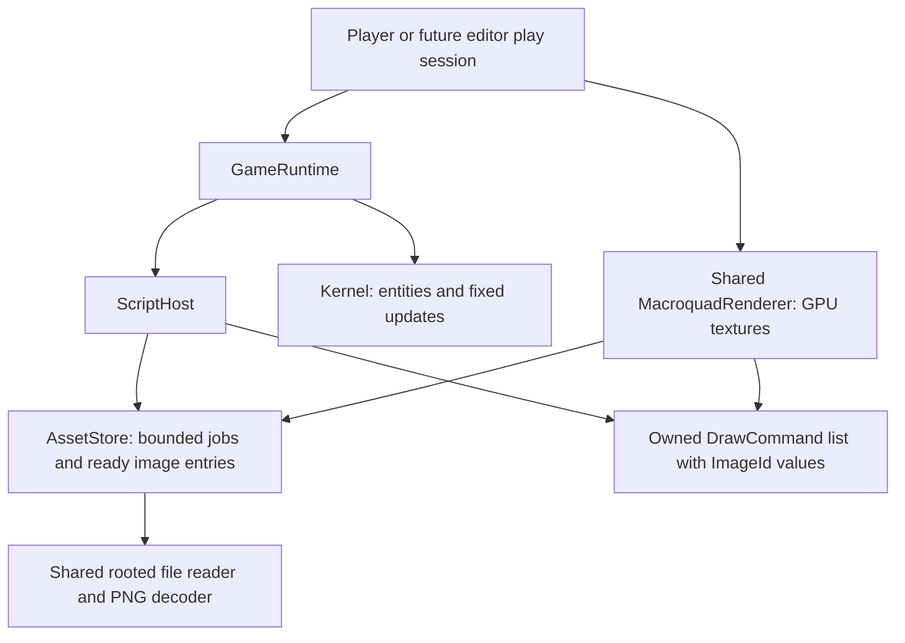

# ADR-002: Bundle PNG assets and sprite drawing

**Status:** Complete. Phases 0-4 delivered, with the full check matrix run.
P1-P8, including the P7 manual-eviction extension, accepted 2026-09-06.
The [Phase 0 record](PNG_SPRITE_PHASE0.md) freezes the implementation contracts
and records dependency/worker/GPU feasibility evidence. Phase 1 implemented the
headless asset service, Phase 2 its Luau and runtime integration, Phase 3 the
shared renderer, GPU residency and Player integration, and Phase 4 the authoring
sample and its delivery evidence; their records are at the end of this document.
Implemented APIs and limits are documented in the README; the unresolved gaps
each phase records are the standing limitations.
**Date:** 2026-09-06.
**Decider:** Project owner.
**Baseline:** `61a72adb93c94c4a5dada0a7c0384f2f44490976`.

The selected next feature is bundle-local PNG loading, sprite/tileset drawing,
and shared runtime support. This document records the accepted decisions,
implementation contracts to finalize, and phase exits. It does not describe
implemented APIs. Record contract changes and
verification evidence here as work proceeds.

## Outcome and scope

A copied Player runs a small room drawn from a PNG tileset, with an animated,
controllable character drawn from a spritesheet. Replacing either PNG and
restarting the same executable changes the artwork without rebuilding Rust.
The same assets and drawing commands can be validated by the headless runtime.

Include update-time asset requests and staged processing, bounded PNG decoding,
reusable image handles with script-controlled eviction and metadata utilities,
cropped sprite drawing, destination size,
horizontal/vertical flips, tint/opacity, nearest-neighbor
filtering, shared rendering, and behavioral/capture evidence.

Tile layout and animation frame selection belong to sample Luau code. Engine
tilemaps, collision, cameras, rotation/pivots, engine animation components,
asset hot reload, texture packing, other image formats, audio, editor UI, and
export tooling are outside this milestone. Kernel-owned tilemaps and solid-tile
collision remain a likely next feature, not a dependency or deliverable here.
Phase 0 selected bounded worker-assisted processing and logical image unload.
Direct pixel-buffer access and a dedicated script API for
job cancellation remain future extensions; safe internal cancellation/teardown
is required by this milestone.

## Current contracts to preserve

- [Drawing data](../../src/drawing.rs) contains owned `Clear` and `Rect`
  commands and has no graphics dependency. [Script bindings](../../src/scripting/drawing.rs)
  validate before f32 conversion; a successful draw publishes one fresh list.
  Fault/stop clears it. Rejected host `alpha` preserves the accepted list.
- [ScriptHost](../../src/scripting.rs) supplies drawing independently of
  [GameRuntime](../../src/runtime.rs). Keep PNG/sprite authoring available in
  both. Runtime-only world/input/native APIs retain their existing boundaries.
- `GameRuntime::finish_call` releases the entire `ScriptHost` as soon as a
  session reaches `Stopped` or `Faulted`, before native teardown. Everything the
  host owns disappears at that moment, so a host-owned asset store cannot outlive
  termination and renderer-held GPU resources are the only surviving state.
- [Player](../../src/bin/player.rs) owns a private rectangle renderer today.
  Its capture path draws, invokes shutdown, then reads the framebuffer.
  New GPU resources must survive any queued drawing through that readback.
- [Filesystem bindings](../../src/scripting/filesystem.rs) canonicalize roots,
  enforce [portable names](../../src/portable_path.rs), and reject links/reparse
  points below each root. `resolve` does not canonicalize the final node or
  recheck containment; segment validation plus per-descendant link rejection
  carry that weight today. Their 1 MiB file and 8 MiB callback transfer limits
  are utility contracts; PNG loading needs its own accounting.
- Fixed ticks, input edges, world pixels, callback deadlines, VM cancellation,
  native teardown order, and script-owned persistence stay as documented in
  [ADR-001](SCRIPTING_C_API_PLAN.md) and the [agent guide](../../AGENTS.md).
- `game/game.tot` remains the optional version-1 native-plugin manifest.
  This feature adds no manifest fields and no asset scanning.

## Accepted decisions and implementation follow-through

| ID | Status | Decision / implementation follow-through |
| --- | --- | --- |
| P1 | Accepted, revised | Games may request images during update through a staged queue. Init-only synchronous preloading is a test convenience, not a production restriction. Use the Phase 0 service ordering and readiness contracts. |
| P2 | Accepted | Use one CPU decoder shared by headless tools and the Player, feeding GPU upload. Retain CPU RGBA until unload or session end; track GPU residency separately. GPU captures verify rendered pixels; headless tests need no graphics context. |
| P3 | Accepted | PNG paths are relative to the bundle root; no new asset manifest is required. |
| P4 | Accepted | Opaque session IDs and image identities, with a bounded session-local registry/cache. |
| P5 | Accepted | One shared Macroquad renderer in the library. |
| P6 | Accepted | Explicit source rectangles and destination dimensions, flips/tint, and nearest filtering. |
| P7 | Accepted, including extension | `unload(image)` invalidates the logical image for all aliases; retire physical resources after outstanding owners/frames release them. Keep at most 128 reusable GPU slots/context. Separate GPU-only eviction and raw pixels remain deferred. |
| P8 | Accepted; coupled to P1 | One bounded worker processes reads/decode/conversion; the graphics thread transfers complete row bands. Use 32 KiB quanta, eight per grant/pass, soft 2 ms cutoffs and no accumulated credits. Non-preemptible stages and cancellation boundaries are explicit in Phase 0. |

### Headless validation versus repeatable GPU captures

GPU-only loading does not inherently make frames nondeterministic. Repeat seeded
captures still validate the actual renderer on the tested graphics stack. They
require a GPU context, including on a machine that creates an offscreen context
without showing a window. Protogine's existing headless configuration uses no
graphics context at all; it can validate paths, decoded pixels, dimensions,
handle lifetimes, and owned drawing commands if decoding is a shared CPU service.
Final rendered pixels still need the Player capture tests.

P2 establishes one CPU decode path that also feeds GPU upload. Retain RGBA until
logical unload or session retirement; count any remaining pinned owners until
released. This preserves the session snapshot and lets headless tools inspect
real pixels. A future different retention policy requires its own reload and
accounting contract.

### Staged processing

`request -> queued -> reading -> decoding/converting -> CPU ready -> uploading
-> drawable` separates independent work and publication boundaries. Init/update
may enqueue a request and retain an opaque image handle immediately; neither
callback waits for the file to finish. Ready cache hits reuse the handle. Scripts
can inspect status and draw a loading screen while other gameplay continues.

Use an engine-owned destination buffer for encoded chunks; do not expose a
partially decoded image to scripts. A 32 KiB read quantum is a starting point,
not the entire tick allowance. At exactly one quantum per 60 Hz tick, a 17 MiB
file needs 544 ticks, about 9.07 seconds, just for reading. Multiple quanta may
run under an aggregate service budget. Several concurrent requests share that
budget; the allowance must not multiply by the number of jobs.

Chunked reads alone do not spread PNG decompression, RGBA conversion, or texture
allocation/upload. The current whole-image `read_image` call cannot be placed
after EOF and described as incremental loading. The pinned `image` reader has
a row-based path for noninterlaced PNGs, but its interlaced path decodes a whole
frame when creating the reader. Header/metadata processing can also do work
independent of a pixel-row allowance. Phase 0 selected a bounded worker using the
pinned row reader, including its non-preemptible interlaced/metadata stages.
Do not drop interlaced support or substitute a dependency silently.

GPU work remains on the graphics thread. Upload complete RGBA row bands through
bounded region updates, keeping the image unavailable for drawing until every
band is transferred. Texture allocation/resizing is still a non-preemptible
operation that must be measured separately. Bounded bytes reduce work but do
not guarantee a wall-clock deadline for filesystem calls, decoding, or drivers.

Use the exact grant, publication and frontend order in the Phase 0 record: one
CPU grant per frame/step, no repeated grants across catch-up ticks, GPU service
before the runtime frame, and snapshots committed at the first update boundary.
Standalone ScriptHost uses the same CPU service without a renderer. Production
completion ticks may vary. Preload/completion-trace helpers drive the same service;
capture drains pending work without advancing simulation before drawing. They do
not introduce another loader, validation policy or script deadline override.

Asset service slices run outside the Luau callback's execution budget. Preserve
the existing 1 s startup and 100 ms update/draw cancellation contracts for script
execution; do not extend/reset those deadlines on every chunk or request.
Hitting a normal service-slice budget yields until a later pass. A separate job
deadline, if needed, needs an explicit failure/cancellation policy; elapsed time
for the whole staged job is not the duration of one Luau callback.

### Image access, eviction, and cancellation boundaries

The script's image handle is the public view of its session-local cache
entry: identity, status, dimensions when known, and deliberate utility operations.
Drawing passes that handle. The renderer's reusable GPU slot is an implementation
detail and must never become a script-visible mutable texture pointer.

Manual eviction uses `ctx.assets.unload(image)` in init/update. It invalidates
every alias and removes the path lookup; a later request gets a fresh identity.
Status remains inspectable on retained handles in the live session. The Phase 0
record defines idempotence, pending-job cancellation, pinned storage and frame
retirement. Separate GPU-only eviction and raw pixel-buffer access are deferred.

Cancellation should address the job identity and discard its partial buffers,
release file/decoder resources, and prevent late completion from publishing it.
If work runs on a worker, cancellation can suppress publication immediately but
cannot promise to interrupt an in-progress non-preemptible operation. Define
worker shutdown/join behavior as specified in Phase 0: wake, cancel and join one
worker without detached workers or late publication. A dedicated script
cancellation API remains deferred; unloading a pending image already cancels it.

Neither cancellation nor eviction may recycle a GPU slot while queued drawing
still references it. Pending/published frame references need pinning until their
work is submitted/discarded, and releases take effect at a documented boundary.
Implement eviction with resident-count accounting, wrapper-cache
cleanup, stale-handle behavior, and slot reuse together; the default session-end
residency rule below must not be applied to an explicitly evicted image.

## Ownership and feature boundaries



- Add image identifier/metadata types to `src/assets.rs`; keep those types and
  drawing data available without graphics or scripting. Put file/decode/store
  implementation behind an `assets` feature enabling the existing `image`
  dependency. No new workspace member is needed.
- `ScriptHost` owns an `AssetStore` rooted at the same canonical bundle as its
  filesystem API, plus the VM handle cache. This follows the existing
  `FileSystem` precedent rather than the runtime-owned `EngineContext` pattern,
  because standalone hosts must load PNGs. `GameRuntime` exposes read-only
  access through its host, and that accessor yields an empty view once the host
  has been released on stop or fault. Rust tools can borrow image
  metadata/pixels; scripts receive metadata copies and handles with scoped
  eviction operations. A raw pixel-buffer API is deferred.
- Store/path/decoder errors and accounting remain independent of mlua. Rust
  loading uses an explicit load budget with the same byte/count limits; bindings
  translate immediate argument errors and expose staged job failures without
  depending on a currently executing Luau callback. Supply service budgets and
  cancellation through a host hook rather than making the asset module depend
  on the scripting host. Publish immutable image contents only on successful
  completion; the registry can accept further requests during update.
- Add `src/scripting/assets.rs` for scoped bindings. Make `scripting` enable
  `assets`. Standalone `ScriptHost` loads real PNGs without a window.
- Add `src/rendering.rs` under a `graphics` feature enabling `assets` and
  Macroquad. Change `player` to enable `graphics`, `scripting`, and
  `native-plugins`. Capture's `image` use is satisfied through `assets`.
- The application owns one renderer for its graphics context's lifetime and
  reuses it across runtime restarts. Session-to-texture mappings expire on
  retirement; a bounded pool of cleared GPU allocation slots remains. This is
  allocation reuse, not a cache of prior game assets or their contents.
- `graphics` does not enable `scripting`, so the renderer cannot reference
  `GameRuntime`. Keep the typed renderer error in `src/rendering.rs`, the
  presentation-fault entry point on `GameRuntime`, and any command validation
  shared by bindings and renderer in a feature-free module: `src/drawing.rs`,
  or the unconditional part of `src/assets.rs`. Neither feature implies the
  other, so shared validation cannot live under either one.
- Keep Macroquad 0.4.16 with default features disabled and the current PNG-only
  `image` dependency. Pin it exactly as `image = "=0.24.9"`: this feature depends
  on specific decoder and limit semantics that a caret range could move
  underneath it.
  Verify the feature graph and lockfile; do not combine this feature with a
  decoder/library upgrade.
- The kernel does not own images, textures, sprite components, or the renderer.
  A future editor drives these same runtime/rendering interfaces. Startup text
  and window management remain Player responsibilities.

| Configuration | Required behavior |
| --- | --- |
| `--no-default-features` | Core and command/identifier types compile without image decoding, Luau, or Macroquad |
| `--no-default-features --features assets` | Rust asset decoding/store tests run without VM or graphics |
| `--no-default-features --features scripting` | Real Luau asset loading and sprite commands work headlessly |
| `--no-default-features --features graphics` | Shared renderer compiles without scripting/native plugins; constructing it requires a live Macroquad context |
| Default `player` / `--all-features` | Existing Player and native behavior plus shared sprite rendering |

## Bundle loading and image lifetime

Example distribution:

```text
My Game/
  protogine-player.exe
  game/
    main.luau
    room.luau
    assets/
      tiles.png
      character.png
```

The proposed `ctx.assets.request_png("assets/tiles.png")` addresses the bundle
root, including when called from a required submodule. It never resolves against
the module directory, working directory, executable directory, or writable data
root. `assets/` is a convention, not a mandatory directory.

1. Validate a UTF-8 string of 1..4096 bytes with portable `/`-separated segments
   and a `.png` suffix, compared ASCII-insensitively. Do not coerce numbers into
   paths. Reject empty/dot/parent segments, absolute/drive/UNC paths, backslashes,
   device names, and other names refused by the existing filesystem policy.
2. On a cache miss, traverse beneath the canonical root, rejecting symlinks and
   Windows reparse points at every descendant, non-directory intermediates, and
   non-regular final nodes. Canonicalize the resolved file and check containment.
   The canonical root itself may have been reached through a link, as today.
3. Key successful loads by the resolved canonical path, using platform path
   equality. Memoize successful request spellings so repeat requests use the
   session snapshot without reopening the file. Case aliases resolving to the
   same canonical path reuse the image; distinct hard-link paths need not dedupe.
   Do not globally lowercase paths on case-sensitive filesystems.
4. Open/read with an encoded-byte cap plus a one-byte overflow probe; metadata
   length is only an early check. Retain bounded reader/decoder state between
   service passes and discard encoded/scratch buffers when no longer needed.
   Do not reread the entire file or restart decoding for every chunk.
5. Reserve a new image identity and publish its pending handle only after job
   admission, path-cache allocation and VM wrapper publication succeed. Roll
   back a failed admission and burn its identity. Pending requests for the same
   canonical path coalesce rather than reading/decoding twice. Ready image data
   is published atomically only after complete validation/decode/conversion.
   Failed/cancelled jobs release work resources and are removed from the path
   lookup so a later explicit request can retry; old handles must not silently
   become that new job. Retain terminal status as specified in Phase 0.
   Counters for attempted work are never rolled back.

Extract a small non-VM rooted-read/path helper from the current filesystem code
where needed; share traversal rules rather than routing assets through
`ctx.fs.read`. The two callers need different final-node policies: `ctx.fs`
keeps today's behavior, while asset loading adds canonicalization and a
containment recheck on the resolved file. Make that step a parameter of the
helper rather than changing `ctx.fs`. Keep existing utility limits, listing
classification, mkdir rollback, and writes intact, and run their regressions
after the extraction. The existing stable-bundle assumption applies: this is
not protection against concurrent hostile filesystem replacement.

Each `ImageId` contains a process-unique session identity and an append-only
image identity with private construction. Use checked session allocation, not
wrapping IDs or reusable addresses. No identity is handed out twice within a session,
including numbers burned by a failed publication: keep the sequence strictly
append-only so the no-reuse rule is auditable by inspection instead of by
re-deriving why an unpublished ID could not have escaped. Update-time requests
can burn more than one callback's allowance over a long session, so use a checked
monotonic counter independent of resident storage slots. Every lookup checks
session identity and entry state. GPU cache keys include the full ID; reusing a
physical allocation slot never reuses the image identity.

Keep `ImageId` a plain `Copy` scalar — a monotonic session counter plus a monotonic
image number — so `DrawCommand` retains its existing `Clone, Copy, Debug, PartialEq`
derivation. Do not model session identity with an `Rc` marker as `EntityHandle`
does: a reusable address cannot satisfy the cross-session rule and would cost
`Copy`.

Coalesced pending requests and ready cache hits return the same Luau userdata,
including `rawequal` and table-key identity. Keep canonical wrappers only while
the corresponding entry occupies the bounded registry; terminal-job and
eviction cleanup must not leave an unbounded strong cache. Retained stale handles
remain VM-owned values and cannot resurrect an entry. Bound request-spelling
memoization explicitly (256 entries with replacement), since per-callback
attempt limits no longer bound a cache's lifetime. Dropping a spelling memo does
not evict the image. Handles may be retained; context functions still expire.

Release asset-store and userdata borrows before VM work, including allocating
metadata tables/wrappers or inspecting option tables. Transfer owned IDs and
metadata across those steps; do not hold a `RefCell` borrow during Lua operations.
Keep publication rollback explicit across the separate Rust and VM allocations.

Successful init does not freeze the registry. Normal shutdown can inspect ready
metadata but admits no new jobs; after its callback, invalidate handles, cancel
pending jobs and release CPU assets. Faults invalidate immediately and skip Luau
shutdown; drop releases resources without invoking scripts. Apply this cleanup
to standalone `ScriptHost` as well as `GameRuntime`. Preserve destruction of VM
references before native teardown.

Owned sprite commands contain IDs and scalar data, not pixels or GPU references.
A Rust copy remains inspectable after shutdown but cannot be rendered against a
stopped or different store. Restart constructs new IDs, rereads files, and builds
a fresh session mapping in the existing renderer. Its cleared allocation pool
survives; no cross-session image-content cache is introduced.

## PNG representation and limits

Accept static PNGs with RGB/RGBA, grayscale/grayscale-alpha, or indexed color,
including palette transparency and 1/2/4-bit grayscale expansion. Decode
interlaced PNGs through the shared CPU service. Reject APNG and 16-bit channels
explicitly for this milestone; do not silently choose an animation frame or narrow 16-bit
samples. Normalize supported input to top-to-bottom, tightly packed RGBA8 with
straight alpha; opaque formats receive alpha 255. Preserve decoded sample bytes
without ICC/gamma correction, premultiplication, or vertical flipping.

The pinned decoder supplies each of these; Phase 0 tested the following mechanisms.
`PngDecoder::with_limits` sets
`png::Transformations::EXPAND`, which is what makes palette expansion, tRNS
alpha, and 1/2/4-bit grayscale work without extra handling, and which
deliberately does not narrow 16-bit samples. So 16-bit input surfaces as
`L16`/`La16`/`Rgb16`/`Rgba16` from `color_type()` on the constructed decoder and
is rejected before any output allocation; APNG is detected with `is_apng()`.
For the whole-image baseline, `read_image` asserts that the supplied buffer
length equals `total_bytes()` and panics on mismatch. That size uses the decoder's
native color type — three bytes per pixel for `Rgb8`, not four. A staged path must
likewise size native rows/scratch from the decoder's representation and account
for RGBA conversion separately; it need not retain a second full-image buffer.
RGBA input may reuse its validated output directly. Use the Phase 0 worker/reader
path rather than calling whole-image `read_image` on the runtime thread after
chunked reads.

| Resource | Bound and accounting (detailed grants/ownership in Phase 0) |
| --- | --- |
| Image registry | 128 admitted pending/resident entries; terminal entries leave the live registry, with retained status owned by VM handles |
| Encoded file | 17 MiB; check actual reads, not only metadata |
| Dimensions | Both integers in `1..=2048` |
| Retained RGBA8 | Checked `width * height * 4`; at most 16 MiB/image and 64 MiB/store |
| `ctx.assets` attempts | 256 per callback, shared by `request_png`, `status`, `size` and `unload`, before argument conversion/phase checks; hits and refusals count |
| In-flight jobs | 8 FIFO jobs sharing grants, one active worker/decoder; waiting jobs reserve no decoder workspace |
| Encoded staging storage | 34 MiB aggregate outstanding encoded data, including failed/partial reads and overflow probes until released; ready cache hits transfer zero |
| Work per service pass | 32 KiB work units, eight per worker grant/GPU pass, soft 2 ms cutoffs; one non-preemptible worker stage / GPU allocation per pass; no accumulated grants |
| Decoder header bound | Pass `max_image_width` and `max_image_height` of 2048 to `PngDecoder::with_limits`, which checks them immediately after header parsing and before `read_info` |
| Decoder allocation limit | One decoder with 32 MiB best-effort `max_alloc`; separately reserve up to 16 MiB native interlaced output and 32 KiB conversion scratch; see Phase 0 for row lookahead |
| Sprite attempts during draw | 10,000, counted before argument/option conversion, including refusals |
| Published drawing commands | Existing combined 10,000-command cap, including clears, rectangles, sprites, and zero-area commands |
| Renderer allocation slots | At most 128 over one graphics context's lifetime, allocated lazily and reused across sessions; every retired slot holds only a transparent 1x1 RGBA8 image |

These are separate from VM heap, utility, world, and native budgets. Asset
metadata queries must not consume the 128-call utility budget. Sprite drawing
must not consume the 256-call asset budget through internal dimension lookups.
Keep existing clear/rectangle accounting unchanged; the new sprite attempt
counter bounds rejected sprite validation as well as accepted calls. That
asymmetry is deliberate: `clear` and `rect` take scalars and are bounded
adequately by the deadline, while a rejected sprite may already have cost two
option-table inspections, so its refusals need their own ceiling.

The encoded cap includes 1 MiB of headroom above the 16 MiB RGBA8 maximum for
scanline filters, compression framing, and chunks. The pinned encoder produced
a valid 2048x2048 RGBA PNG of 16,780,612 bytes in the review probe, exceeding
16 MiB by 3,396 bytes. Both that file and two such files fit the revised 17/34
MiB allowances. Add an incompressible boundary fixture so this case stays covered.

Encoded size remains an independent restriction: arbitrary metadata, chunk
fragmentation, or inefficient encoding can exceed 17 MiB even within 2048x2048.
Document both limits; do not promise that every PNG within the dimension limit
fits. The aggregate staging allowance accommodates two files at the encoded cap,
or more smaller files. It limits concurrent storage, not lifetime throughput:
completed stages release capacity for subsequent requests. A bounded waiting
queue must distinguish temporary capacity pressure from an impossible request.
Admission/reservation must let at least one active job reach completion; partial
buffers from several jobs must not consume all staging capacity and leave every
job waiting for more. Include that case when measuring queue fairness.

Check dimensions/products before output allocation. Bound each read by the
remaining file/staging allowance plus the overflow probe, so a failing read cannot
allocate past the service's storage budget. Check retained
capacity before decoding, reserve work before performing it, and
release all temporary buffers on failure. Avoid cloning RGBA buffers for each
command or upload. Identify encoded storage, decoder workspace, conversion
scratch, retained CPU storage, and GPU storage separately in the implementation.
These are storage bounds and scheduling budgets, not measured latency
guarantees. The former 34 MiB encoded/128 MiB decoded cumulative init-work limits
are superseded by the Phase 0 staged-processing, scratch-reservation and
catch-up contracts.

Invalid arguments, wrong phases and admission/path-resolution errors are
catchable. After admission, I/O/format/unsupported/limit/capacity errors become
inspectable failed jobs, with no partial ready image. Normal slice exhaustion
yields. API-attempt abuse and callback deadlines remain latched outside protected
calls. Worker panic/disconnect and invariant faults stop the session through the
runtime service-fault path. Use the exact Phase 0 classifications/status schema.

Work between yield/cancellation boundaries is not preempted by VM interrupts.
Keep protected script cancellation and independently bound adversarial decoder
fixtures with a 10-second child-process watchdog. Never present an image allocation setting as a total process or GPU
memory guarantee: the decoder's `max_alloc` is best-effort, and driver/allocator
overhead is outside these counters. It is weaker than it looks. `max_alloc`
becomes `png::Limits { bytes }`, which in png 0.17.16 reserves roughly one
output line plus a little metadata, explicitly excludes caller-supplied buffers,
and is documented as best-effort. The effective bounds against a hostile file
are therefore the engine's own encoded-byte cap and the `max_image_width`/
`max_image_height` header check, not `max_alloc`. See the
[image 0.24.9 limit contract](https://docs.rs/image/0.24.9/image/io/struct.Limits.html).

## Luau API and drawing semantics

| API | Contract |
| --- | --- |
| `ctx.assets.request_png(path)` | Init/update; return a pending/cached canonical handle after synchronous rooted metadata resolution, without waiting for content/decode |
| `ctx.assets.status(image)` | All live callbacks; owned Phase 0 status/error snapshot, including CPU state and distinct GPU residency |
| `ctx.assets.size(image)` | All live callbacks; return validated known dimensions; unknown/failed/unloaded refuses |
| `ctx.assets.unload(image)` | Init/update; invalidate logical image/all aliases, remove path lookup, cancel pending work and retire physical resources safely; true once, false when already terminal |
| `ctx.draw.sprite(image, x, y, options?)` | Draw only; requires live CPU-ready image; validated owned command. Renderer skips pending GPU uploads without forcing work. |

`ctx.assets` is read-only and exists in all callbacks; requests outside init/update
refuse explicitly. `ctx.draw` still exists only in draw. Top-level modules
receive no context. Neither handles nor metadata tables expose engine internals.

`size` and `sprite` reject a handle whose session is not this host's as an
ordinary catchable error, mirroring the existing `foreign entity handle`
behavior in the world bindings. This is a binding-level check, separate from
the renderer's later validation of copied commands against a live store. Only
a Rust harness can produce such a handle, exactly as in the world tests.

The Phase 0 record freezes status and readiness. This callback fragment is an
illustration, not a complete runnable game:

```luau
-- Enqueue once during init/update; retain the handle between callbacks.
character = ctx.assets.request_png("assets/character.png")
local progress = ctx.assets.status(character)

-- During draw, after the ready-image condition has been met:
ctx.draw.sprite(character, x, y, {
    source = {x = frame * 16, y = 0, width = 16, height = 16},
    width = 32, height = 32,
    flip_x = false, flip_y = false,
    tint = {r = 1, g = 1, b = 1, a = 1},
})
```

- The 256-call `ctx.assets` budget is per callback, so a `size` query inside a
  per-tile draw loop will exhaust it on any real room. Dimensions are frozen
  once an image is ready; the sample must read them once and keep them, and the authoring
  documentation must say so rather than leaving authors to discover the ceiling
  as a fault.
- Coordinates are top-left screen pixels, positive x right and positive y down,
  matching rectangles. Source coordinates are image pixels, never tile indices.
  Source rectangles are half-open; integer x/y are nonnegative, integer
  width/height are positive, and their checked extents must fit the image.
- Omitted/nil options use the full image, its natural dimensions, no flips,
  and white/opaque tint. When a source is present, omitted destination dimensions
  default independently to its width/height. An explicit source supplies all
  four fields; an explicit tint supplies all four RGBA fields.
  Nil optional fields behave as omitted; non-nil fields must have the stated type.
- Optional tables must be plain tables with no metatable or unknown/numeric
  keys. Read fields without metamethods; enforce actual numeric/boolean types,
  reject coercions, and copy values during the call. Mutating options afterwards
  cannot change a published command. Bound key inspection by the allowed field
  count and stop at the first unexpected key.
- Validate x/y as finite f64 within +/-1,000,000 and destination width/height as
  finite values in `0..=1,000,000` before narrowing to f32. Zero-area sprites are
  valid counted no-ops; negative sizes are errors, not flip shorthand. Tint is
  finite normalized RGBA in `[0,1]`. Use the same ranges as existing rectangles.
- Flips mirror the selected source inside the same destination footprint. No
  rounding or implicit snapping is added; integer placement and integer scale
  give the predictable pixel-art case. Fractional placement/size are supported
  with normal rasterization and do not promise equal pixels across GPUs.
- Tint multiplies sampled RGBA, then uses the existing straight-alpha blend
  behavior and command order. Nearest filtering is fixed for this milestone;
  no mipmaps, repeat sampling, color management, or automatic texture packing.
- Preserve ordered drawing across image changes and rectangle/sprite mixtures.
  A clear discards earlier drawing, including queued sprites. An empty accepted
  draw leaves black. No sorting by texture or layer is allowed.
- A caught invalid sprite leaves the pending list unchanged. An uncaught error
  or latched budget failure discards the entire pending frame and clears the
  published list. Every valid sprite participates in the existing command cap.

Add a `DrawCommand::Sprite` variant with an `ImageId`, normalized explicit
source rectangle, destination rectangle, flips, and RGBA tint. Keep source
coordinates integer-valued until renderer conversion. Scalar owned data can
remain `Copy`; no Macroquad or mlua types enter this enum.

## Shared renderer and Player lifecycle

Expose a graphics-only `MacroquadRenderer` with session attachment, staged image
upload, render, and retirement operations as frozen in Phase 0. This replaces
the earlier single prepare-before-play transaction. The behavior is:

1. Attach a live session to a retired renderer and admit completed CPU images
   as they arrive, including during play. Lazily create missing
   pool slots once through `Texture2D::from_rgba8`; resize/repopulate existing
   slots through the scoped adapter below. New pool slots start as transparent
   1x1 images; allocate destination storage, then transfer bounded RGBA row bands
   with `texture_update_part`. Allocate storage once per admitted image rather
   than once per band. Set nearest filtering explicitly and retain strong owners.
   Never call Macroquad's file/image decoder from the renderer. Reuse free slots
   first, assigning each pending/resident image a distinct slot; grow only when
   no free slot exists. Reserve pool/mapping storage
   before GPU creation so a later Rust allocation failure cannot lose ownership
   of an already registered texture.
2. An image becomes presentation-ready only after all its upload bands succeed.
   Publish its full-ID mapping atomically, without disturbing already ready
   images. A failed/cancelled staged upload clears its private slot back to 1x1
   after queued work no longer references it and discards its tentative mapping.
   Keep already allocated slots for reuse; do not delete/recreate them on retry.
   Do not publish partially uploaded images. The upload service does no Luau
   work; readiness/failure is acknowledged at the agreed update boundary.
3. Render against the matching live store and attached session. Validate the
   complete command list, including Rust-supplied commands, before queueing it:
   IDs, sizes, source bounds, colors, and cap. Share validation with bindings
   where practical. Missing/foreign/stopped assets fail explicitly. The draw
   traversal performs no file reads, decoding, or uploads; those stages have
   separate service budgets. It must not force-complete a pending image as a
   side effect of drawing it. Skip CPU-ready commands whose texture upload is
   pending; reject foreign/unloaded IDs, as specified in Phase 0.
4. Use `draw_texture_ex` for source/destination/flips/tint and the same ordered
   clear/rectangle path. The application supplies a screen-space default camera
   and ordinary blend/material state, and must never call
   `build_textures_atlas` or `reset_textures_atlas`. Document all three
   preconditions together for future editor viewport integration. No editor
   viewport implementation is included.
5. Fatal renderer errors detected by engine validation enter an explicit runtime
   presentation-fault path, set `ScriptState::Faulted`, clear commands/assets,
   invalidate the kernel, release VM references, and perform reverse native
   teardown without Luau shutdown. Reuse the existing primary-fault/log handling
   rather than merely replacing Player's runtime with `None`.
   Repeated failure notification after a terminal state preserves the first
   failure and performs no callbacks or second native teardown. Ordinary failed
   asset jobs follow their inspectable error policy, distinct from renderer
   invariant faults and backend process failures.
6. Retire only after queued work is submitted/discarded, on the owning graphics
   thread with its context still alive. Invalidate the session mapping and
   shrink every used slot to transparent 1x1 RGBA8. Retain those cleared slots
   for the next session; retirement is idempotent. Do not allow a new
   session to inherit any old `ImageId` mapping or image content.

`Texture2D::from_rgba8` appends a weak entry to Macroquad's `unbatched` list;
ordinary texture garbage collection does not remove it. Miniquad 0.4.11's
Windows OpenGL backend also appends a texture record on creation without
removing that record on deletion. Recreating a renderer's textures each session
would grow both lists even if GPU storage was deleted correctly. The application
must therefore retain the same pool until its graphics context ends. Allocation
and registration counts attributable to game images cannot exceed 128 across
all successful sessions and job rollbacks in that context.

Use `macroquad::window::get_internal_gl` only inside a small synchronous adapter
in `src/rendering.rs`. Obtain a slot's `raw_miniquad_id()` before entering the
adapter, then use `quad_context.texture_resize(id, width, height, Some(bytes))`
to clear a retired slot without creating a texture record or batcher entry.
For a staged image, allocate with `texture_resize(..., None)`, keep it invisible,
then fill it with bounded `texture_update_part` calls. Validate dimensions,
region bounds, row alignment and exact checked RGBA8 lengths before these calls;
reapply nearest filtering and no mipmaps. The pinned Windows implementation
updates the existing texture record's dimensions, which Macroquad then reads
for size and source UV calculation. Phase 0 verified that path behaviorally;
Phase 3 repeats the checks through the actual shared renderer.

Document the adapter's unsafe invariants: a live context on its owning thread,
exclusive short-lived access, no retained backend references, and no other
Macroquad calls, Luau callbacks, or awaits while that access is held. Flush
queued work before resizing any referenced texture. Keep managed `Texture2D`
owners private to the renderer; no raw handle or wrapper clone may escape it.
Pool growth must respect the 128-slot cap, including slots created during failed
upload admission. Active image storage follows the 64 MiB decoded-content limit;
idle slots add at most 512 bytes of pixel payload. At retirement every slot is
1x1 transparent, so no previous game's full-size storage/content is retained.
These are payload bounds, not guarantees about driver memory reclamation.

Keep atlas build/reset prohibited: packing would switch drawing to an atlas
whose filtering is independent of each slot, while reset would invalidate
unrelated font state. Source cropping stays in image pixels with this unatlased
pool. `Texture2D` destruction still requires the live graphics context; drop the
renderer only at graphics-context shutdown, after pending work is flushed, inside
the `Window::from_config` future. Never recreate it for a runtime restart.

For capture, hold the renderer/textures independently of runtime CPU assets:
queue the final frame, invoke normal shutdown exactly once, and retain textures
until `get_screen_data()` has flushed/read the frame. On a shutdown fault, draw
the Game error screen as today before readback. Only then retire the session;
the exiting Player may also drop the renderer while the context is alive. Do
not clear/repopulate slots between queueing the final frame and its readback,
or render again from stopped assets to save it. Interactive Escape/window-close
and fault paths must likewise retire queued work and image contents safely.

Macroquad texture creation returns a texture, not a recoverable allocation
result. Do not promise containment of driver OOM, context loss, or backend
panics. Phase 0 established the 2048x2048 upload path on the tested Windows
MSVC stack and recorded the observable failure boundary; report incompatibilities
instead of silently reducing the asset contract or substituting a renderer.
Fatal asset-service/renderer failures retain Player exit code 3; an inspectable
failed job does not automatically fault the session. Capture/configuration codes,
fallback screens, seeding, and tick counts persist.

## Implementation phases and stop gates

All P1-P8 scope decisions are accepted. Phase 0 completed its five exits in the
linked record: shared decoding/retained CPU pixels; bounded worker selection;
job/error/budget/catch-up contracts; CPU/GPU readiness and deterministic draining;
logical unload with alias/pinning/cancellation rules. It established feasibility
and contracts, not production implementation; Phases 1-4 then delivered them,
and each records its evidence at the end of this document.

Each phase ends with a focused diff review and evidence recorded here. A failed
gate blocks dependent work; record the reason and proposed contract adjustment.
Do not mark a phase complete based only on compilation when its exit requires
behavior or pixels. Keep changes as separate logical slices.

| Phase | Work and primary files | Exit / stop gate |
| --- | --- | --- |
| 0. Contract and feasibility — complete | `examples/png_sprite_probe.rs`, fixture/watchdog tools, and `PNG_SPRITE_PHASE0.md`. | Contracts frozen; exact CPU/GPU pixels, metadata/interlace worker behavior, bounded upload passes, 100 pool cycles, capture lifetime and negative controls passed on the recorded Windows stack. Production integration remains later work. |
| 1. Headless asset service — complete | `src/assets.rs` and supporting modules; rooted-read extraction; `Cargo.toml`, `src/lib.rs`; `tests/assets.rs`. Implement admitted jobs, stage advancement, bounds, cache/identity, decode and teardown. | Identical decoded pixels through bounded service passes without VM/GPU. Rooting, coalescing, rollback, cancellation-safe teardown, queue fairness, storage pressure and stale/foreign IDs pass. Existing filesystem regressions remain intact. |
| 2. Luau and runtime integration — complete | `src/scripting/assets.rs`, `src/scripting/drawing.rs`, `src/scripting.rs`, `src/runtime.rs`, `src/drawing.rs`; runtime/test drivers. | Init/update requests work in ScriptHost and GameRuntime; callbacks continue while loading. Status/error/readiness, eviction utilities, canonical wrappers, publication, budgets and cleanup obey frozen contracts. Preload/completion-trace tests use the same service path. No GPU dependency enters scripting-only builds. |
| 3. Shared renderer and Player — complete | `src/rendering.rs`, `src/bin/player.rs`, readiness acknowledgements and fault integration; actual Player captures/input probes. | Bounded upload passes publish only complete images; rendering never forces loading. One admission/upload sequence per uncached image, explicit eviction/reload, queued-frame pinning, mixed ordering, shutdown captures and repeated-session pool bounds pass. Pending work is cleaned on faults/exit. Existing rectangle/startup/native captures pass. |
| 4. Authoring sample and delivery — complete | `examples/games/sprites/` using the supplied Kenney sheet and provenance; README/AGENTS/index updates; complete verification matrix. | Copied Player shows a responsive loading state, then the room and animated controllable character. Requests during update and PNG replacement without rebuilding are demonstrated. Deterministic preload replay, live loading interaction, and limitations are recorded. |

Player subprocess evidence must identify per-image admissions/completions and
aggregate read/decode/upload work with bounded test diagnostics; a once-per-session
"prepared" line no longer proves dynamic loading behavior. Pair those receipts
with in-process stage counters and negative controls. The sample bundle needs
`include_bytes!` or `fs::copy` for PNGs, not `include_str!`.

## Behavioral verification

Use independently specified expected values and asymmetric fixtures so incorrect
implementations cannot pass by reproducing their own conversion or crop logic.

- **Rooting:** Run with unrelated cwd and a different-colored decoy at the same
  relative path there. Test a module in a subdirectory, spaces/Unicode in valid
  names, traversal/absolute/device paths, directories, links/reparse points,
  missing files, and platform case aliases. Record any OS permission required
  for link fixtures rather than silently skipping that boundary.
- **Decoding:** Commit tiny RGB, RGBA, grayscale, palette/tRNS, and interlaced
  fixtures with known dimensions and bytes. Include 16-bit, APNG, wrong-format,
  truncated IDAT, and corrupt PNG cases. Check exact limits and one-over limits,
  huge-dimension headers with small payloads, checked arithmetic, and aggregate
  exhaustion across different files. Generate deterministic incompressible
  2048x2048 RGBA input and verify that its PNG exceeds 16 MiB but fits 17 MiB,
  decodes back to the expected pixels, and two distinct asset files fit 34 MiB
  of aggregate encoded staging. Keep separate 17/34 MiB boundary and one-over tests; extra
  metadata remains subject to encoded limits. Verify decoder limits are installed
  before header parsing and conversion allocations. Commit a generator script or the
  documented byte listings alongside the fixtures, so expected values are
  specified independently rather than recorded from a first passing run.
  Keep `*.png -text` in `.gitattributes` for the same reason the generated C header
  is pinned: fixture bytes are compared exactly on every platform.
- **Accounting/publication:** Use mixed cache hits, malformed calls, wrong-phase
  calls and failed jobs. Exhaust per-pass work and aggregate staging independently;
  normal yielding must preserve the job and let gameplay continue. Check no
  retained image/canonical wrapper leaks after admission or completion
  failure, no bypass through `pcall`/`xpcall`, and no systems after a fault.
  Use targeted allocation-failure injection for wrapper publication if needed;
  a structurally unexercised rollback is not behavioral proof.
- **Scheduling and late work:** Exercise multiple concurrent requests, cache
  coalescing, partial/final chunks, EOF/error, interlaced decode, compressed
  metadata, conversion bands and GPU bands. A tiny encoded PNG with large output
  must not bypass decode/transfer budgets. Test aggregate fairness and catch-up
  frames; distinguish bytes-per-pass assertions from elapsed-time observations.
  Cancel/tear down jobs at every stage and race completion with cancellation or
  session shutdown; no late result may publish. Exercise the accepted script
  eviction operations with aliases, retained handles, published-frame pins and
  busy-slot reuse, including later reupload or a fresh logical request as defined
  by the operation. Use deterministic test scheduling for exact readiness traces.
- **Lifetime:** Query sizes in every legal callback; retain old binding functions;
  use the same image as a table key after a repeated load. Test two simultaneous
  stores with matching image numbers, repeated restart, standalone-host terminal
  cleanup, invalid host alpha preserving commands, and copied commands rejected
  by a foreign/stopped store. Check that `size` and `sprite` refuse an injected
  foreign handle catchably at the binding, and that a burned image number is
  never issued again after a failed publication. File replacement between
  sessions must reload.
- **Command semantics:** Verify every default, source edges, zero destination
  size, negative/non-finite/fractional-invalid inputs, unknown options/metatables,
  tint boundaries, mutations after append, mixed 10,000-command limits, and
  clear/rect/sprite order. Check a valid sprite following a caught bad call and
  no commands surviving an uncaught draw error.
- **Pixels:** An asymmetric sheet with distinctive corners and contrasting
  neighboring cells proves crop, flip axes, and no tile-edge bleed at integer
  scale. Cover each flip alone and both together, each composed with an explicit
  source rectangle and a destination size that differs from it, since that is
  where mirroring the destination footprint could diverge from swapping source
  coordinates. Test transparent texels over colored backgrounds, half-alpha pixels
  combined with tint alpha, nonwhite RGB tint, 1x/2x scales, offscreen clipping,
  image switches, intervening rectangles/clears, and an empty next frame. Use
  exact opaque/nearest samples and a stated small rounding tolerance for blend
  channels, not broad whole-image similarity.
- **Loading and retirement:** Count reads/decodes/uploads in test-owned
  instrumentation to prove draw traversal never triggers them and completed
  images are not read/decoded/uploaded again without an explicit residency action.
  Verify per-band progress during active loading. Run preloaded first-frame capture
  and shutdown-fault capture with sprites and the existing Escape/window-close
  probe. Reuse one renderer for at least 100 attach/load/retire cycles under one
  live Windows graphics context, alternating empty/small/128-image sessions,
  staggered admissions, image dimensions/content, and injected upload failures. Assert at most
  128 lifetime texture creations/registrations, no further creation after the
  pool reaches that size, and every retired slot measuring 1x1 transparent.
  Couple adapter creation counters to the sole `from_rgba8` call site; source
  review must verify that resize never calls creation or batcher registration.
  Include a control that recreates textures so the count assertion fails.
  Verify changed dimensions, source UVs, pixels and new IDs after reuse, and
  old IDs refusing access. Test final context shutdown after flushing, with
  each pool texture released once. Ensure native instances tear down once on
  presentation faults with their logs retained.
- **Shipped sample:** Copy the Player, Luau and PNGs into an isolated directory;
  use an unrelated cwd. Demonstrate requesting an image during update while
  input/movement continue, then drawing it only when ready. Check animation at
  selected tick numbers after deterministic asset preloading; use separate
  injected/headless movement input for control. Compare repeat seeded PNG bytes
  on the same graphics stack with the same readiness schedule. Replace a tileset
  and spritesheet between launches without changing the executable. Visually
  inspect full captures and exercise movement interactively.

Use the supplied [Kenney 1-Bit Pack sheet](../../examples/kenney_1-bit-pack_transparent-packed.png),
with attribution in [examples/README.md](../../examples/README.md). The local PNG
is 784x352, 17,497 encoded bytes, and indexed 1-bit color; RGBA8 output occupies
1,103,872 bytes. Its 16x16 tiles form 49 columns and 22 rows. It fits one 32 KiB
file-read unit but needs multiple decode/upload units, so it is useful coverage
for stage accounting. Add larger synthetic fixtures for multi-read tests.

The sample uses a small Luau tile array and fixed-screen layout, with at least
two animation frames and a documented movement/reset control scheme. Motion
uses the existing kernel timing; animation advances in update, not draw. State
and frame selection must replay at 30/60/144 presentation FPS for the same
fixed-input and controlled asset-completion trace, or with fixtures preloaded.
Do not claim production load-completion ticks are frame-rate independent solely
because simulation is fixed-step. Compare image content/command fields with session IDs mapped
by logical asset path, since IDs intentionally differ across runtime sessions.
Provide provenance/license information for committed art; asset replacement
instructions must copy PNGs as well as Luau. Keep the old rectangle-only tiles
sample as compatibility coverage.

## Required checks and completion record

For implementation, run the Rust and scripting suites from [AGENTS.md](../../AGENTS.md),
including release headless tests and the lifecycle example. Add these commands
once the new features and `assets` test target exist:

```text
cargo test --workspace --no-default-features --features assets
cargo clippy --workspace --all-targets --no-default-features --features assets -- -D warnings
cargo check --workspace --all-targets --no-default-features --features graphics
cargo clippy --workspace --all-targets --no-default-features --features graphics -- -D warnings
cargo test --release --no-default-features --features scripting --test assets --test drawing --test runtime
cargo test --test player_capture -- --ignored
cargo test --test plugins -- --ignored
cargo build --release --bin protogine-player
pwsh -NoProfile -File tests/player_input.ps1
```

Inspect `cargo tree --no-default-features --features scripting` and the corresponding
`assets` and `graphics` graphs to verify the feature boundaries above. Run the
native/SDK matrix in AGENTS.md when modifying native teardown integration; keep
the independent watchdogs. If exact deadline enforcement changes, rerun the
distance benchmark and its protected-call regressions. Add all newly required
feature/test commands to AGENTS.md when those features are implemented.

The current `script_host` example runs only three ticks; that is not a sufficient
completion check for staged assets. Phase 2 must add a bounded preload/drain or
completion-trace driver and document its actual command. Keep the existing
lifecycle example checks, and never report a loading sample as verified merely
because the three-tick process exited successfully.

Record each phase's changed files, commands and results, behavioral observations,
capture paths/dimensions/ticks, platform/graphics stack, and unresolved gaps.
Distinguish a missing GPU context from a failed rendering test. No test run or
image generated during implementation may be described as verified here before
it is actually inspected. Keep performance claims limited to measured evidence.

Completion requires all four delivery phases after feasibility, the full
applicable check matrix, copied-game and interactive evidence, documentation
matching final APIs/limits, and no unresolved correctness gate. Archive the plan
as completed only then. Until implementation starts, documentation changes need
only content, link, and diff review; this draft does not require running Rust tests.

## Phase 1 completion record

Completed 2026-09-06 on Windows 10 x64, MSVC, stable rustc. This phase touched
no graphics code and required no graphics context.

### Changed files

- `src/assets.rs`: identity, status, error and bound types with no dependency on
  a decoder, a VM or a window. `ImageId` is a `Copy` scalar of a process-unique
  session number and an append-only image number with private construction.
  `UploadAck` is defined here for Phase 3 and is not yet produced.
- `src/assets/store.rs`: the session-local registry, admission, path and
  spelling caches, byte accounting, grants, publication, eviction and teardown.
- `src/assets/worker.rs`: one bounded worker owning file reads, decoder
  construction, native row decoding and RGBA conversion.
- `src/rooted_path.rs`: traversal extracted from the filesystem bindings. The
  final-node policy is a parameter, so `ctx.fs` keeps today's behavior while
  asset loading adds the regular-file requirement, canonicalization and the
  containment recheck.
- `src/scripting/filesystem.rs`: uses the shared helper and maps its errors back
  to the existing diagnostics verbatim; no behavior change.
- `Cargo.toml`, `src/lib.rs`: the `assets` feature, `scripting` enabling it, and
  `image` pinned exactly at `=0.24.9`. `player` no longer names `image`
  directly; it reaches it through `scripting`.
- `tests/assets.rs`, `tests/fixtures/assets/`, `tools/asset_fixtures.py`.
  `.gitattributes` now also pins `*.rgba` alongside `*.png`: the expected-pixel
  files are raw bytes that can contain CR, and they are compared exactly.
- `README.md`, `AGENTS.md`, `docs/implementation/README.md`.

### Implemented contracts

`AssetStore::new(root)` canonicalizes an absolute root and starts one worker.
`request_png` validates, resolves and admits synchronously. `service` runs one
non-blocking pass; `advance(wait)` runs exactly one pass and waits for the
outstanding grant; `drain(timeout)` is the bounded preload helper with its own
watchdog. `status`, `size` and `image` return owned snapshots or a pinning
owner. `take_settled` hands the host the state transitions since the last drain.
`unload` and `roll_back` are the two eviction entry points; `shutdown` is
idempotent and joins the worker.

Store and worker exchange one command and one reply at a time over bounded
channels. The worker performs at most eight quanta or one non-preemptible stage
per grant, with a 2 ms soft cutoff between operations, and holds no policy: the
store computes each read allowance from the remaining per-image cap plus the
overflow probe and free staging, and reserves output and scratch before the
worker allocates either. Cancellation sets a per-job flag, marks the image
terminal immediately, and discards whatever the worker returns; a job the worker
still holds is abandoned explicitly before the next job starts, so no partial
buffer outlives its identity.

### Contract refinements made during implementation

- **Terminal entries and registry slots.** A failed or unloaded image leaves
  every path and spelling lookup the moment it settles, but keeps its registry
  slot until `take_settled` takes its transition. This keeps the frozen "no
  immortal terminal registry" rule while giving the host exactly one chance to
  copy terminal status into VM-owned values, and bounds undrained transitions to
  the registry size instead of letting them grow. A host that never drains stops
  admitting rather than accumulating history.
- **Decoder scratch is reserved conservatively.** `image` 0.24.9 does not expose
  a PNG's interlace method, so every job reserves the whole native frame the
  Adam7 path would decode eagerly, plus one conversion band. That is at most
  16 MiB and 32 KiB, matching the frozen ceilings, and it is a separate counter
  from the 64 MiB retained-content budget. Detecting interlacing would require a
  second PNG header parser in the engine and was not added.
- **`roll_back` is the Phase 2 publication hook.** Rust admission has no
  fallible step after its checks, so the burned-identity path is exposed as an
  explicit operation for the VM wrapper publication that Phase 2 adds, and is
  exercised from queued, loading and ready states.
- **The early metadata check is retained and is not the authority.** A file
  whose metadata already exceeds 17 MiB is refused before any read. A file at
  exactly the cap is still read in full and accepted, which is what the test
  asserts, so the accepted size is decided by bytes that actually arrived. That
  same length also sizes the encoded destination once, at job start; see the
  review corrections below.

### Review corrections

The Phase 1 diff review found two defects, fixed in the same phase before any
Phase 2 work. Both are covered above by the frozen contracts they violated.

- **`shutdown` released everything except a cancelled job's output
  reservation.** `AssetStore::shutdown` cleared the job queue after resetting
  the encoded and scratch counters, but retained storage cannot be reset that
  way, because published and pinned content share the counter. A job torn down
  at or past its allocate grant therefore left up to 16 MiB counted for the life
  of the store. Shutdown now releases each job's own reservations and lets all
  three counters reach zero through that release, so a future leak stays
  visible instead of hidden behind a blanket reset.
  `shutdown_releases_the_reservations_of_a_cancelled_job` interrupts a load at
  twelve pass counts and asserts every counter, and fails on the previous code
  with exactly the 1,103,872 bytes the Kenney sheet reserves.
- **Encoded reads grew the destination by one grant per pass.** Because a fully
  used grant leaves capacity equal to length, `reserve_exact` reallocated and
  copied the whole buffer every pass, at a cost proportional to the bytes
  already read, and it ran before the pass timer started, so the soft cutoff
  could not see it. The destination is now sized once at job start from the
  metadata length the cap was just checked against, plus the overflow probe. A
  file that grows past its metadata still cannot exceed the per-image cap,
  because the store bounds every grant by the bytes already read.

Measured on the 16,780,612-byte incompressible fixture, release build, same
machine and probe, three runs each:

| | Before | After |
| --- | --- | --- |
| Time in read passes | 112-123 ms | 11.4-12.1 ms |
| Read passes over the 2 ms target | 26-29 of 66 | 1 of 66 |
| Whole load | 122-134 ms | 21-24 ms |

The remaining over-target pass is the one that opens the file and takes the
single reservation, which is already a non-preemptible stage in the frozen
model. Pass counts, grant sizes and decoded pixels are unchanged; this is a
scheduling-accuracy correction, not a new latency guarantee.

The whole command list below was rerun after both fixes, including the ignored
GPU captures and plugin suites, with the same results.

Two evidence gaps the same review found are also closed, in a second pass.

- **Adversarial fixtures now run under a process watchdog.** Decoder work runs
  to completion inside non-preemptible stages, and a store joins its worker on
  drop, so neither `drain`'s deadline nor an unwinding assertion can bound a
  decoder that never returns: the frozen contract asks for a child process, as
  `scripting_feasibility` already uses for the VM.
  `adversarial_decoder_fixtures_stay_inside_a_process_watchdog` spawns nine
  probes with a 10-second kill deadline: the five refusals reached through the
  decoder, the header-limit fixture, the eagerly decoded Adam7 frame, a full
  maximum image, and a store dropped mid-load so its unconditional join is
  bounded too. Verified by temporarily adding a probe that sleeps: the parent
  killed it and failed in 10 seconds instead of hanging Cargo.
- **The read-based encoded cap is now exercised.** The early metadata refusal
  cannot prove the cap is decided by bytes that arrived, because it rejects an
  oversized file before the first read.
  `a_file_that_grows_after_its_metadata_check_is_refused_by_the_reads` appends a
  byte after the worker has accepted a file of exactly the cap and dispatched
  its first grant, which is the only way the read check and the one-byte
  overflow probe can fire, and is the case they exist for. The job fails as
  `limit` with `bytes_read` of exactly 17 MiB plus one, so the refusal is
  demonstrably the probe rather than the metadata.

A third pass closed the review's two remaining code observations.

- **`Reply::Abandoned` is removed.** The store cancelled a job by setting a
  private flag and a shared atomic at three call sites, and only then abandoned
  it, so the worker's own cancellation check always answered first and the
  `Abandoned` reply could never be produced. Cancelling both halves is now one
  `Job::cancel` method, so the two cannot drift, and `Command::Abandon` reports
  `Cancelled`: releasing on the command as well as on the flag keeps that
  ordering from being load-bearing. One outcome, one reply, no unreachable arm.
- **The decoder workspace reservation names its ceilings.** The frozen 16 MiB
  native frame and 32 KiB conversion band have no budget to be refused against,
  unlike retained storage beside them: both fall out of the validated
  dimensions, and only the active job holds workspace. `grant_allocate` now
  checks all three of those before reserving and treats a violation as a service
  fault, which is the class it belongs to, since it would mean the store's own
  validation was wrong rather than the image being at fault.
  `band_and_frame_reservations_stay_inside_their_frozen_ceilings` proves the
  bounds hold across the legal dimension range, sweeping every width against
  both the tall worst case and the clamped small-height branch.
  `evicting_the_active_job_releases_its_workspace_to_the_queue` covers the
  handoff the aggregate clause guards: evicting the job that holds the worker at
  eight interruption points, with four queued behind it.

Both were verified against a deliberately broken `band_rows` that reserves one
row too many: the unit test fails at the first 1x1 case, and a maximum image
raises a service fault and never settles instead of over-reserving.

### Behavioral observations

- The Kenney sheet loads with 17,497 bytes read and 36 conversion bands, and its
  stage trace is exactly `waiting, read, header, allocate, decode, complete`.
  Both figures match the Phase 0 measurements for the same file, from a
  separate implementation of the same grant policy.
- The pass count for that sheet is deliberately not fixed. A pass is bounded by
  both the eight-band grant and the 2 ms soft cutoff, so it ranges from eleven
  passes when every grant is used in full to one band per pass when it is not.
  This debug run took 19. The test asserts that range rather than a constant,
  because a time cutoff that never bit would not be a cutoff.
- No pass exceeded eight work quanta of reads or eight conversion bands, and the
  final pixels are identical to the same file drained in one call.
- The maximum incompressible fixture encodes to 16,780,612 bytes: above the
  16 MiB decoded size and inside the 17 MiB encoded cap, confirming the headroom
  correction. That is byte-for-byte the size Phase 0's independently encoded
  fixture reached, since incompressible input lands in stored blocks either way.
  Two of them fit the 34 MiB aggregate staging allowance. Because
  exactly one job reads at a time, observed staging peaked near one encoded file
  rather than near the aggregate ceiling, so that ceiling is a bound rather than
  the binding constraint; the per-image cap and registry are what admission
  actually presses against.
- Filling the store to 64 MiB with four maximum images makes the fifth job fail
  as `capacity` after its dimensions are validated and before any output is
  allocated, and unloading one image lets the retry succeed.
- The 256-entry spelling memo can only be reached where the platform supplies
  aliases: at most 128 images can be live, and evicting an image drops its
  spellings with it. The bound is therefore covered on Windows through case
  aliases, and the portable test covers the live-only invariant instead.
  Nothing is lowercased to manufacture aliases on case-sensitive filesystems.
- Cancelling at each of ten pass counts released every reservation, published
  nothing, and left no service fault. Dropping a store mid-load joined its
  worker every time.
- Pinned pixels survive both `unload` and `shutdown` until the owner drops, and
  the store's resident byte count reflects that rather than the logical state.

### Commands and results

All passed on this machine:

```text
cargo fmt --all -- --check
cargo check --workspace --all-targets
cargo test --workspace
cargo test --workspace --no-default-features
cargo clippy --workspace --all-targets -- -D warnings
cargo build --release --bin protogine-player
cargo test --workspace --no-default-features --features assets
cargo clippy --workspace --all-targets --no-default-features --features assets -- -D warnings
cargo test --workspace --no-default-features --features scripting
cargo check --workspace --all-targets --all-features
cargo clippy --workspace --all-targets --all-features -- -D warnings
cargo test --release --no-default-features --features scripting --test assets --test drawing --test runtime
cargo test --release --no-default-features --features scripting,native-plugins --lib --test plugins --test manifest
cargo run --example script_host --no-default-features --features scripting -- examples/games/lifecycle
cargo test --test player_capture -- --ignored
cargo test --test plugins -- --ignored
```

`tests/assets.rs` contains 35 tests, three of them Windows-only, and runs in
about 2.9 seconds in debug and 1.1 seconds in release. One of those tests spawns
nine child-process decoder probes, which run beside the rest of the suite;
`isolated_probe` returns immediately unless `PROTOGINE_ASSET_PROBE` names one.
The one library unit test proves the decoder workspace ceilings. The existing filesystem,
scripting, runtime, drawing, plugin and capture suites pass unchanged, including
the ignored GPU captures, which confirms the traversal extraction and the
feature reshuffle changed no existing behavior.

`cargo tree` confirms the boundaries: `--no-default-features` resolves only
hecs and tot; adding `assets` adds image 0.24.9 and png 0.17.16 with no mlua or
Macroquad; adding `scripting` adds mlua on top of that. `Cargo.lock` is
unchanged, so the exact `image` pin matched the already resolved version.

`tests/player_input.ps1` was not rerun: physical input, Player shutdown and the
renderer are untouched by this phase. The distance benchmark was not rerun for
the same reason, since deadline enforcement did not change.

### Unresolved gaps for later phases

- No Luau API exists yet. `ctx.assets`, the canonical VM wrappers, the attempt
  budget, phase checks and terminal status retained on handles are Phase 2, and
  `roll_back` is unused until then.
- `GpuResidency` is always `Unavailable`, and `UploadAck` has no producer until
  the Phase 3 renderer exists. Nothing here proves rendered pixels.
- `GameRuntime` and `ScriptHost` do not own a store yet, so the frozen
  once-per-frame grant, update-boundary publication and capture drain are not
  wired up. The store's pass function is the one those will call.
- Service faults are recorded and reported through `service_fault`, but no
  caller turns one into a session fault yet.
- Decoder scratch is reserved per job and bounded by the dimension check rather
  than by an aggregate budget, because only one job holds workspace at a time.
  Phase 3 adds GPU reservations beside it; if a second holder ever becomes
  concurrent, the aggregate clause in `grant_allocate` is where that has to be
  revisited, and it will fault rather than silently over-reserve.

## Phase 2 completion record

Completed 2026-09-06 on Windows 10 x64, MSVC, stable rustc. This phase touched
no graphics code beyond one skipped command arm in the Player, and required no
graphics context.

### Changed files

- `src/drawing.rs`: `DrawCommand::Sprite(Sprite)` with an `ImageId`, an integer
  half-open `SourceRect`, a destination rectangle, flips and an RGBA tint, all
  `Copy` scalars. The scalar range rules are the `valid_coordinate`,
  `valid_extent` and `valid_color` predicates plus `Sprite::check` and
  `SourceRect::fits`, so the bindings and the Phase 3 renderer validate through
  one definition rather than two copies.
- `src/scripting/assets.rs`: `ImageHandle`, the published script-visible view,
  the canonical wrapper cache and the `ctx.assets` bindings, plus the two
  harness-only unit tests.
- `src/scripting/drawing.rs`: `ctx.draw.sprite` with option, source and tint
  parsing. `clear` and `rect` now call the shared predicates unchanged.
- `src/scripting/utilities.rs`: separate 256-call asset and 10,000-attempt
  sprite counters beside the existing 128-call utility counter. All three latch
  through the same host budget, outside `pcall`.
- `src/scripting.rs`: `ScriptHost` owns the store, binds `ctx.assets` in every
  callback, exposes `assets()`, `advance_assets` and `drain_assets`, runs one
  service pass in the standalone `update()`, and releases the store on stop,
  fault and drop.
- `src/runtime.rs`: read-only `assets()` that empties once the host is released,
  one service pass per valid `frame`/`step`, publication at the first update
  boundary, the preload pump, and asset service faults routed through the
  existing primary-fault handling.
- `src/bin/player.rs`: skips sprite commands until the Phase 3 renderer exists.
- `examples/script_host.rs`: `--preload` and `--ticks`, plus the per-stage asset
  trace. `examples/games/loading/` is the driver bundle it exercises. (Phase 4
  removed that bundle and pointed these commands at `examples/games/sprites`;
  the commands recorded below are what this phase actually ran.)
- `tests/script_assets.rs`, `README.md`, `AGENTS.md`, `examples/README.md`,
  `docs/implementation/README.md`.

### Implemented contracts

`ctx.assets` exists in every live callback and is read-only. `request_png` and
`unload` refuse outside init and update; `status` and `size` do not. Every entry
point counts its attempt before the phase check and argument conversion, so
cache hits, refusals and malformed calls all consume the 256-call budget, and
none of them touch the 128-call utility budget.

A request resolves synchronously on a miss, admits, and returns the canonical
wrapper. Publication is the last step: if the userdata or its cache entry cannot
be allocated, the store rolls the admission back and burns the image number.
Repeat requests for one live image return the same userdata, so `rawequal` and
table-key identity hold, and a request after failure or unload is a new identity.

`status` returns the frozen schema as owned VM values, `size` returns
`{width, height}` once validated, and `unload` invalidates every alias, returning
true once. `ctx.draw.sprite` requires a live CPU-ready image, validates the
scalar and crop rules, and appends one owned command; it never advances loading
and never spends the asset budget on its own dimension lookup.

Scripts read a published view of the store rather than the store itself. Worker
progress reaches that view only at a publication boundary, so a zero-tick frame
cannot reveal a completed image and `state`, `stage` and `bytes_read` advance at
the fixed tick rate rather than the presentation frame rate. A script's own
request and unload publish immediately: the boundary governs worker results, not
the caller's own action within the callback that took it. Rust callers read the
live store through `assets()` instead, which is what lets a test observe the
difference. The view is keyed by image number and bounded by the registry
exactly as the wrapper cache is.

`GameRuntime::frame` and `step`, and standalone `ScriptHost::update`, each start
exactly one CPU service pass. Catch-up ticks, `init`, `draw` and refused calls
grant none. Publication happens at the first update boundary of a frame: the
view is refreshed, terminal status is copied onto its retained handle, the
wrapper leaves the strong cache, and that same drain releases the registry slot.
`advance_assets` and
`drain_assets` drive the same service without running callbacks or advancing
simulation, and publish for the same reason preload helpers exist. Normal
shutdown can still inspect ready metadata and then releases
the store; a fault releases it immediately and runs no Luau shutdown; drop
releases it without invoking scripts. Worker loss and broken invariants become
session faults through the existing fault path, while a failed job stays
inspectable.

Every `ctx.assets` operation refuses a foreign handle catchably. The ADR's Luau
API section names only `size` and `sprite`, while the Phase 0 record says "every
asset operation checks session identity"; the two disagree and the broader Phase 0
reading is implemented, because a handle from another store is equally meaningless
to `status` and `unload`.

### Contract refinements made during implementation

- **The script-visible view is a separate published map, not the store.** The
  frozen boundary rule is unenforceable while `status`, `size` and `sprite` read
  live store state, because the store publishes readiness during the service
  pass. `Images` therefore keeps the committed status per image number and
  refreshes it in `commit`. This is what makes `bytes_read` and `stage` behave
  as snapshots rather than as a live counter, which is also what a loading bar
  needs to replay at a different presentation frame rate. All three readers go
  through it: `size` derives its dimensions from the same snapshot rather than
  from `AssetStore::size`, since a `size` that reached through to the store
  would leave half the boundary unenforced.
- **A script's own request and unload publish immediately, under a stated
  invariant.** The boundary governs worker results, not an action taken inside a
  callback that is already past it: `init` must see the handle it just requested
  as `queued`, and the callback that unloads must see `unloaded`. But
  `AssetStore::unload` builds its terminal status from the store's live stage and
  byte count, so this exception depends on no CPU service pass running between a
  commit and the callbacks that follow it. Every path satisfies that today —
  `frame`, `step` and `update` service and then commit immediately before
  running update, `init` sees a fresh store, and `draw` refuses both operations
  — so the view and the store always agree at that point. The dependency is
  load-bearing rather than incidental, and it is recorded at `publish_now` as
  well as here. Phase 3's GPU service does not advance the CPU store and so
  preserves it; a later phase that services the CPU store elsewhere in a frame
  would let an unload publish progress the boundary had withheld.
- **Publication is also what releases registry slots, and no callback or run of
  zero-tick frames can drain itself.** A terminal entry keeps its slot until the
  next update boundary, which is Phase 1's frozen rule. So a single callback, or
  a stretch of zero-tick frames, that unloads and re-requests more than 128
  images is refused with `limit` rather than recycling slots. Draining
  mid-callback would consume the ready transitions the Phase 3 renderer needs,
  and it buys nothing a later tick does not already give.
- **`size` returns a table.** The frozen contract names the values, not the
  shape; `{width = w, height = h}` matches `ctx.world.position`'s `{x, y}`.
- **Sprite refusals name the state they found**, for example `sprite requires a
  ready image; this one is loading`, so a script can distinguish "not yet" from
  "never" without a second `status` call against its budget.
- **The example's `--preload` drains after init and after each measured step**,
  before that step's draw, rather than only once at startup. That is the frozen
  capture-mode schedule, and it is the only form that makes an update-time
  request deterministic.
- **`ScriptHost::fault` joins the asset worker.** Immediate invalidation is the
  frozen fault rule, and the store joins on shutdown, so an in-progress
  non-preemptible decoder stage can delay a fault's return exactly as it can
  delay a drop.

### Behavioral observations

- The `loading` driver, debug build, requests the Kenney sheet during update at
  tick 2 and reports ready at tick 99 on three consecutive runs, with 17,497
  bytes, 2 read calls and 36 conversion bands. Bytes and bands match Phase 1 and
  Phase 0 for the same file; only they are reproducible.
- That tick number is a property of this driver on this machine, not a load-time
  guarantee, and it is not stable across builds: the same driver measured 93 and
  105 before the publication boundary was implemented. Treat it as one
  observation. A pass only makes progress when the previous grant's reply has
  arrived, and this example steps far faster than 60 Hz, so roughly seven steps
  elapse per grant. Within a grant the debug build converts about three bands
  before the 2 ms soft cutoff, against eight in the frozen allowance. A 60 Hz
  Player would collect one grant per frame instead.
- `--preload` reports the same 17,497 bytes and 36 bands with the sheet ready at
  tick 2, after 21 service passes, reproducibly. The staged and preloaded runs
  publish the same content through the same service, and the drain between a
  step and its draw is what makes an update-time request ready in the same tick.
- Two hundred consecutive zero-tick frames advance the service to completion and
  publish nothing: the draw callback observes one identical `queued/0` snapshot
  throughout and draws no sprite, while the store's own counters show the image
  completed. One `step` then publishes it. Against the pre-boundary
  implementation the same probe failed at frame 34. Proving exactly two distinct
  snapshots is what rules out `bytes_read` dribbling through between updates.
- At four presentation frames per fixed tick, the first frame that draws the
  image is a ticking frame, on the fourth of its group. That is the case a
  replay claim rests on and the one a never-ticking probe cannot reach:
  readiness never surfaces on the zero-tick frames in between.
- Two hundred unload-and-re-request cycles across update boundaries admit 200
  images with no refusal, no resident bytes and at most one memoized spelling.
  The registry-slot ceiling recorded below is therefore a per-boundary
  consequence of the frozen terminal-slot rule, not a slow leak.
- `resident=1103872` appears one tick after the header is validated and before
  decoding finishes, because output is reserved at the allocate grant. That is
  the reservation, not completed content.
- Service passes are exactly one per valid `frame` (with zero, one or five
  catch-up ticks) or `step`, and zero for `init`, `draw` and a refused frame.
- A zero-tick frame leaves an unloaded image's registry entry in place; the next
  `step` publishes the transition, after which the store no longer knows the
  identity while the script's retained handle still reports `unloaded/complete`.
- Ten thousand protected sprite refusals cost more than the default 100 ms draw
  budget in a debug build, so the attempt-ceiling test raises its callback
  timeout. The ceiling under test is the attempt count; the deadline is covered
  by the existing scripting suites.

### Commands and results

All passed on this machine:

```text
cargo fmt --all -- --check
cargo check --workspace --all-targets
cargo test --workspace
cargo test --workspace --no-default-features
cargo clippy --workspace --all-targets -- -D warnings
cargo build --release --bin protogine-player
cargo test --workspace --no-default-features --features assets
cargo clippy --workspace --all-targets --no-default-features --features assets -- -D warnings
cargo test --workspace --no-default-features --features scripting
cargo check --workspace --all-targets --all-features
cargo clippy --workspace --all-targets --all-features -- -D warnings
cargo test --release --no-default-features --features scripting --lib --test kernel --test runtime --test drawing --test scripting --test scripting_feasibility --test scripting_utilities --test assets --test script_assets
cargo test --release --no-default-features --features scripting,native-plugins --lib --test plugins --test manifest
cargo run --example script_host --no-default-features --features scripting -- examples/games/lifecycle
cargo run --example script_host --no-default-features --features scripting -- --ticks 200 examples/games/loading
cargo run --example script_host --no-default-features --features scripting -- --preload --ticks 4 examples/games/loading
cargo test --test player_capture -- --ignored
cargo test --test plugins -- --ignored
```

`tests/script_assets.rs` contains 20 tests and runs in about 1.2 seconds in
debug and 0.2 seconds in release. The two harness-only cases are library unit
tests. Every existing suite passes unchanged, including the ignored GPU captures
and the native plugin suites, which confirms that adding a store to every
`ScriptHost` and a variant to `DrawCommand` changed no existing behavior.

`cargo tree` confirms the boundaries are intact: `--features assets` resolves
image 0.24.9 and png 0.17.16, `--features scripting` adds mlua on top, and
neither pulls in Macroquad or Miniquad, so no GPU dependency enters a
scripting-only build. `Cargo.toml` and `Cargo.lock` are unchanged.

`tests/player_input.ps1` was not rerun, and neither was the distance benchmark:
physical input, Player shutdown and deadline enforcement are untouched by this
phase. The Player's only change is skipping a command variant it cannot yet draw.

### Review corrections

The Phase 2 diff review found one blocking defect and three coverage gaps, all
fixed in this phase before any commit.

- **The update boundary did not gate script-visible readiness.** `commit` took
  the settled transitions and cleaned up wrappers, but `status`, `size` and the
  sprite binding read the live store, and the store publishes readiness during
  the service pass. So the `ticks > 0` guard in `frame` gated terminal-slot
  release only, and nothing gated readiness. A `GameRuntime` that only ever
  calls `frame(0.0, ...)` crosses no update boundary, yet its draw callback
  observed `ready` and published a sprite at frame 34. That failed the frozen
  "zero-tick frames ... hold new script-visible snapshots until the next update"
  rule, and it is exactly the determinism Phase 4 has to claim: at 144 Hz a
  sprite could first appear on a zero-tick frame with no 60 Hz counterpart.
  `Images` now keeps the published view described above.
  `zero_tick_frames_hold_new_snapshots_until_the_next_update` runs 200 zero-tick
  frames, asserts the draw callback sees one identical snapshot and draws
  nothing while the store's counters show the image completed, then asserts that
  one `step` publishes it. It fails on the previous code at frame 34.
- **`Sprite::check` was never called by the bindings.** The shared leaf
  predicates were shared, but the binding and the renderer's entry point were two
  separate assemblies of them, and only `check`'s positive direction was
  exercised. The binding now builds the `Sprite` and calls `check` before
  appending, so every accepted command passes the same assembly Phase 3 will
  apply to copied commands. The f64 checks stay where they are, because
  validation has to precede narrowing; every range boundary is exact in f32, so
  the added call rejects nothing that was accepted before.
- **A request from a required submodule had no guard**, although the plan states
  the bundle root applies "including when called from a required submodule".
  `requests_from_a_required_submodule_resolve_against_the_bundle_root` requests
  from `rooms/room.luau` with differently sized decoys at both the module
  directory and the working-directory spelling, so a wrong root changes the
  reported dimensions rather than passing silently.
- **Sprites had no lifetime guard on the published list.** `tests/drawing.rs`
  covers a rejected `draw(alpha)` for rectangles only.
  `a_published_snapshot_survives_a_rejected_alpha_and_dies_with_an_uncaught_error`
  covers both directions now that sprites share the list.

The re-review ran three further probes, and the suite now owns the same checks
rather than leaving them in a scratch file: the mixed-cadence case above, the
slot-recycling count, and `size` staying refused for exactly as long as the
status is withheld, which the zero-tick test now asserts on every frame. It also
raised the `publish_now` invariant, recorded above as a latent coupling rather
than a defect.

Two review observations were checked and deliberately left as they are.

- `plain`'s field-count refusal is a bound on iterations, not a second
  diagnostic. Keys are unique, so the unknown-key check already stops the walk
  within `fields.len() + 1` iterations, and which of the two refusals reports
  first depends on the VM's iteration order: ten different extra-key names all
  produced "unknown field" here. The counter is kept because it makes the bound
  evident by inspection rather than by re-deriving uniqueness, and its comment
  now says so instead of implying a distinct outcome.
- Rollback detection and the worker join inside `fault` were confirmed correct
  and unchanged.

### Unresolved gaps for later phases

- No renderer exists, so `GpuResidency` is still always `unavailable`,
  `UploadAck` still has no producer, and the Player draws no sprite. Nothing here
  proves rendered pixels, upload band progress, queued-frame pinning or GPU
  eviction; those are Phase 3's exits.
- Upload acknowledgements are not applied at the update boundary yet. `commit` is
  where they belong, and Phase 3 adds them beside the worker results.
- **`commit` discards ready transitions.** It refreshes the published view from
  the store and then skips every non-terminal status in `take_settled`. Phase 2
  needs nothing from them, but they are the only signal the store gives that an
  image's CPU content just became available, and the renderer is the intended
  consumer. Phase 3 must stop discarding them rather than re-deriving readiness
  by scanning the registry.
- `examples/games/loading/` is a Phase 2 driver bundle, not the Phase 4 authoring
  sample. It has no room, no animation timing contract and no replay evidence.
- Coalescing two distinct spellings onto one canonical path stays covered by the
  Phase 1 store tests, since a portable second spelling for one file does not
  exist: the path policy rejects dot segments, and case aliases are platform
  behavior.
- A script that unloads and re-requests more than the registry allows inside a
  single callback is refused rather than served. That follows the frozen slot
  rule and is recorded above as accepted behavior, not a defect to fix in Phase 3.

## Phase 3 completion record

Completed 2026-09-07 on Windows 10 x64, MSVC, stable rustc, OpenGL
`3.1.0 NVIDIA 610.62`. Every GPU claim below comes from a run on that stack.

### Changed files

- `src/rendering.rs`: `MacroquadRenderer` with `attach`, `admit`,
  `service_uploads`, `validate`, `render` and `retire`, plus `RenderError`,
  `RenderCounters` and the frozen pool and pass constants. One `with_backend`
  function holds the whole `get_internal_gl` surface and carries the four
  invariants; `Texture2D::from_rgba8` has exactly one call site, beside the
  `creations` counter.
- `Cargo.toml`, `src/lib.rs`: the `graphics` feature enabling `assets` and
  Macroquad. `player` is now `graphics + scripting + native-plugins` and no
  longer names Macroquad directly.
- `src/scripting/assets.rs`: `commit` keeps the CPU-ready transitions instead of
  discarding them, applies queued acknowledgements in the same step, and carries
  GPU residency into the published view.
- `src/scripting.rs`, `src/runtime.rs`: `take_ready_images`,
  `acknowledge_uploads`, `attach_gpu`, `publish_assets` and
  `GameRuntime::presentation_fault`.
- `src/bin/player.rs`: owns the renderer for the graphics context's lifetime,
  services uploads before each frame, drains CPU and GPU work after init and
  after each measured step in capture mode, and retires after the final readback.
- `examples/renderer_harness.rs`, `tools/run_renderer_harness.ps1`,
  `tests/rendering.rs`, `tests/player_capture.rs`, `tests/script_assets.rs`,
  `README.md`, `AGENTS.md`.

### Implemented contracts

Attaching a session retires the previous one, so no session inherits another's
mapping or content. Admission is once per image; `service_uploads` allocates one
destination and moves at most eight row bands and 256 KiB per pass, with a soft
2 ms cutoff between operations. An image publishes its full-ID mapping only
after every band succeeds. `render` validates the complete list, including
Rust-supplied commands, before queueing anything: missing, foreign and
undrawable images are refused, while a CPU-ready image whose upload is
incomplete is skipped without disturbing the order of the rest or forcing the
transfer. Retirement shrinks every used slot to a transparent 1x1 texel and is
idempotent.

The pool is created lazily through one `from_rgba8` call site, capped at 128
slots for the graphics context's lifetime, and reused by resizing in place.
Slots the queued frame draws from are pinned until it is presented.

The Player's per-frame order is the frozen one: service uploads from the last
committed snapshot, queue the acknowledgements, run the runtime frame, then
submit. Renderer errors enter `GameRuntime::presentation_fault`, which reuses
the primary fault path and exit code 3, runs no Luau shutdown, and preserves the
first failure on repeat notification.

`released` means an image is not on the GPU and never will be. That covers an
image whose upload was cancelled, and also one that was never admitted at all: a
failed job never had CPU content, and an image unloaded while still loading was
never offered to the renderer.

### Contract refinements made during implementation

- **`validate` is public and `render` is defined as validate-then-submit.** This
  is what lets every refusal be tested without a graphics context, and it is the
  pre-flight hook a future editor viewport needs. It returns only
  `Result<(), RenderError>` and leaks no slot indices.
- **Transient slot pressure yields instead of faulting.** A slot freed while the
  queued frame still draws from it is deferred for exactly one pass. With the
  pool full, a new admission would otherwise turn a condition with a guaranteed
  one-pass resolution into an unrecoverable fault. Genuine exhaustion stays
  fatal, and the 128-entry registry makes it unreachable, so the invariant is
  sharper rather than weaker.
- **The ready queue is the inbox of a renderer that exists.** Only an attached
  renderer takes it, so a scripting-only host would grow it for the session's
  life. `attach_gpu` therefore seeds the queue with every already-ready image on
  first attach, which bounds the queue without making attach order load-bearing.
- **The renderer reads the live store while scripts read the published view.**
  That is correct because the store changes only during a CPU service pass and
  during a script's own request or unload, all strictly before `render`. The
  invariant is recorded on `plan`, which also names `cancel_undrawable` as its
  second dependent.
- **Upload failure is cancellation.** Macroquad's texture creation returns no
  recoverable error, so the only real failure of a staged upload is its CPU
  content disappearing. The harness exercises that rather than inventing a fake
  failure path.
- **Slot identity is exposed as a predicate, not a handle.** `identities_stable`
  answers the pool-reuse question the plan asks about while keeping the frozen
  rule that no raw handle or `Texture2D` clone escapes the renderer.

### Behavioral observations

From `tools/run_renderer_harness.ps1`, which drives the production renderer and
store under one live graphics context:

- **`cycles`**: 100 attach/load/retire cycles alternating empty, one-image and
  128-image sessions, with staggered admissions and varying dimensions and
  content. 166 attaches, 4,257 images uploaded in 4,257 bands, a pool of exactly
  128 slots and exactly 128 lifetime creations, with no creation after the pool
  reached that size. Every slot kept its backend identity, every retired slot
  measured 1x1, and the aggregate retired payload was 512 bytes, which is four
  bytes per slot. A retired session's identity is refused by the next session.
- **`bands`**: the 784x352 sheet uploads in 36 bands over 5 to 6 bounded passes,
  1,103,872 bytes, matching Phase 1's conversion band count and RGBA size for
  the same file. No pass exceeded eight bands or 256 KiB or made a second
  allocation. Validating a partially transferred image advanced no band and left
  it undrawable; drawing the finished image moved no upload work at all; and
  re-admitting a resident image transferred nothing.
- **`eviction`**: unloading mid-transfer releases the slot, clears it to 1x1 and
  emits `released`. The freed 784x352 slot is then reused for the 2x3 fixture, a
  different size, which is where a stale allocation or stale source UVs would
  show, because Macroquad reads the backend record's dimensions for both the
  texture size and the UVs. Creations stayed at one, the slot resized to 2x3 and
  kept its identity, and the framebuffer read back through the production
  renderer gives the fixture's exact opaque texels: red at the top left, yellow
  and white on the right. A separate 1x1 crop of the bottom-right texel drew
  white, so the source rectangle resolved against the new allocation rather than
  the old one.
- **`pressure`**: 128 resident images with every slot pinned by a queued frame.
  Evicting one and admitting another yields with the admission intact and no
  fault, then completes on the next pass. Creations stayed at 128 with 129
  allocations.
- **`recreate`**: the control fails at
  `negative control: 256 lifetime texture creations exceed 128`. It creates
  textures outside the renderer, whose pool is private, so it proves the
  counting assertion rejects an over-creating implementation rather than proving
  anything about this renderer.

What actually proves that reuse never recreates is `identities_stable` across
100 cycles, tied to the pool by
`assert_eq!(counters.creations as usize, renderer.pool_size())`, plus a source
review confirming one texture-creating call in the crate, in `acquire_slot`,
immediately followed by its counter; `allocate` and `resize_cleared` both go
through `texture_resize`. That was verified by deliberately breaking
`clear_slot` to assign a fresh `Texture2D::from_rgba8` instead of resizing in
place: `cycles` then failed at `cycle 1: a slot changed backend identity`. The
source was restored immediately afterwards and the full matrix rerun.

From `cargo test --test player_capture -- --ignored`, against a copied Player in
an unrelated working directory:

- The committed 2x3 fixture drawn at 16x gives exact opaque texels for red,
  yellow and white, leaves the fully transparent texel unpainted, blends the
  half-alpha texel to within one channel step of the expected value, and mirrors
  correctly for `flip_x`, `flip_y` and both together. Nearest filtering at
  integer scale showed no bleed across a texel edge. A 1x1 crop tinted red over
  an intervening blue rectangle proved crop, tint and ordering together.
- Repeat captures with the same readiness schedule produced identical PNG bytes.
- An explicit unload and re-request mid-run uploaded and drew again.
- Framebuffer alpha is not the sprite's alpha. Straight-alpha blending applies
  the source alpha to the destination alpha too, so a half-transparent texel
  over an opaque clear leaves about 0.75 rather than 1.0. Blended samples are
  therefore compared on color only, as the existing rectangle test already did.

`tests/player_input.ps1` passed all three cases against the release Player:
`close` and `escape` exited 0 and `shutdown-fault` exited 3 with its shutdown
callback running exactly once. The `close` case also posted every physical key
and matched the six button mappings across pressed and released edges in order.
That covers the interactive Escape and window-close sequence this phase changed:
the branch used to set the exit status and return, and now breaks into a tail
that retires the renderer first. Retiring after the loop, with the context still
alive, did not disturb either exit path.

### Review corrections

The slice review found one blocking defect and two should-fix items, all fixed
before any commit.

- **The capture drain admitted nothing.** `PlayerSession::drain` looped while
  `renderer.pending_uploads() > 0 || self.has_ready_images()`, but
  `has_ready_images` asked whether CPU jobs were outstanding, which the
  `drain_assets` on the line above had just guaranteed to be zero. Both terms
  were false, the body never ran, and the drain settled no upload. The pixel
  capture passed only because it used `PLAYER_CAPTURE_FRAME=2`, where the next
  iteration's own upload service covered for it; at frame 1 it drew nothing.
  The loop is now a do-while, `has_ready_images` is deleted rather than
  corrected, and the capture test uses frame 1 permanently because that is the
  configuration whose readiness comes entirely from the drain.
- **Transient slot pressure was fatal**, as described under the refinements
  above. `pressure` is the mode that covers it.
- **`update_region` validated less than it appeared to.**
  `(texture.width() as u32, texture.height() as u32).0` is the width alone, so
  the height was computed and discarded, and there was no `y + rows` bound at
  all. All four checks the plan names are now present, and `transfer_band`
  returns early on a zero-row band so the degenerate call is unreachable rather
  than merely harmless.

The review also confirmed the fixes independently, including a frame sweep on
the Kenney sheet showing `ready/resident` at frame 1 for a 36-band upload, which
the old code could not have reached in fewer than about five frames.

Two smaller items came from the same review: `plan` now deduplicates its pin set
so it holds at most 128 entries instead of one per sprite command, and the
`session.faulted` redraw in the Player carries a comment saying a fault always
sets the error screen, so it never re-renders from a released store.

### Commands and results

All passed on this machine:

```text
cargo fmt --all -- --check
cargo check --workspace --all-targets
cargo test --workspace
cargo test --workspace --no-default-features
cargo clippy --workspace --all-targets -- -D warnings
cargo build --release --bin protogine-player
cargo test --workspace --no-default-features --features assets
cargo clippy --workspace --all-targets --no-default-features --features assets -- -D warnings
cargo test --workspace --no-default-features --features graphics
cargo clippy --workspace --all-targets --no-default-features --features graphics -- -D warnings
cargo test --workspace --no-default-features --features scripting
cargo check --workspace --all-targets --all-features
cargo clippy --workspace --all-targets --all-features -- -D warnings
cargo test --release --no-default-features --features scripting --lib --test kernel --test runtime --test drawing --test scripting --test scripting_feasibility --test scripting_utilities --test assets --test script_assets
cargo test --release --no-default-features --features scripting,native-plugins --lib --test plugins --test manifest
cargo run --example script_host --no-default-features --features scripting -- examples/games/lifecycle
cargo build --release --no-default-features --features graphics --example renderer_harness
powershell -NoProfile -File tools/run_renderer_harness.ps1 -Mode cycles
powershell -NoProfile -File tools/run_renderer_harness.ps1 -Mode bands
powershell -NoProfile -File tools/run_renderer_harness.ps1 -Mode eviction
powershell -NoProfile -File tools/run_renderer_harness.ps1 -Mode pressure
powershell -NoProfile -File tools/run_renderer_harness.ps1 -Mode recreate
cargo test --test player_capture -- --ignored
cargo test --test plugins -- --ignored
pwsh -NoProfile -File tests/player_input.ps1
```

`tests/rendering.rs` adds 6 tests and needs no graphics context.
`tests/script_assets.rs` is now 24 tests and `tests/player_capture.rs` 2, both
ignored. `cargo tree` confirms the boundaries: `--features graphics` resolves
Macroquad, Miniquad and image with no mlua, and `--features scripting` still
resolves no Macroquad, so neither feature implies the other. `Cargo.lock` is
unchanged.

### Unresolved gaps

- The distance benchmark was not rerun: deadline enforcement is unchanged.
- Cross-GPU pixel equality is not established. Every pixel and pool observation
  here is from one Windows NVIDIA OpenGL stack, as in Phase 0.
- Driver memory reclamation is still outside these counters. The payload bounds
  describe what the engine holds, not what the driver frees.
- Phase 4's authoring sample remains unimplemented; `examples/games/loading/` is
  a driver bundle, not that deliverable.

## Phase 4 completion record

Completed 2026-09-07 from `508c318`, on Windows 10 x64, MSVC, rustc 1.95.0,
OpenGL `3.1.0 NVIDIA 610.62`: the same stack every earlier phase used. The
shipped sample, its committed art and provenance, the delivery documentation and
the full applicable check matrix. This is the last delivery phase, so it also
closes the plan.

### Changed files

- `examples/games/sprites/main.luau` (new, 212 lines) and `room.luau` (new, 41):
  the authoring sample. `main.luau` requests both PNGs from update, draws a
  loading state per image until each is ready, then the room and an animated
  controllable character; `room.luau` is the tile array, its legend of sheet
  cells and tints, and the spawn.
- `examples/games/sprites/assets/tiles.png` (new, 17,497 bytes) and
  `character.png` (new, 170 bytes): the bundle's own art. `fc /b` reports no
  differences between `tiles.png` and the committed Kenney sheet.
- `tools/sample_sprites.py` (new, 127 lines): derives both files from that sheet
  with the Python standard library alone, so the crop is a statement that can be
  rechecked rather than a recorded first result.
- `tools/run_sprites_probe.ps1` (new, 152 lines): posts real Windows key events
  to a live Player running the sample and reads back what the game did.
- `tests/sprites_sample.rs` (new, 402 lines, 5 tests): headless coverage of the
  committed bundle.
- `tests/player_capture.rs` (+248 lines, now 695 and 3 ignored tests): the
  copied-Player sample capture. `blended` became `near`, since a tinted opaque
  texel needs the same one-byte tolerance for a different reason.
- `examples/games/loading/` removed: it was the Phase 2 driver bundle this
  sample supersedes, its comment about the Player drawing only rectangles was
  stale after Phase 3, and it held a third copy of the same sheet. The staged
  and preloaded driver commands now name `examples/games/sprites`.
- `README.md`, `AGENTS.md`, `examples/README.md`,
  `docs/implementation/README.md`: the sample, its provenance and replacement
  rules, the new checks, and the plan's status. Two stale claims were corrected
  while there: the README said there was no Luau image or sprite API, and both
  README and AGENTS still called this the next milestone.

### Implemented contracts

- **The sample.** A 30x17 tile array of 16-pixel sheet cells drawn at 2x fills
  960x544, with a 56-pixel status band under it. Tints turn one monochrome sheet
  into stone, foliage and timber. The character is two frames of `character.png`
  at 32x32, mirrored by `flip_x` when it faces left. Arrows move it two pixels
  per tick with per-axis collision against solid tiles, Backspace returns it to
  the spawn, and Space unloads both images so the next tick requests them again.
- **Requests during update.** Neither image is requested from init. The same
  branch that issues the first request issues the reload after an eviction, so
  there is one code path rather than a startup special case.
- **Independent readiness.** The two images are separate logical assets and each
  is drawn as soon as it is ready. One job runs at a time in request order, so
  the sample asks for the small character sheet first and draws it while the
  tileset is still decoding; the room keeps its shape as placeholder rectangles
  until then.
- **Animation advances in update.** `steps` counts moving ticks and the frame is
  `(steps // 8) % 2`, so which frame a draw shows depends on completed ticks and
  not on the presentation frame rate. Positions stay whole pixels.
- **Sizes read once.** Dimensions are read in the update that first observes
  readiness and kept, never queried inside the per-tile draw loop. A drawn frame
  makes at most four `ctx.assets` calls, all in update, against the 256-call
  per-callback budget, and publishes 517 draw commands against the 10,000 cap.
- **Provenance.** `examples/README.md` records the CC0 attribution, the exact
  sheet cells the character crop comes from, the generator command, and what a
  replacement PNG has to keep. The two encodings differ deliberately: the
  tileset stays 1-bit indexed and the character sheet is 8-bit RGBA, so the
  sample loads both PNG color types.

### Contract refinements made during implementation

- **Identifying images by logical path.** IDs differ between sessions, and no
  binding exposes one to a script, so the tests compose two mappings the session
  itself produces: the sample logs `ready <path> <width>x<height>` once per
  image, and the store maps an ID to its size. The two shipped PNGs therefore
  have deliberately different dimensions, and `path_of` asserts that no two
  logged sizes collide, so the composition fails loudly rather than silently
  guessing if the art is ever replaced with same-sized files.
- **A missing asset stops the session; a corrupt one does not.** Resolution is
  synchronous, so a missing file refuses at the call and the sample, which does
  not catch it, faults with exit code 3 and the logical path in the message. A
  file that resolves but cannot decode becomes an inspectable failed job: the
  bar turns red, the placeholder stays, and the other image still loads. Both
  are asserted, and the sample's header says which is which.
- **Capture mode cannot show a partially loaded frame.** It drains before every
  captured draw by design, so the loading capture is necessarily the frame whose
  requests have not yet reached an update boundary. What has no pixel evidence
  is the middle state, not staged loading itself: the headless trace and the
  live probe both record it, and the gate asks for a responsive loading state
  rather than a still frame of one.
- **A one-byte tolerance for tinted samples, correcting this plan.** The
  verification section asks for exact opaque samples. That cannot be met here,
  because this stack applies three different conversions and none of them is
  fixed by the sprite contract. Solving the measured bytes for a model, and
  confirming it against every expected color in the capture test:
  a rectangle's normalized color is truncated to eight bits, the product of a
  truncated tint with a texel is rounded, and the clear color is rounded.
  `PLACEHOLDER_FLOOR` needs the first (0.10, 0.12, 0.16 gives 25, 30, 40, where
  rounding gives 26, 31, 41), the wall sprite needs the second (a tint of 0.40
  truncates to 102, and 102/255 x 249 = 99.6 measures 100, not 99), and the
  clear needs the third (0.05 x 255 = 12.75 measures 13). No two-rule model
  covers them: truncating the color and rounding the product accounts for seven
  of the eight sampled colors and misses only the clear, which rounds at the
  color step instead, and the other three pairings of the two rules miss three
  or six. That single remaining mismatch is why the model needs all three rules.
  The vertex half is not a guess: Macroquad 0.4.16 converts a `Color` to bytes
  with `(val.r * 255.) as u8` in `src/color.rs`, which truncates. So `near`
  carries a one-byte tolerance for tinted and blended samples, and colors the
  contract does pin down stay exact. It costs no discriminating power: the
  closest two expected colors in that test differ by about 49.

### Behavioral observations

- **Staged, debug, `--ticks 200`:** both requested at tick 1;
  `assets/character.png` ready at tick 8 and `assets/tiles.png` at tick 53 in
  one run, with `reads=4 bytes=17667 bands=37` and 1,105,920 resident bytes. The
  byte and band counts are fixed by the art, but the ticks are not: a pass
  yields on a 2 ms cutoff, so how much of a decode fits in one varies with the
  machine. Runs here landed between 8 and 9 for the character and 53 and 56 for
  the tileset. The room is placeholder rectangles for all of them while input
  already works, and the character precedes the tileset in every run, which is
  what the ordering test asserts rather than a tick number.
- **Preloaded, `--preload --ticks 4`:** both requested at tick 1, both settled
  by the tick-1 drain (27 service passes), both observed ready at tick 2. That
  is the readiness schedule capture mode uses, and it is identical at every
  frame rate.
- **Captures**, 960x600, from a copied Player in an unrelated working directory
  with the executable, both `.luau` files and both PNGs copied:
  `PLAYER_CAPTURE_FRAME=1` is the loading state, `=2` is the game after 2
  completed ticks. Inspected both: the loading frame shows the room's walls,
  trees, cacti and fences as flat rectangles, the character as a filled square
  at the spawn, and two bars with a queued sliver; the loaded frame shows the
  tinted tiles, the character's first frame, and two full green bars. Frame 2
  reproduces byte-for-byte across runs.
- **Exact texels at frame 2:** the corner wall tile samples (100, 107, 125),
  which is the sheet's (249, 250, 251) times the legend's wall tint. Two texels
  distinguish the animation frames: (2, 9) of cell (27,1) is set only in frame 0
  and (2, 10) only in frame 1, so the capture asserts the first is the character
  color and the second is the clear color.
- **Replacement without rebuilding.** Overwriting `character.png` with a 32x16
  opaque magenta image changes only the character; overwriting `tiles.png` with
  a 144x96 one changes only the room and is reported as
  `ready assets/tiles.png 144x96 at tick 2`. The same executable ran all three.
- **Live input**, `tools/run_sprites_probe.ps1`: holding Right moved the
  character from x=448 to x=640 and no further, which is the fence beyond the
  chamber; both walk frames appeared while moving and frame 0 returned on
  release; the row never changed; Left turned it to face -1 and moved it back;
  Space evicted both images and the next tick requested and reloaded them;
  Escape exited 0. The tick numbers depend on how long the script holds a key,
  so they differ between runs; in one, both were requested at tick 1 and ready
  at ticks 6 and 16, evicted at 219, re-requested at 220 and ready again at 227
  and 237. That is ten live ticks with the character drawn over a placeholder
  room, twice, which is the responsive loading state a still frame cannot show.
  Those figures are also the release Player's loading cost, against the 8 and 53
  of the debug headless run above.
- **Frame-rate replay.** After a preload, 30 ticks right then 30 ticks down end
  at (508, 316) showing the second animation frame at 30, 60 and 144 FPS, and
  the per-tick traces agree wherever two rates share a tick count.

### Negative controls

Each was applied, observed to fail at its named assertion, and reverted.

- One border tile changed from wall to floor: `border tile 0,0` fails.
- The animation advanced from a draw counter instead of `steps`: the 30 FPS
  frame assertion fails, because 30 draws are not 60 ticks.
- The request order reversed: the character no longer becomes drawable before
  the room.
- The idle frame index inverted: the capture's `the idle frame's texel` fails
  with the clear color instead of the character's.
- The right-hand fence moved one tile right: the live probe reports the
  character reaching 672 instead of 640.

### Commands and results

All passed on this machine:

```text
cargo fmt --all -- --check
cargo check --workspace --all-targets
cargo test --workspace
cargo test --workspace --no-default-features
cargo clippy --workspace --all-targets -- -D warnings
cargo test --workspace --no-default-features --features assets
cargo clippy --workspace --all-targets --no-default-features --features assets -- -D warnings
cargo check --workspace --all-targets --no-default-features --features graphics
cargo test --workspace --no-default-features --features graphics
cargo clippy --workspace --all-targets --no-default-features --features graphics -- -D warnings
cargo test --workspace --no-default-features --features scripting
cargo check --workspace --all-targets --all-features
cargo clippy --workspace --all-targets --all-features -- -D warnings
cargo test --release --no-default-features --features scripting --lib --test kernel --test runtime --test drawing --test scripting --test scripting_feasibility --test scripting_utilities --test assets --test script_assets --test sprites_sample
cargo test --no-default-features --features scripting,native-plugins --lib --test plugins --test manifest
cargo test --release --no-default-features --features scripting,native-plugins --lib --test plugins --test manifest
cargo test --release -p protogine-plugin-api
cargo run -p protogine-headergen -- --check
cargo run --example script_host --no-default-features --features scripting -- examples/games/lifecycle
cargo run --example script_host --no-default-features --features scripting -- --ticks 200 examples/games/sprites
cargo run --example script_host --no-default-features --features scripting -- --preload --ticks 4 examples/games/sprites
cargo build --release --bin protogine-player
cargo test --test player_capture -- --ignored
cargo test --test plugins -- --ignored
pwsh -NoProfile -File tests/player_input.ps1
powershell -NoProfile -File tools/run_sprites_probe.ps1
python tools/sample_sprites.py
```

`tests/sprites_sample.rs` adds 5 tests and needs no graphics context;
`tests/player_capture.rs` is now 3 ignored tests. Regenerating the art rewrites
both committed PNGs identically. `cargo tree` still shows `--features scripting`
resolving image and mlua with no Macroquad, and `--features graphics` resolving
Macroquad and image with no mlua. `Cargo.lock` is unchanged: this phase adds no
dependency.

The GPU harness was not rerun and the distance benchmark was not rerun: neither
the renderer nor deadline enforcement changed in this phase.

### Closed gaps

- Phase 2 recorded that `examples/games/loading/` was a driver bundle with no
  room, no animation timing contract and no replay evidence, and Phase 3 that
  the authoring sample remained unimplemented. This sample supplies all three,
  and takes over that bundle's role as the staged and preloaded driver.

### Unresolved gaps

- Cross-GPU pixel equality is still not established. Every pixel here is from
  the one Windows NVIDIA OpenGL stack used since Phase 0, and the byte a tint
  produces depends on that backend's float-to-byte conversion, which is why the
  tinted assertions carry a one-byte tolerance.
- The sample's layout is fixed at the default 960x600 window, as the plan
  specifies. Other `PLAYER_WIDTH`/`PLAYER_HEIGHT` values crop or letterbox it
  rather than reflowing the grid.
- In a release Player the loading state lasts a few frames rather than seconds,
  because both images are small. The long staged trace above is from a debug
  build. Neither is a latency guarantee.
- The live probe runs the committed sample with one added statement, a position
  log at the end of update, so it is not literally the shipped file. The
  insertion is inert by construction rather than by inspection: it reads locals
  that update has already computed, and reading them has no observable effect,
  so nothing it does can change `x`, `y`, `steps` or `facing`. Its only costs
  are two utility calls against a 128-call budget, one interpolation against the
  callback deadline, and log volume. The script also fails if its anchor line
  moves, so a refactor cannot leave it silently probing something else.
- No test asserts a fractional tint alpha at the pixel level, and none publishes
  one at the command level either: `script_assets` covers fractional red, green
  and blue and refuses out-of-range alpha, but every accepted tint it publishes
  has `a = 1`. The removed `examples/games/loading/` used `a = 0.35` and was
  never captured, so nothing regressed with it. Alpha is the same array element
  as the three covered channels, which is why this is a note and not a hole.
- No screenshot is committed. The captures are reproducible from the recorded
  commands, as in Phase 3.

## Planning evidence

The observations below preceded Phase 0; its linked record contains the later
behavioral probes and current contract choices. Inspected at the baseline above:
Cargo manifests/lockfile; the asset-free draw
enum; script callback scopes/budgets and terminal cleanup; rooted filesystem
reads; GameRuntime lifecycle; Player render/capture/shutdown flow; drawing and
Player capture fixtures. No implementation or runtime probe was performed while
drafting this plan. A later review pass extended the dependency observations
below by reading the vendored png 0.17.16 and Macroquad 0.4.16 sources; it also
performed no runtime probe.

The subsequent encoded-size review did run an isolated probe against the
existing release `image` 0.24.9 library. It generated 2048x2048 RGBA bytes with
xorshift64 (seed `0x123456789abcdef`, shifts 13 left/7 right/17 left, low byte
per pixel channel), encoded with `CompressionType::Fast` and
`FilterType::NoFilter`, then decoded with the proposed dimension and 32 MiB
decoder limits and checked every byte. RGBA size was 16,777,216 bytes; PNG size
was 16,780,612 bytes; two files total 33,561,224 bytes. This supports the 17/34
MiB headroom correction, not completion of the asset-loading or timing gates.

The locally resolved `image` 0.24.9 source exposes
`PngDecoder::with_limits`, dimension checks during decoder construction, APNG
inspection, palette expansion, and 16-bit output types. `with_limits` sets
`Transformations::EXPAND` and calls `check_dimensions` immediately after header
parsing; `read_image` asserts its buffer equals `total_bytes()` in the native
color type. Its later `set_limits` does not update the underlying PNG reader's
allocation limit, which is why this plan requires limits at construction. The
png 0.17.16 source shows that limit reserving roughly one output line, excluding
caller buffers by its own documentation. These source observations were followed
by the Phase 0 adversarial fixtures; Phase 1 still needs service-level coverage.

The locally resolved Macroquad 0.4.16 source exposes source rectangles,
destination size and flips in `DrawTextureParams`; RGBA8 texture upload takes
u16 dimensions; `get_screen_data` flushes queued rendering. Flips negate the
destination extent rather than swapping source coordinates, which is where this
plan's destination-footprint wording comes from; the reversed winding is
inconsequential only because no `cull_face` state appears anywhere in the crate.
`from_rgba8` enrolls textures with the batcher, `build_textures_atlas` has no
internal callers, and its atlas is constructed with `FilterMode::Linear`.
Batcher entries survive ordinary texture collection. Miniquad 0.4.11's
`GlContext::new_texture` appends to `Textures(Vec<Texture>)`; deletion does not
remove that record, while `texture_resize` updates the existing record in place.
Those observations motivate a context-lifetime pool with cleared contents at
session retirement. Phase 0 subsequently verified resize/reuse and registration
counts; Phase 3 must verify production integration. The earlier plan correction
itself performed no GPU probe.
Texture destruction uses the live graphics context. The [texture API documentation](https://docs.rs/macroquad/0.4.16/macroquad/texture/struct.Texture2D.html)
also documents RGBA8 upload and explicit filtering. Source support alone does
not verify the proposed lifetime, blend, or pixel behavior.
