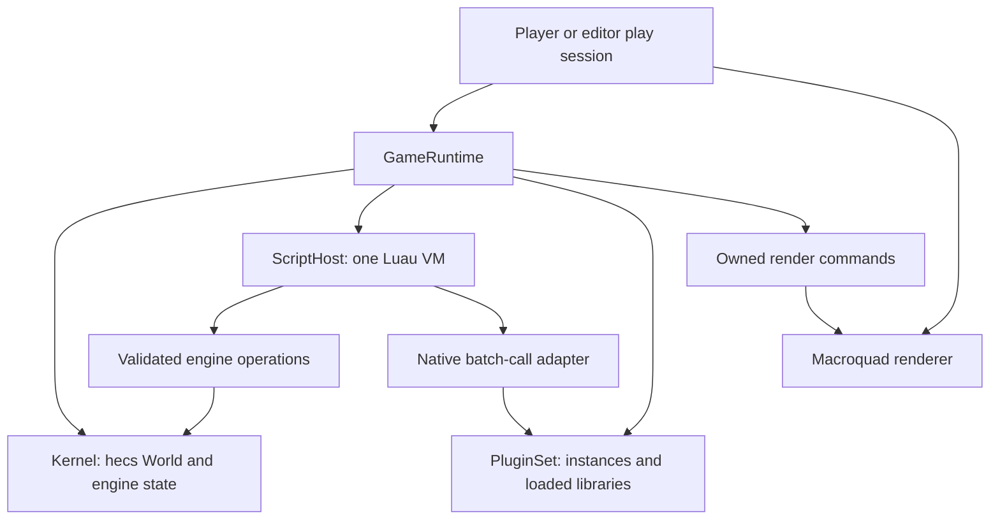

# ADR-001: Luau scripting and the native plugin API

**Status:** Complete on `x86_64-pc-windows-msvc`: D1-D8 and Phases 0-5,
including Phase 1a. Later review corrections and source-loading amendments are
recorded below.
**Date:** 2026-09-05.
**Decider:** Project owner.
**Baseline:** `539659e` (Player, bundle discovery, built-in capture).

This record retains accepted decisions, contracts and delivery evidence. The
[README](../../README.md) describes the current authoring API; the
[development guide](../DEVELOPMENT.md) owns current validation commands.
Dated verification records describe their phase's state, dependencies, commands
and measurements. Later records supersede earlier gaps; they are not fresh test
results. PNG assets and shared rendering were delivered by [ADR-002](PNG_SPRITE_PLAN.md).

## Context and fixed requirements

Protogine shares a kernel/runtime between the Player and future editor. Luau
owns game behavior; trusted C plugins provide synchronous batch computation.
The Player discovers `game/main.luau` beside its executable and supports capture.
The runtime remains usable without graphics.

Required technologies are hecs 0.11.1, mlua 0.12.1 with `luau-jit`, Macroquad
0.4.16, tot 0.2.0 from GitHub, libloading 0.9.0 and Kira 0.12.4 for future audio.
Save schemas, timing and migration belong to scripts. This C API is a plugin
boundary; embedding the whole engine is separate scope.

## Accepted decisions

| ID | Status | First step | Alternative and consequence |
| --- | --- | --- | --- |
| D1 | Accepted 2026-09-05 | One `main.luau` module with init/update/draw callbacks first | Entity-attached scripts immediately also require attachment data, ordering, and per-entity lifecycle rules |
| D2 | Accepted 2026-09-05 | Luau-callable native batch computation with synchronous input/result buffers; command buffers remain a future option | Direct ECS queries/mutations immediately require a much larger stable component and borrowing contract |
| D3 | Accepted 2026-09-05 | One runtime thread; fixed 60 Hz gameplay `update`, with `draw` at the presentation frame rate | Separate variable-rate and fixed-rate update callbacks provide more presentation hooks but require explicit ownership and ordering rules |
| D4 | Accepted 2026-09-05 | First native target to verify: `x86_64-pc-windows-msvc` | Supporting more targets immediately requires matching SDK, loader, dependency, and JIT evidence |
| D5 | Accepted 2026-09-05 | Source modules, explicit native plugin declarations, complete runtime restart | Bytecode distribution, automatic DLL discovery, and live reload each add separate compatibility/lifetime contracts |
| D6 | Accepted 2026-09-05; updated to 0.2.0 at owner request | Use tot for `game/game.tot`; depend on `tot` 0.2.0 from GitHub | Do not use TOML for the manifest or substitute the sibling checkout as the normal dependency |
| D7 | Accepted 2026-09-05 | Scripts own saves; engine may provide filesystem, tot parsing/formatting, and JSON/YAML/TOML export utilities | Engine-owned save schemas, slots, migrations, and save timing are outside the engine contract |
| D8 | Accepted 2026-09-05 | Use `libloading` 0.9.0 for runtime C API plugins | The loader supplies library/symbol access; Protogine still defines ABI and lifetime rules |

Command buffers remain a future option requiring their own ordering and
mutation contract. The completed phase records below freeze the callback,
ABI and resource-limit details.

The tot declaration and optional libloading dependency are implemented:

```toml
tot = { git = "https://github.com/totlang/tot", rev = "031226fdcd930421580161faf6e8755bfba88517", version = "=0.2.0" }
libloading = "=0.9.0"
```

The tot revision matched GitHub HEAD and `v0.2.0` when verified on 2026-09-05
with `git ls-remote`; its package declares version 0.2.0. The version constraint
checks the package version, not a Git tag; `Cargo.lock` records the revision.
`../tot` is a source reference for development, not the shipped dependency source.
The `scripting` feature enables `tot/yaml` and `tot/toml`; the core remains free
of conversion dependencies. The TOML syntax above is for Cargo's own manifest;
game manifests use tot. Historical verification records below retain their
original dependency versions; the upgrade record follows Phase 1a.

## Ownership and dependency boundaries



- `GameRuntime` owns a kernel, VM, plugin instances, lifecycle state, and clock.
  The Player owns window/input polling and rendering; the editor later drives
  the same runtime interface. Constructing or testing a runtime needs no window.
- Kernel/runtime/scripting/plugins and owned draw types live in the shared
  library. Keep `mlua` behind `scripting`, the loader behind `native-plugins`,
  and graphics independent of scripting. Player enables all three.
- Rust owns `hecs::World`; Lua references, plugin pointers and graphics handles
  are not kernel component storage. The separate SDK contains only ABI
  definitions. Add further splits only when needed.
- Run game callbacks, engine systems, and native calls on the runtime thread.
  Never keep a `hecs` query/reference or a Rust dynamic borrow alive across a
  call into game code.

## Luau authoring contract

`main.luau` runs once and returns exactly one plain table with optional
`init`, `update`, `draw` and `shutdown` functions. Unknown fields, metatables
and callback return values are refused. Top-level code may define state and
require modules, but receives no context. A minimal runnable game:

```luau
local x = 16
return {
    init = function(ctx)
        ctx.log("Game started")
    end,
    update = function(ctx, dt)
        x += 24 * dt
    end,
    draw = function(ctx, alpha)
        ctx.draw.clear(0.08, 0.10, 0.13, 1)
        ctx.draw.rect(x, 32, 16, 16, 0.4, 0.8, 0.7, 1)
    end,
}
```

Scoped context functions expire after their callback; returned owned values and
opaque handles may be retained. No yielding or reentrant game callbacks. Only
init/update mutate the world or invoke native computation. Draw reads state and
publishes commands; shutdown performs bounded cleanup after successful init on
normal exit. [Phase 1a](#phase-1a-implementation-contract) defines data/I/O phases;
[ADR-002](PNG_SPRITE_PLAN.md#luau-api-and-drawing-semantics) adds asset operations.

World writes are immediate, and engine systems follow a successful update.
Reads/enumeration return owned snapshots; no ECS/dynamic borrow crosses VM work.
Validate session and generation for opaque handles, and roll back a spawn whose
wrapper publication fails. Never expose pointers or encode full 64-bit entity
handles in Lua numbers. The private cache's exact numeric key is an internal
lookup, not a public handle. See [Phase 2](#phase-2-implementation-contract).

Draw cannot mutate the world; scripts must also keep gameplay upvalue changes
in update. Validate numbers before graphics conversion, bound commands and publish
only successful draws. Fault/stop clears the list; rejected alpha preserves it.

### Time, input, and snapshots

`update(ctx, dt)` and subsequent kernel systems advance `1/60` second per tick.
Each presentation frame samples input, runs zero or more ticks, then draws once.
At 120 FPS there are roughly two draws per tick; at 30 FPS, two ticks per draw.
Ticks are simulation steps, not threads or precisely spaced wall-clock events.

- Accumulate at most 250 ms/frame and run at most five ticks. Discard excess
  whole ticks, retain the fractional alpha and report overloads/clamped time.
- Held state uses the latest sample. Press/release edges wait through zero-tick
  frames, reach only the first catch-up tick and then clear; draw sees its own
  sampled edges. [Phase 2](#phase-2-implementation-contract) specifies explicit
  taps, exact stepping and rounding tolerance.
- `draw(ctx, alpha)` receives fractional tick progress in `[0,1)`. It stores or
  interpolates nothing automatically. Entity traversal order must be explicit;
  hecs query order is not a gameplay contract. A variable-rate presentation hook
  remains separate scope with its own ordering and mutation rules.
- Capture seeds Luau `math.random` with 0 before module load, uses neutral input
  and performs one tick then draw(alpha=0) per rendered frame. Frame N observes
  N completed ticks; startup screens run no simulation. Native state is not
  seeded. [ADR-002](PNG_SPRITE_PHASE0.md#deterministic-validation) adds asset draining.
- Verify state with headless replays and repeated same-stack captures. Selected
  frame numbers alone do not establish determinism; cross-platform float/RNG
  or pixel equality is not promised.

### Modules, resource access, and failures

Ship UTF-8 `.luau` source with bundle-relative traceback names. Require uses
extensionless paths relative to the importer, canonical-file caching once per VM,
and errors for cycles, failed imports, ambiguity and root escapes. Failed results
are not cached. The [Phase 0/1 record](#implementation-record-phases-0-and-1)
freezes resolver/allowlist/limit details; the [BOM amendment](#leading-byte-order-marks-in-module-source-2026-09-07)
accepts one leading encoding signature after checking the on-disk source size.

The game is one trust domain. Scripts have an explicit library/API allowlist
without process execution, network, raw pointers or script-selected DLL loading;
native plugins execute trusted in-process code. VM interrupts cannot preempt
I/O, source/JIT compilation or native functions.

Defaults are 64 MiB VM heap, 1 s for load/init/shutdown, 100 ms for update/draw,
256 KiB/source, 256 compiled modules, 64 active imports, and 4 KiB/message plus
64 KiB/callback logging. Drawing and native buffers have separate limits.
These are guardrails, not performance targets or total process-memory bounds.

Caught VM allocation errors remain recoverable under the heap cap; mlua provides
no host-latched allocation-failure notification. Host-detected deadlines and
resource/native-contract faults latch outside Luau. Uncaught exceptions and
invalid callback results also fault the session. Check every VM interrupt and
host boundary exactly; protected calls cannot clear cancellation.

Faults stop callbacks and skip script shutdown, but release host resources and
native instances. Normal stop runs shutdown once under its deadline. Preserve
primary errors through cleanup. Earlier world writes/upvalue changes are not
transactionally rolled back; restart discards the failed session.

### Structured data, filesystem utilities, and script-owned saves

`game/game.tot` is an optional versioned native manifest; `main.luau` remains
the discovery marker. Scripts own save schema, layout, format, timing, restoration
and migration. The engine provides scoped tot parse/format/export and general
rooted read/list/mkdir/atomic-write operations, with no save lifecycle or automatic
ECS/VM serialization. Player data-directory selection remains future work.

[Phase 1a](#phase-1a-implementation-contract) defines roots, phases, value mappings,
byte/operation bounds and replacement behavior. Preserve integer/float, null/absent
and array/object distinctions; refuse unsupported conversions without silent loss.
Use tot's library JSON/YAML/TOML exporters and TOML `NullPolicy::Error`, not CLI
invocation or copied adapters. Synchronous I/O can stall a tick; scripts choose
when to save and cannot rely solely on shutdown, which faults may skip.

## C plugin API

### Discovery and lifetime

The optional `game/game.tot` declares an ordered list of required plugin IDs and
bundle-relative DLLs. No scanning or hot reload. Resolve/deduplicate all primary
paths, load/query/validate every descriptor, then initialize in manifest order
before VM creation. Failed init cleans itself up and publishes no instance.

[Phase 4](#implementation-record-phase-4) freezes ABI 1, trusted loading and
Windows dependency lookup. An absolute primary path alone does not control
helper DLL lookup. `libloading` supplies library/symbol access; the engine owns
descriptor, instance and teardown rules.

Normal teardown runs bounded Luau shutdown, destroys the VM/references, shuts
down native instances in reverse order, then releases all libraries. Faults/drop
skip Luau shutdown but retain native cleanup. Host pointers are scoped to
synchronous runtime-thread calls; workers must join before return.

### Batch data versus engine command buffers

Native buffers carry computation inputs/results. One call can process a tile
grid or many requests, amortizing FFI and marshaling; a typed Luau wrapper owns
the layout. The accepted synchronous order is:

```text
update(ctx, dt)
  -> native call with batch inputs
  <- batch results
  -> script applies results through immediate engine operations
engine systems
draw(ctx, alpha) -> owned render command list
```

No system runs during the native call and no plugin receives ECS storage.
Internal parallel computation must join before return. The implemented
[distance-field example](../../examples/games/native_distance/SCHEMA.md) computes
one four-neighbor field per call.

Engine command buffers remain a future option: deferred spawn/despawn/set-position
would require explicit ordering, read visibility, entity-ID reservation, failure
rules and flush points. Adding them must revise the immediate-write contract.
Owned render commands defer drawing only; byte-buffer FFI defines no mutation
schedule by itself.

### ABI shape and ownership

ABI 1 uses one `protogine_plugin_query` bootstrap and exact versioned C tables.
The dependency-free [SDK](../../sdk/src/lib.rs) is the source of truth for the
[generated header](../../include/protogine_plugin.h). [Phase 4](#implementation-record-phase-4)
freezes layouts/lifetimes; [Phase 5](#implementation-record-phase-5) freezes calls.
ABI versions are independent of the engine package version.

| Surface | Contract |
| --- | --- |
| Tables | ABI/size prefix, fixed-width statuses/flags, reserved fields, exact target C layout |
| Declarations | Namespaced plugin/function IDs, call pointer, byte schema ID/version; immutable before game init |
| Instance | Plugin-owned opaque state; successful init requires one matching shutdown |
| Host services | Bounded logging on the runtime thread during a host-initiated call |
| Input/output | Host-owned read-only input and disjoint zeroed output scratch, explicit capacities/lengths; valid until return |
| Errors | Fixed-width status and bounded UTF-8 diagnostics in unchanged host-owned storage |

`ctx.native.call(plugin_id, function_id, input, output)` returns written bytes.
Copy VM buffers into host scratch before FFI; publish only a validated success
prefix, preserving the suffix and all output on failure, including aliased VM
buffers. No automatic retry. Recoverable plugin errors must leave instance state
unchanged; panic/contract failure faults the session without claiming rollback.
Use byte-defined encodings, not packed casts or alignment assumptions.

Keep unsafe code localized. Use `extern "C"`, `#[repr(C)]`, explicit lengths and
opaque pointers; no Rust collections/references, trait objects, ECS or VM internals.
No unwind, C++ exception or Lua longjmp may cross C. SDK shims catch unwind panics
and guard payload disposal; aborts, corrupt pointers and hangs remain process
failures. The loader cannot undo DLL initializer side effects.

Libraries stay loaded through every reachable descriptor, function and instance.
No native reentry into Luau. Future append-only ABI extensions need explicit size
negotiation/tests; struct size alone promises no compatibility. Measure the full
typed path, including copies, before proposing zero-copy or direct ECS access.

### Alternatives and consequences

- **Expose Luau's C stack API:** Convenient for existing Lua bindings, but couples
  plugins to VM internals/version and undermines an engine-owned ABI. Defer.
- **Expose hecs storage directly:** Avoids some copying, but freezes internal
  layouts and makes borrowing, structural changes, and lifetime rules public.
  Prefer a future explicit batch/query API if measurements justify it.
- **Function tables over exported engine symbols:** Slightly more bootstrap code,
  but supplies explicit version negotiation and the same host contract in Player
  and editor. This is the accepted design.
- **Batch buffers before a universal variant/value system:** Less ergonomic at
  the lowest level, but a smaller stable interface and measurable copying costs.
  Typed Luau wrappers supply ordinary game-facing functions.

## Implementation phases and stop gates

Each phase is a reviewable slice. Update this plan with decisions, exact commands,
evidence, and outstanding limits before advancing. Do not expand to entity script
scheduling or direct ECS plugins implicitly while implementing the smaller APIs.

| Phase | Deliverable | Exit evidence / stop gate |
| --- | --- | --- |
| 0. Feasibility and contract freeze | Implement accepted D3 and freeze initial lifecycle details; compile exact hecs/mlua versions and Luau JIT; verify tot Git pin/API and specify module/limit policies | Tiny typed-Luau call with verified JIT execution, error traceback, interrupt and allocation-limit probes (including JIT loops and `pcall`); parse a tot manifest fixture; verify native C/C++ toolchain and target; stop on any required-version mismatch |
| 1. Shared scripting host | One VM, entry table, resolver, lifecycle and fault state; headless runtime tests | Init exactly once; normal/failed teardown; invalid callback shapes, import cycles/escapes, infinite loop, allocation failure, and stale context; no graphics dependency |
| 1a. Script data utilities | tot bindings, filesystem helpers, script-owned save/load example; choose exporter adapters before adding JSON/YAML/TOML support | Freeze path/value/conversion contracts; test null/large integers/empty collections, unsupported target values, denied I/O, and failed replacement preserving the old file; a script round-trips its chosen save data without engine save semantics |
| 2. Kernel-facing API | Fixed ticks/input, opaque entity handles, minimal concrete components, immediate mutation rules | Spawn/read/change/despawn; stale and cross-session rejection; no borrows across callbacks; catch-up edges consumed once; fixed-input state replay |
| 3. Scripted Player and captures | Renderer-independent clear/rectangle commands, sample game, real runtime in Player | Sample source changes work without rebuilding engine; sample moves a visible tile; copied Player runs outside repo; same seeded state and screenshot repeat; first-frame text still correct |
| 4. C ABI and loader | Dependency-light SDK definitions, generated C header, tot plugin manifest, `libloading` 0.9.0, version negotiation and teardown | Independently compile a C plugin against only the header; assert layout in C and Rust; test malformed/unsupported manifest, wrong ABI/size, missing symbol/DLL/dependency, duplicate IDs, failed init, reverse teardown, and missing required plugin |
| 5. Luau/native integration | Buffer adapter, typed Luau wrapper, one useful batch computation | Compare pure-Luau/native results; invalid lengths/capacity/status; failed call cannot publish output; both Player and headless host use the same bridge; published benchmark method includes copying |

Phase 4 pins cbindgen 0.29.2 in the separate header-generation tool; the loader is
fixed at `libloading` 0.9.0.
Keep Rust ABI definitions as the header's source of truth and check regeneration
for drift. Do not invent arbitrary API symbols beyond the reviewed bootstrap and
minimum tables just to fill out an SDK.

The distance-field example supplies the selected workload. Its
[benchmark](../../examples/games/native_distance/BENCHMARK.md) records release
median/p95, sizes, machine, marshaling/copies and observed crossover. Correctness
is mandatory; a measured speedup is not an acceptance requirement.

### Compatibility and verification

Preserve missing/unavailable startup captures, dimensions, capture controls and
exit codes: 0 success, 1 capture failure/interruption, 2 invalid configuration,
3 game load/runtime/plugin fault. Saving a diagnostic PNG cannot turn a fault
into success. Run the applicable [development checks](../DEVELOPMENT.md) for
implementation changes and state unverified platform/toolchain/graphics limits.

Audio, tile-map authoring, editor UI/export, entity script attachments,
asynchronous scripts/native work, custom plugin components, direct ECS views,
hot reload, archive bundles, engine embedding, zero-copy/command buffers and
Player writable-data selection remain outside this milestone. Native scratch
allocation-refusal paths are source-reviewed but lack deterministic allocator
injection. Other native targets remain unverified. Saves/migrations remain game
responsibilities, not deferred engine features.

## Planning evidence

- Local baseline: Rust 1.95.0, host `x86_64-pc-windows-msvc`; clang/clang-cl and
  gcc are discoverable. Initial planning did not build mlua/JIT or a C plugin.
  Subsequent Phase 0/1 build and execution evidence is recorded below. The initial
  Player and capture checks belong to baseline `539659e`.
- The published [mlua feature list](https://docs.rs/crate/mlua/0.12.1/features)
  identifies 0.12.1 and `luau-jit`. Its
  [VM API](https://docs.rs/mlua/0.12.1/mlua/struct.Lua.html) supplies custom Luau
  require, scoped bindings, sandbox, memory-limit, and interrupt mechanisms.
  Phase 0 subsequently verified the selected build; documentation alone was
  not execution proof. Links are pinned to the inspected release.
- [Luau embedding guidance](https://luau.org/sandbox/) explains source/bytecode
  trust, restricted standard libraries, and the limits of interrupting native
  calls. These constraints motivate engine-owned module and plugin loading.
- [hecs World](https://docs.rs/hecs/0.11.1/hecs/struct.World.html) documents dynamic
  borrow checks, arbitrary query order, and entity reuse; the runtime must supply
  ordering and session-handle rules.
- [Godot processing](https://docs.godotengine.org/en/stable/tutorials/scripting/idle_and_physics_processing.html)
  and [Unity fixed updates](https://docs.unity3d.com/6000.0/Documentation/Manual/fixed-updates.html)
  distinguish frame callbacks from fixed simulation steps. They explain the
  timing analogy for D3, not a requirement to copy either engine's full API.
- The inspected local tot checkout was clean and matched GitHub HEAD
  `2f407897f985654cdbb6201ad01ba05216a6e3d7`, verified with `git ls-remote`.
  Its [Cargo manifest](https://github.com/totlang/tot/blob/2f407897f985654cdbb6201ad01ba05216a6e3d7/Cargo.toml)
  declares version 0.1.0. The
  [library API](https://github.com/totlang/tot/blob/2f407897f985654cdbb6201ad01ba05216a6e3d7/src/lib.rs)
  and [CLI converters](https://github.com/totlang/tot/blob/2f407897f985654cdbb6201ad01ba05216a6e3d7/cli/src/convert.rs)
  established the parser/export split at the planning baseline. The upgrade
  record below replaces that dependency with tot 0.2.0 and library exporters.
- [libloading](https://github.com/nagisa/rust_libloading)
  documents unsafe loading, initializer execution, symbol typing, and library
  lifetime. Version 0.9.0 was selected at planning and added in Phase 4.
- The [Rust FFI guidance](https://doc.rust-lang.org/nomicon/ffi.html) is the
  reference for ABI layout, ownership, callback lifetimes, and unwinding rules.

## Implementation record: Phases 0 and 1

The shared `scripting` feature now provides `ScriptHost`, independent of graphics.
It loads a game directory, validates one plain callback table, and supports
Loaded -> Running -> Stopped or terminal Faulted state. The sample in
`examples/games/lifecycle` runs through `examples/script_host.rs`. The Player
continues to show startup states; integration is Phase 3.

Contracts finalized in this slice:

- `init()` runs once; `update()` passes `dt = 1/60`; `draw(alpha)` validates finite
  `[0, 1)` interpolation; `shutdown()` runs once after successful init on an
  orderly stop. No callbacks after a fault, implicit script execution on drop,
  callback return values, or public coroutine API. `ctx.log` is the first host
  operation and its scoped function expires after each call.
- The explicit standard-library allowlist is Luau's sandboxed base functions plus
  `table`, `string`, `utf8`, `math`, `bit32`, `buffer`, `vector`, and `debug`.
  Retain Luau's diagnostic-only `debug.info` and `debug.traceback` for game-authored
  diagnostics. Host error tracebacks do not depend on that library. This is Luau's
  two-function subset: no registry access, local/upvalue mutation or hooks. Remove
  `loadstring`, `getfenv`, `setfenv`, `collectgarbage`, `newproxy`, and `print` from
  the base environment; logging uses scoped `ctx.log`.
- Require uses mlua's Luau resolver with canonical bundle-root validation and
  canonical file cache keys. Extensionless relative path segments select UTF-8
  `.luau` files; aliases, dotted segments, directory init modules, and escaping
  junctions/symlinks are rejected. A file and same-named directory inside the
  bundle are ambiguous; sibling files outside the bundle do not affect its root.
  Modules return one value. Cycles are errors; failed results are not cached;
  compiled source and successful values persist until the VM is replaced.
  A Rust scope guard releases active imports on success, error, and cancellation,
  including allocation failures during module execution or return processing.
  Bundle files are assumed stable during execution, not concurrently hostile.
- Limits: 64 MiB VM heap; 1 second load/init/shutdown execution; 100 ms update/draw;
  256 KiB/source; 256 compiled modules; 64 active imports including main;
  4 KiB/log message and 64 KiB/log bytes per callback including separators.
  VM interrupts cannot preempt I/O, compiler/JIT work, or a native call; module
  preparation is checked when control returns to the VM/host. The VM heap budget
  does not cover all host/codegen allocations.
- VM allocation failures are catchable and may be handled by scripts while the
  heap cap remains enforced. Uncaught failures fault the host. Host-detected
  deadline/source/import/log failures are latched and cannot be cleared by pcall.
- Deadline cancellation uses a private Rust unwind payload and mlua's
  `catch_rust_panics(false)` option. mlua transports it through protected VM
  errors and resumes it at the Rust boundary, where only that payload is caught.
  Unexpected Rust panics continue unwinding. Scripting rejects `panic=abort`.
  An interrupt yield alone was experimentally insufficient: a nested protected
  loop in `__tostring` exceeded the independent watchdog. The current host exits
  this fixture within its callback deadline. No Rust panic crosses the future
  plugin C ABI; this mechanism is internal to the mlua embedding boundary.

Verified evidence:

- Exact dependencies compile: hecs 0.11.1, mlua 0.12.1 (`luau-jit`), tot 0.1.0
  from the pinned GitHub revision. Cargo resolves mlua-sys 0.12.0 and
  luau0-src 0.21.0+luau736. `Cargo.lock` records these sources.
- `tests/scripting_feasibility.rs` proves native Luau execution via the public
  `lua_incustomexecution` API, with JIT disabled as a negative control. It checks
  tracebacks, VM allocation failure, actual native-frame interruption, and the
  production host's protected-call, import, and metamethod cancellation.
  Each potentially runaway fixture has an independent 10-second process timeout.
- `tests/scripting.rs` covers lifecycle/fault transitions, callback schema,
  fixed dt, invalid alpha, stale context functions, import caching/retry/cycles,
  entry execution exactly once, source stability, host-owned import guards,
  allocation-error retry, sibling-file isolation, Windows case aliases and
  junction escape. The sample prints ticks at 0.016667, 0.033333, and 0.050000 seconds.
- The C and C++ fixture compiled and ran successfully on
  `x86_64-pc-windows-msvc` using clang with `-std=c11` and `-x c++ -std=c++17`:
  `tests/fixtures/native_toolchain.c`, outputs `target/phase0/c-probe.exe` and
  `target/phase0/cpp-probe.exe`. This checks the toolchain and elementary layout,
  not a plugin ABI or dynamic loader, which remain Phase 4.

Completed checks on 2026-09-05:

```text
cargo fmt --all -- --check
cargo check --workspace --all-targets
cargo check --workspace --all-targets --all-features
cargo test --workspace
cargo test --workspace --no-default-features
cargo test --workspace --no-default-features --features scripting
cargo clippy --workspace --all-targets -- -D warnings
cargo clippy --workspace --all-targets --all-features -- -D warnings
cargo build --release --bin protogine-player
cargo test --release --no-default-features --features scripting --test scripting --test scripting_feasibility
cargo run --example script_host --no-default-features --features scripting -- examples/games/lifecycle
```

All passed. The final scripting tests pass in debug and release: 15 behavioral
tests and 17 isolated feasibility/resource probes. Existing bundle and Player
unit tests pass; the opt-in GPU smoke test was not rerun because this slice does
not change Player rendering or capture. Other native platforms are unverified.

The sibling-file and allocation-retry regressions both failed against `db0a7c2`
and pass after the resolver fixes. The checks above were rerun after those fixes.

The standalone host supplies constant dt only. The Phase 2 record below covers
kernel systems and real-time accumulation; invoking draw still supplies no renderer.

## Phase 1a implementation contract

This slice adds scoped `ctx.data` and `ctx.fs` utilities. It does not wire the
Player or interpret a plugin manifest; manifest schema validation remains Phase 4.

- `data.parse(text)` and `data.format(value)` use the pinned tot library.
  `data.export(value, format)` uses tot 0.2.0's JSON/YAML/TOML library APIs.
  The `scripting` feature enables tot's YAML/TOML converters. Direct `yaml_serde`
  and `toml` dependencies are test-only, for independent output parsing.
  TOML is only an export target; `game.tot` remains tot.
- Ordinary Luau tables are string-keyed objects; `data.array(table)` marks a
  dense one-based array, including empty arrays. It checks keys only; format/export
  validate elements. Parsed arrays retain this tag.
  `data.null` is a distinct immutable value; nil means an absent object member
  and cannot stand for a data value. `data.integer(decimal_text)` preserves
  arbitrary integers in immutable userdata with a `.text` field. All ordinary
  Luau numbers represent finite floats; parsing floats normalizes them to f64.
  `data.number(integer_userdata)` converts integer userdata only within the safe
  range `[-(2^53-1), 2^53-1]`; finite ordinary Luau numbers pass through unchanged.
  `data.kind(value)` reports the data kind.
  Object keys are sorted for repeatable output; source order/comments/float
  spelling are not preserved. Mixed/sparse tables, cycles, custom metatables,
  unsupported userdata, invalid UTF-8, and nonfinite numbers are errors.
- JSON retains integer digits; downstream readers may round them. YAML export
  rejects integers outside signed/unsigned 64-bit range. TOML requires an object
  root, rejects null anywhere and integers outside signed 64-bit range. Export
  uses f64 floats; there is no implicit omission or lossy integer conversion.
  TOML selects `NullPolicy::Error`. Conversion diagnostics use tot paths with
  zero-based indices; Luau arrays remain one-based.
- `ScriptHost::load` grants only bundle reads. `load_with_data_root` additionally
  accepts an existing absolute writable directory. Both roots are canonicalized
  and must be disjoint. The host selects the location; no process-working-directory
  or implicit platform-data-directory policy is introduced in this slice.
- `fs.read(root, path)` returns binary-safe Luau strings; `fs.list(root, path)`
  returns sorted `{name, kind}` entries. Root names are `bundle` and `data`.
  `fs.mkdir(path)` creates data subdirectories; `fs.write(path, bytes)` creates or
  replaces a data file atomically using a synced tempfile in the destination
  directory. Failed replacement preserves the previous file; crash durability
  of the directory entry is not promised. `fs.write` requires existing parent
  directories; `fs.mkdir` creates intermediate directories as needed.
  Writes/mkdir are allowed only in init/update/orderly shutdown; reads/list are
  also available in draw. All function references expire with their callback.
  Listing classifies links, unrepresentable names and other nodes as `unsupported`
  without hiding siblings; traversal stays refused. Failed mkdir unwinds only
  directories created by that call, preserving existing or nonempty directories.
- Paths use portable relative `/` segments, at most 4096 UTF-8 bytes; absolute,
  empty file paths, dot/parent segments, backslashes, Windows device names,
  trailing dots/spaces, and reserved characters are rejected. Empty paths select
  a root only for listing. Symlinks/reparse points below either root are refused.
  Root trees must not be concurrently replaced by another process; these helpers
  do not claim an OS security boundary against hostile filesystem races.
- Limits: 1 MiB per file/data input/output and per converted tree's string bytes,
  16,384 data nodes, nesting 64, 1024 directory entries, 128 utility call attempts
  (including malformed or missing arguments) and 8 MiB of file transfer per
  callback. Resource/deadline failures latch a session
  fault; ordinary validation/conversion/I/O failures are catchable. Parsing,
  conversion, and synchronous I/O cannot be preempted while inside native code.

Immutable integer userdata retains its text as a VM string; mutable data lives
in VM tables. This avoids a second unbounded persistent Rust-owned data heap.
The alternative of a Rust-owned document API would preserve all source number
lexemes but complicate ordinary Luau editing and require separate heap accounting.

### Phase 1a verification record — 2026-09-05

Implemented in `src/scripting/data.rs`, `data/export.rs`, `filesystem.rs`, and
`utilities.rs`; bindings are added by the shared host. At this phase Cargo pinned
yaml_serde 0.10.7 and toml 1.1.4 as adapters, with tempfile 3.27.0 for same-directory
file replacement. The tot 0.2.0 upgrade below replaces the adapters.
The selected libraries provide in-process serializers
([yaml_serde](https://docs.rs/yaml_serde/0.10.7/yaml_serde/),
[toml](https://docs.rs/toml/1.1.4/toml/)) and a replacement operation
([tempfile persist](https://docs.rs/tempfile/3.27.0/tempfile/struct.NamedTempFile.html#method.persist));
their local implementation and actual Windows behavior were also checked.

The 13 new `scripting_utilities` tests pass in debug and release. They cover
null/empty collections, integer precision and export ranges, independent
YAML/TOML parsing of exported output, invalid values and cycles, rooted binary
I/O, path restrictions, junction refusal, draw permissions, expired functions,
retained values, and byte/node/depth/call/list/transfer limits. A locked Windows
destination rejects replacement, preserves the original bytes, and leaves no
temporary file. A denied read is recoverable. Resource failures remain latched.
Nesting tests cover arrays and objects at depth 64 (accepted), 65/128 (engine
limit), and 129/256 (tot's parser limit). Catching either depth failure cannot
permit a following write; ordinary syntax errors, including diagnostics quoting
the parser's depth message, remain recoverable. The wrapper classifies the exact
pinned tot diagnostic because this revision has no typed error kind; recheck the
classification and boundary tests when updating tot.

`examples/games/persistence/main.luau` owns its schema, validation, filenames,
restoration, and write timing. Two actual example runs against
`target/phase1a-example-data` produced `Loaded 0 ticks` / `Stored 3 ticks`, then
`Loaded 3 ticks` / `Stored 6 ticks`. The test also proves that an unsupported
schema leaves existing data untouched. No engine save policy was added.

All passed:

```text
cargo fmt --all -- --check
cargo check --offline --workspace --all-targets
cargo check --offline --workspace --all-targets --all-features
cargo test --offline --workspace
cargo test --offline --workspace --no-default-features
cargo test --offline --workspace --no-default-features --features scripting
cargo clippy --offline --workspace --all-targets -- -D warnings
cargo clippy --offline --workspace --all-targets --all-features -- -D warnings
cargo build --offline --release --bin protogine-player
cargo test --offline --release --no-default-features --features scripting --test scripting --test scripting_feasibility --test scripting_utilities
cargo run --offline --example script_host --no-default-features --features scripting -- examples/games/lifecycle
cargo run --offline --example script_host --no-default-features --features scripting -- examples/games/persistence target/phase1a-example-data
```

The persistence command ran twice. The existing 15 scripting behavior tests,
17 isolated probes, and bundle/Player unit tests also pass. Player rendering and
capture are unchanged; the opt-in GPU capture was not rerun. Filesystem behavior
on other targets and crash durability remain unverified. Platform data-directory
selection remains the embedding application's responsibility; plugin manifest
interpretation is Phase 4.

### tot 0.2.0 upgrade record — 2026-09-05

Pinned GitHub revision `031226fdcd930421580161faf6e8755bfba88517`, matching
upstream HEAD, `v0.2.0`, and the inspected sibling checkout. Replaced copied
YAML/TOML adapters with `tot::yaml::to_string` and `tot::toml::to_string`, selecting
`NullPolicy::Error`. No Luau import API was added; `data.parse` still reads tot.
Upstream conversion errors now use tot paths with zero-based indices instead of
the former `$` paths with one-based indices. Integer/null/root restrictions,
sorted output, utility budgets, and scoped filesystem access remain in force.
The parser's exact depth diagnostic is unchanged and its boundary tests pass.

All 15 scripting utility tests pass in debug and release, including added signed
integer boundaries, null refusal inside arrays, quoted diagnostic paths, and
successful export after a caught refusal without mutating the input. Independent
YAML/TOML parsers verify output types. `cargo tree --no-default-features -e normal`
confirms the core has only hecs and dependency-free tot; scripting enables the
two converter features. The lockfile changes only tot's revision/version and its
converter dependency edges.

Passed on Windows MSVC x64 with Rust 1.95.0 (tot requires Rust 1.88):

```text
cargo fmt --all -- --check
cargo check --workspace --all-targets
cargo check --workspace --all-targets --all-features
cargo test --workspace
cargo test --workspace --no-default-features
cargo test --workspace --no-default-features --features scripting
cargo clippy --workspace --all-targets -- -D warnings
cargo clippy --workspace --all-targets --all-features -- -D warnings
cargo build --release --bin protogine-player
cargo test --release --no-default-features --features scripting --lib --test kernel --test runtime --test drawing --test scripting --test scripting_feasibility --test scripting_utilities
cargo run --example script_host --no-default-features --features scripting -- examples/games/lifecycle
```

The default workspace suite initially hit sandbox-denied Clang access; its rerun
with compiler access passed, including native plugin fixtures. Opt-in GPU captures
were not rerun; rendering/input code is unchanged. Other targets remain unverified.

## Phase 2 implementation contract

The shared, headless `GameRuntime` wraps `ScriptHost` and a private
hecs world. Keep standalone `ScriptHost` calls available for VM/data tests; only
`GameRuntime` supplies `ctx.world` and `ctx.input`. Player wiring and drawing
commands remain Phase 3.

- Every entity has `Position { x, y }` in world pixels and `Velocity { x, y }` in
  pixels/second, stored as finite f64 values. Spawn takes a position and starts
  with zero velocity. No tile/map, collision, or generic component API yet.
- `ctx.world.spawn(x, y)`, `despawn(entity)`, `position(entity)`,
  `set_position(entity, x, y)`, `velocity(entity)`, `set_velocity(entity, x, y)`,
  and `entities()` are the initial operations. Reads return owned `{x, y}` tables;
  enumeration is an owned array ordered by the internal entity identifier.
  Handles are opaque userdata, with session identity and hecs generation checks.
  Despawn/reuse, cross-session use, and stopped/faulted sessions reject access.
  A private VM table with weak values canonicalizes retained wrappers by session
  and generation, including when handles are Luau table keys. Unreferenced
  wrappers/cache entries can be collected. After the cache-key correction below,
  private keys pack (session index, hecs slot) into exact numbers below 2^52;
  retained session markers prevent address reuse, `SESSION_LIMIT` is 2^20, and
  each hit compares the full handle to reject a reused slot. Keys are neither
  script-facing IDs nor persisted data.
- Init/update mutations are immediate. Draw/shutdown permit world reads only.
  Each operation releases Rust/hecs borrows before VM allocation or return to
  script code; retained functions expire while returned handles/values may live
  across callbacks. Callback failure does not roll back earlier mutations.
  A spawn whose wrapper/cache publication fails removes its unpublished entity
  before returning the error; caught allocation failures cannot leave an extra
  live entity behind.
- After each successful update, integrate `position += velocity * (1/60)` once.
  Validate all resulting positions before committing the system's changes.
  Nonfinite results fault the session; no engine systems run after a failed
  callback. No gameplay behavior depends on hecs traversal order.
- Cap live entities at 16,384 and world call attempts at 4,096 per callback,
  including malformed or missing arguments. Both limits latch session faults even
  through protected calls. Invalid handles,
  nonfinite arguments, and phase violations are ordinary catchable errors.
- Input uses six logical buttons: `up`, `down`, `left`, `right`, `action`,
  `cancel`. The application supplies held/pressed/released sets; the runtime
  also derives edges from held-state transitions. Explicit edges preserve taps
  occurring between samples. Physical key/controller mapping remains Player work.
  Scripts read `ctx.input.held(name)`, `pressed(name)`, and `released(name)`.
- Frames accumulate pending edges until a tick consumes them; only the first
  catch-up tick receives those edges. Held state uses the latest sample. Draw
  sees that frame's sampled edges independently of tick consumption; init and
  shutdown see neutral input. Repeated edges before a tick coalesce to booleans.
- `frame(elapsed_seconds, input)` validates finite nonnegative time, clamps to
  250 ms, runs at most five fixed ticks, discards excess whole ticks, and draws
  once with the retained fractional alpha. Its report includes completed ticks,
  discarded ticks, clamped seconds, and alpha; the runtime counts overloaded
  frames. Invalid arguments leave state and queued input untouched.
  Accumulated tick values within `1e-12` of a positive integer are normalized to
  that integer before counting ticks (about 17 femtoseconds of tolerance).
  Ordinary fractional time is retained; tiny inputs near zero still accumulate.
- `step(input)` runs exactly one tick without drawing or altering the frame
  accumulator; `draw(alpha)` draws separately. These support headless replay and
  future capture. Completed-tick counts advance only after callback and systems
  succeed. Fixed input replay tests compare owned, ordered world state on this
  target; no cross-platform floating-point or RNG determinism claim is made.

Exit evidence: real Luau spawn/read/change/despawn and velocity integration;
stale/cross-session/stopped handle refusal; mutation permissions and expired
functions; catchable validation versus latched limits; fault ordering; zero-tick
and catch-up edge handling; overload/remainder/invalid-time boundaries; repeated
fixed-input state replay. Run the existing default/headless/all-feature checks
and debug/release scripting suites, plus the new kernel/runtime tests.

### Phase 2 verification record — 2026-09-05

Phase 1a was committed as `a74e72c` before this slice. Phase 2 adds `src/kernel.rs`,
`src/input.rs`, `src/runtime.rs`, and `src/scripting/world.rs`; the headless runner
now drives `GameRuntime`. No dependencies or Player rendering code changed.

Four kernel tests, thirteen runtime tests, and three internal Luau bridge tests pass in
debug and release. They verify owned snapshots, immediate mutations, generation
and session rejection (including a foreign handle injected into Luau), stopped
session refusal, phase restrictions, expired functions, finite-value validation,
atomic system overflow refusal, latched operation/entity limits, and lifecycle
fault ordering. Tests consume press/release edges once across catch-up, preserve
taps through zero-tick frames, isolate draw input, reject invalid time without
changing queued input, and retain the fraction while dropping overload ticks.

`examples/games/movement/main.luau` moves through the real hecs system. Replaying
half a second right followed by half a second down at 30, 60, 100, 120, 144, 180,
and 240 FPS completes 60 ticks at `(46, 46)` from `(16, 16)`; another 30 FPS run
matches. The lifecycle
example still logs three ticks. Two actual persistence runs through GameRuntime
against a fresh data directory restore 0 then 3 ticks and leave version 1/ticks 6.

All passed:

```text
cargo fmt --all -- --check
cargo check --offline --workspace --all-targets
cargo test --offline --workspace
cargo test --offline --workspace --no-default-features
cargo clippy --offline --workspace --all-targets -- -D warnings
cargo build --offline --release --bin protogine-player
cargo test --offline --workspace --no-default-features --features scripting
cargo check --offline --workspace --all-targets --all-features
cargo clippy --offline --workspace --all-targets --all-features -- -D warnings
cargo test --offline --release --no-default-features --features scripting --lib --test kernel --test runtime --test scripting --test scripting_feasibility --test scripting_utilities
cargo run --offline --example script_host --no-default-features --features scripting -- examples/games/lifecycle
cargo run --offline --example script_host --no-default-features --features scripting -- examples/games/movement
```

Player capture/rendering was unchanged, so the opt-in GPU smoke test was not
rerun. Rendering commands, physical input mapping, seeded game capture, and
Player integration are Phase 3. Other platforms remain unverified.

The Phase 2 review regressions failed before remediation: enumeration returned
distinct userdata table keys, 100/144 FPS replay completed 59 ticks, and caught
spawn allocation failure left one extra entity alive. All pass after the fixes
in debug and release. Negative controls cover stale handles after slot reuse,
cross-session cache keys, identity retained through garbage collection, unused
cache entries being collected, fractions on either side of a tick outside the
tolerance, and accumulation of tiny time inputs. Allocation-pressure tests use
both 1 MiB and the default 64 MiB VM limits; an injected cache-write failure also
proves rollback after userdata allocation and successful retry afterward.

## Implementation record: Phase 3

### Contract frozen before implementation

- `player` enables `scripting`. The Player loads and initializes the discovered
  bundle once, drives `GameRuntime`, and renders owned commands. Missing and
  inaccessible bundle screens retain their existing presentation and exit codes.
- `ctx.draw` exists only during draw. `clear(r,g,b,a)` and
  `rect(x,y,w,h,r,g,b,a)` append owned commands, capped at 10,000 per draw;
  exceeding the cap latches a session fault even through protected calls.
  Colors are finite in `[0,1]`; pixel coordinates are finite in
  `[-1_000_000,1_000_000]`; sizes are finite in `[0,1_000_000]`.
  Conversion to f32 occurs after validation. Invalid arguments are recoverable.
  Context tables are read-only and functions expire after the callback.
- Each draw starts empty and publishes commands only on success. Fault/stop
  clears published commands. Frames start opaque black; a clear replaces all
  preceding drawing, and subsequent rectangles composite in insertion order.
  Headless hosts expose the same commands without graphics dependencies.
- Interactive input maps arrows to directions, Space to action, and Backspace
  to cancel. Escape remains Player exit. Poll held/pressed/released once per
  frame; `GameRuntime` owns fixed timing and edge consumption. Prevent native
  immediate quit so orderly window-close/Escape runs shutdown once.
- Capture loads with Luau's `math.random` seed 0 before any game module executes,
  performs one neutral-input fixed tick followed by draw(alpha=0) per frame,
  and captures frame N after N completed ticks. Explicit script reseeding or
  external file changes remain script inputs, not engine determinism guarantees.
  Interactive sessions retain the VM's default random initialization.
- Load/init/update/draw/system faults show a fixed Game error screen, report
  source/callback details to stderr, stop callbacks, and exit with code 3 even
  when a diagnostic PNG is saved. A fault takes precedence over a simultaneous
  capture-write failure (both errors are reported). Shutdown runs before saving
  the final capture so shutdown failure produces a diagnostic PNG and code 3.
  Normal capture failure/interruption stays 1; bad configuration stays 2.
- This slice supplies no Player writable data root; bundle reads and data
  conversion work, while writes require the existing explicit root host API.
  Platform data-directory selection, manifest schema and plugin loading remain
  separate work. The sample uses no filesystem writes or external assets.

### Implementation and verification

`DrawCommand` lives in the graphics-independent `drawing` module. ScriptHost
owns the published list, and GameRuntime exposes it to the Player/headless caller.
Scoped draw bindings accumulate a temporary list and publish only after callback
success. `load_seeded` initializes Luau's math RNG before require/bootstrap runs.
The Player renders commands using Macroquad and retains the static fallback/font
warmup path. `examples/games/tiles` supplies a grid and a moving, controllable tile;
its imported palette exercises module-time randomness.

Verified on `x86_64-pc-windows-msvc`:

- Five headless drawing tests pass in debug/release: owned ordered commands,
  empty-frame replacement, expired/read-only contexts, numeric and permission
  validation, exact command cap plus protected-call overflow, failed publication,
  update/system faults, stop cleanup, seeded sample replay and input controls.
  Two seed-0 replays yield identical command lists and position `(124,128)` after
  60 ticks; seed 1 changes the palette while preserving motion. Pause/direction
  inputs provide negative controls for state replay.
- The expanded opt-in GPU test runs the actual copied Player from a temporary
  distribution outside the repository, with a decoy bundle in an unrelated cwd.
  It verifies frame-1 startup text, dimensions, startup states, PNG write/config
  errors, frame-1/frame-60 tile positions, byte-identical repeated seed-0 PNGs,
  source palette edits without rebuilding, clear ordering/alpha blending, and
  an empty subsequent frame. Load/init/update/draw/system/deadline/shutdown faults
  save the same diagnostic screen and exit 3; simultaneous capture failure retains
  code 3 and reports both errors. Normal capture runs shutdown once.
- Release missing/unavailable captures match the pre-Phase-3 Player byte for
  byte, including first-frame font rendering. Missing PNG SHA-256:
  `270f3b8cac72e32970352cc1421aee0f0a1e83c03357441c2aae2d49097afc93`;
  unavailable: `b65afdcf94f74b874e72d7254ea263fc5bc8421e17d4b510b42b4c8858a3f336`.
  Release tile and missing screenshots were visually inspected; local artifacts
  are under ignored `target/phase3-proof/`.
- The checked-in [Windows event probe](../../tests/player_input.ps1) uses a
  [Luau fixture](../../tests/fixtures/player_input.luau) against the copied release
  Player. It verifies each physical key's logical mapping, held state and exact
  press/release sequence. Window-close and Escape each run shutdown once and
  exit 0; a shutdown fault on window-close exits 3 with the source traceback.
  A negative control swapping Left/Right expectations fails; invalid inherited
  capture/dimension settings are excluded and restored in the caller afterward.
  These are injected OS events, not a manual keyboard playtest. Other platforms
  remain unverified.

Commands passed (dependencies already cached, so offline):

```text
cargo fmt --all -- --check
cargo check --offline --workspace --all-targets
cargo test --offline --workspace
cargo test --offline --workspace --no-default-features
cargo clippy --offline --workspace --all-targets -- -D warnings
cargo build --offline --release --bin protogine-player
cargo test --offline --workspace --no-default-features --features scripting
cargo check --offline --workspace --all-targets --all-features
cargo clippy --offline --workspace --all-targets --all-features -- -D warnings
cargo test --offline --release --no-default-features --features scripting --lib --test kernel --test runtime --test drawing --test scripting --test scripting_feasibility --test scripting_utilities
cargo run --offline --example script_host --no-default-features --features scripting -- examples/games/lifecycle
cargo test --offline --test player_capture -- --ignored
```

No new dependencies or lockfile changes were needed. Kira/audio, data-directory
selection for the Player, the versioned tot manifest/C loader, native batch calls,
and editor/export tooling have not been implemented by this phase.

The independent-review follow-up corrected the README's feature description,
release drawing test command and wrapping, removed the redundant loop-entry exit
status write, and promoted the input probe into the repository. The Rust checks,
release scripting suites (including drawing), GPU captures and the new probe
passed after remediation. Run the probe with PowerShell 7 on Windows after
building the release Player:

```powershell
pwsh -NoProfile -File tests/player_input.ps1
```

## Implementation record: Phase 4

### Contract freeze

- ABI 1 targets `x86_64-pc-windows-msvc`, default C alignment and `extern "C"`.
  The dependency-free `protogine-plugin-api` SDK is the source of truth;
  `cbindgen = 0.29.2` generates `include/protogine_plugin.h` through the separate
  `protogine-headergen` development tool. Exact versions, table sizes, zero
  flags/reserved fields, non-null callbacks and descriptor IDs are validated.
  No implicit append-only compatibility is claimed. Rust/C layout assertions
  and `cargo run -p protogine-headergen -- --check` gate header drift.
- One exported `protogine_plugin_query` copies a descriptor into host storage.
  Tables describe init/shutdown and immutable function declarations with IDs,
  schema IDs/versions, and synchronous byte-buffer call signatures. This phase
  validates the declarations; invoking batch calls and Luau buffers is Phase 5.
  IDs are at most 128 ASCII bytes: at least two dot-separated segments, each
  beginning with a lowercase letter and continuing with lowercase letters,
  digits or underscores. Schema versions must be nonzero. Maximum 16 plugins,
  64 function declarations per plugin; function IDs are unique within a plugin.
- Status values use u32, not Rust enums. Host-owned diagnostics allow 1024 UTF-8
  bytes; returned pointer/capacity must be unchanged and length within capacity.
  Host logging allows info/warn/error, 4 KiB per message and 64 KiB per call;
  invalid logging and exceeded budgets latch a contract fault. Shims catch Rust
  unwind panics. Native code is trusted; arbitrary pointers, memory corruption,
  abort panics, foreign exceptions and native hangs are not sandboxed.
- `game/game.tot` is optional. A present manifest requires integer `version 1`;
  optional `plugins` is an ordered array of `{id "org.example.name" library
  "plugins/name.dll"}` entries. Unknown fields/types/versions and duplicates
  fail startup. UTF-8 source is capped at 64 KiB. Paths are portable relative
  `.dll` paths of at most 1024 bytes; reject traversal, device names, symlinks and
  reparse points below the canonical root. Resolve and deduplicate all primary
  paths before loading; load/query/validate every descriptor before any init.
  The bundle and dependencies must remain stable during a session.
- `libloading = 0.9.0` uses Windows `LOAD_LIBRARY_SEARCH_DLL_LOAD_DIR |
  LOAD_LIBRARY_SEARCH_SYSTEM32` with absolute primary paths. Dependency lookup
  excludes cwd, PATH and the application directory. Windows may reuse modules
  already loaded by basename; private dependency names must avoid collisions.
  Verify adjacent-helper success, missing-helper failure and a cwd/application
  decoy. Other native targets return an explicit unsupported-target error.
- Safe `GameRuntime::load` variants parse the manifest and reject any native
  declarations. An unsafe `load_trusted` entry point, behind `native-plugins`,
  opts into executing trusted libraries and their initializers/terminators.
  It accepts optional data root and RNG seed with the existing script limits.
  Player enables this feature and chooses trusted loading for its shipped bundle.
  The headless example uses the same entry when that feature is enabled.
  The lower-level ScriptHost remains a VM-only utility, without native loading.
- Plugins initialize in manifest order before the VM. Init success requires a
  non-null instance; failed init must free its own allocations and publish null.
  Successful instances unwind in reverse order on partial startup failure.
  Normal runtime shutdown calls script shutdown once, destroys the VM/references,
  shuts down plugins in reverse order, then unloads libraries. Faults skip further
  script callbacks but perform native teardown. Dropping an unclosed runtime
  destroys the VM then tears down plugins without implicitly running Luau.
  Shutdown always consumes its instance, including error returns; cleanup errors
  do not skip remaining plugins. Preserve an earlier script/startup fault and
  report cleanup diagnostics alongside it. Native startup/shutdown errors use
  the Player's existing code 3. All libraries stay loaded through all teardown.
- Tables, buffers and host services are valid only during a host-initiated call
  on the runtime thread. Plugins may not retain host pointers, reenter Lua or
  leave workers running. Input is read-only; output is host-owned scratch;
  errors leave instance state unchanged, and no automatic buffer retry occurs.

The separate SDK/tool avoids adding code generation to Player startup or normal
builds. Explicit trusted loading keeps native safety obligations visible to Rust
embedders; script-only APIs do not silently execute DLLs. These complete the
accepted bootstrap/ownership design without adding ECS access or a Luau adapter.

### Delivery and verification

Phase 3 and its review fixes were committed as `455047a` before Phase 4 began.
The workspace now includes the engine, dependency-free SDK, and development-only
header generator. The generated prototype receives `PG_PLUGIN_EXPORT` in the tool
because cbindgen's normal function prefix does not apply to extern declarations.
No existing dependency versions changed; the lockfile adds libloading and the
separate codegen tool's dependency graph. The loader implementation follows the
versioned [libloading Windows API](https://docs.rs/libloading/0.9.0/libloading/os/windows/struct.Library.html);
the header tool uses [cbindgen](https://github.com/mozilla/cbindgen).

- Five manifest tests pass: optional/strict schema, unsupported versions/types,
  duplicate declarations, size/depth/count bounds, rooted regular unique paths,
  Windows junction refusal, and safe runtime refusal before script evaluation.
  The junction test verifies the outside file remains intact.
- SDK layout and panic-shim tests pass. The native suite independently compiles
  C11 DLLs with Clang 20.1.6, `-Werror`, the Windows/MSVC SDK and only a copied
  generated header. C assertions cover sizes, alignment and key offsets; no
  engine or Luau headers/libraries are used to compile the plugins.
- Forty-one watched native subprocess cases pass in debug and release. They
  cover ordered load/query-before-init, plugin/schema metadata, empty function
  tables, wrong ABI/size/ID, missing export/library/required dependency, duplicate
  function IDs, null init/shutdown/function callbacks and table pointers,
  unsupported flags, reserved fields, oversized function counts, empty/oversized
  identifier spans, bad schema versions, malformed UTF-8/diagnostic
  pointers/lengths, unknown status,
  failed init, invalid instance publication, logging overflow and wrong-thread
  host callbacks. Each native process has an independent 15-second watchdog.
- Tests verify successful instances unwind in reverse order, including when a
  successful init corrupts its diagnostic result. An error from the first native
  shutdown does not skip later cleanup, and all libraries remain loaded through
  the last shutdown. Load/init/update/draw/shutdown script faults release native
  instances; a cleanup error preserves the primary script fault. Repeated shutdown
  is inert. A data-file side effect proves normal Luau shutdown runs while drop
  from Loaded/Running skips it. The VM is explicitly released before native
  teardown; future Phase 5 VM references must retain this ordering.
- An adjacent helper DLL succeeds despite different helpers in cwd and beside the
  executable. Removing the adjacent helper fails before any primary query code
  executes, so a decoy-triggered plugin error cannot falsely pass the refusal test.
  Windows loaded-module basename reuse remains an explicit platform constraint.
- Existing copied-Player GPU captures pass, including script-only games, error
  screens, deterministic PNGs and exit codes. The native GPU test adds copied
  distribution success and failed-init diagnostic PNG/code 3. The release Windows
  input probe passes key mappings/held/edge behavior, close/Escape shutdown once,
  and shutdown-fault exit 3.
- The documented lifecycle C example builds independently and runs through the
  headless runtime and copied release Player. Logs show native init, Luau init,
  Luau shutdown, native shutdown. The release 400x260 screenshot was visually
  checked (green rectangle on dark background); local evidence and gate logs are
  under ignored `target/phase4-proof/`. A runnable copied demo is under ignored
  `target/native-demo/`. A headless CLI fault probe confirms both the primary
  script error and native cleanup diagnostic are printed before exit.
- Header regeneration matches the checked-in file. An intentional header change
  makes `--check` fail with the drift diagnostic; restoring it passes again.

Commands passed (cached dependencies, offline):

```text
cargo fmt --all -- --check
cargo check --offline --workspace --all-targets
cargo test --offline --workspace
cargo test --offline --workspace --no-default-features
cargo clippy --offline --workspace --all-targets -- -D warnings
cargo build --offline --release --bin protogine-player
cargo test --offline --workspace --no-default-features --features scripting
cargo check --offline --workspace --all-targets --all-features
cargo clippy --offline --workspace --all-targets --all-features -- -D warnings
cargo test --offline --release --no-default-features --features scripting --lib --test kernel --test runtime --test drawing --test scripting --test scripting_feasibility --test scripting_utilities
cargo check --offline --no-default-features --features native-plugins
cargo test --offline --no-default-features --features scripting,native-plugins --test plugins --test manifest
cargo test --offline --test plugins
cargo test --offline --release --no-default-features --features scripting,native-plugins --test plugins --test manifest
cargo run --offline -p protogine-headergen -- --check
cargo run --offline --example script_host --no-default-features --features scripting -- examples/games/lifecycle
cargo run --offline --example script_host --no-default-features --features scripting,native-plugins -- target/native-demo/game
cargo test --offline --test player_capture -- --ignored
cargo test --offline --test plugins -- --ignored
pwsh -NoProfile -File tests/player_input.ps1
```

The sample build/copy commands are in the README. These results verify Windows
MSVC x64 only. Phase 5 remains unstarted: no Luau native-call API, buffer copying,
typed computation wrapper or performance claim exists yet. Native corruption and
nonreturning callbacks remain process-level failures. Audio, Player writable-data
selection, editor and export tooling remain outside this phase.

### Phase 4 review fixes

- `catch_status` now guards disposal of caught panic payloads. Ordinary payloads
  are dropped; if that destructor panics, the secondary payload is intentionally
  forgotten to prevent another destructor from unwinding through the C boundary.
  This can leak the secondary payload on that fault path; it does not leak every
  caught payload. No ABI definitions or generated header bytes changed.
- The SDK's `panic_boundary` regression uses actual `extern "C"` entry points in
  watched child processes. It checks status passthrough, ordinary panics, normal
  payload destruction, a panicking destructor, and a secondary payload whose own
  destructor panics. The old shim failed with process exit `0xc0000409`; all five
  cases pass with the fix in debug and release. Keep the independent 10-second
  watchdog and release SDK test (`cargo test --release -p protogine-plugin-api`).
- `.gitattributes` pins `include/protogine_plugin.h` to `text eol=lf`, preserving
  strict header drift checks. Fresh checkouts in isolated Git repositories with
  `core.autocrlf=true` produce exactly the generated bytes with this attribute;
  the negative control without it produces 169 CR characters. Local checkout
  evidence and check logs are under ignored `target/phase4-fixes/`.
- Runtime callback completion now checks for a terminal session before running
  systems. Remaining internal ticks and drawing skip stopped sessions; frame
  catch-up exits immediately and reports only completed ticks. Public lifecycle
  calls retain their state checks. This is preventive hardening: current update
  callbacks cannot return success while stopping, and no script-stop API is added.
  A regression models that successful terminal handoff; removing the completion
  guard reproduces the `Option::unwrap()` panic after VM teardown.
- Five additional native rejection fixtures cover nonzero flags, null shutdown,
  65 function declarations, and identifier lengths 0 and 129. Oversized spans
  retain readable backing storage. Each case checks its validation diagnostic,
  refusal before any init, and library teardown under the existing watchdog.

The required workspace fmt/check/test/clippy checks, core-only and scripting-only
configurations, all-feature checks/clippy, native-only build, headless native
debug/release suites, runtime regression in debug/release, release SDK suite,
release Player build, header verification and native GPU captures pass after
these fixes. Follow-up gate and negative-control logs are under ignored
`target/phase4-followup/`. Phase 5 remains unstarted.

## Implementation record: Phase 5

Phase 4 and its review fixes were committed as `2ae99a1`. The owner authorized
Phase 5. The following detailed contract is frozen before implementation:

- Runtime callbacks expose `ctx.native.call(plugin_id, function_id, input,
  output) -> written_bytes` when native support is enabled. Calls are permitted
  only in init/update. The function expires with its callback; retained buffers
  remain ordinary VM-owned data. `ctx.native.plugins[plugin_id][function_id]`
  is an owned, read-only metadata snapshot with `schema` and `schema_version`.
  No native API is supplied to standalone ScriptHost or module initialization.
- Copy input to host storage and allocate zeroed, disjoint output scratch before
  FFI. Input and output may alias in Luau. Publish only the validated written
  prefix on success; preserve the output suffix and the entire output on failure.
  Zero-length spans use null pointers. No retry, VM pointer, retained native
  callable handle, or ECS access is introduced. Copy validated function pointers
  at registration and keep their libraries alive through calls and teardown.
- Limit combined input length/output capacity to 16 MiB per call, cumulative
  requested bytes to 64 MiB and call attempts to 128 per callback. Limits and
  deadlines latch outside pcall. Include native logs in the existing 64 KiB
  callback log budget and preserve script/native ordering. Check deadlines before
  and after foreign work; a hung plugin still requires process termination.
- Unknown IDs, bad script arguments, allocation refusal and native statuses
  INVALID_ARGUMENT/UNSUPPORTED/ERROR/BUFFER_TOO_SMALL are recoverable script
  errors. No failed call publishes output or retries. PANIC/CONTRACT_ERROR,
  unknown statuses, malformed diagnostics, host-service violations, changed
  output pointer/capacity, out-of-bounds written length or nonzero failure length
  poison the registry and latch a detailed session fault even under pcall.
- Direct Rust `PluginSet::call` rejects oversized buffers recoverably without
  poisoning the registry. The Luau adapter additionally enforces latched script
  resource budgets, so its oversized buffers fault the session.
- The independent C example computes an unweighted four-neighbor tile-grid
  distance field from one source (one batched result for all cells). Input schema
  `protogine.grid_distance`, version 1: little-endian u32 width, height, source
  index, followed by width*height bytes (0 walkable, 1 blocked). Width/height are
  1..256, row-major source is zero-based and must be walkable. Output is one
  little-endian u32 per cell; 0xffffffff means blocked/unreachable. No diagonal
  moves or edge wrapping. Validate the complete input before writing results.
- A typed Luau wrapper marshals ordinary tile arrays and decodes distance arrays;
  a pure-Luau BFS provides parity. A copied Player renders the same result.
  Release benchmarks time the complete typed call including packing, allocation,
  both FFI copies and decoding against the pure-Luau function, with warmed runs,
  median/p95 timings and multiple grid sizes on the named local machine. No
  speedup is an acceptance requirement; report the observed crossover or its
  absence. Correctness, refusal/cleanup tests and both hosts are required gates.

This keeps ABI 1 unchanged. Host scratch costs an extra copy but makes VM buffer
ownership and failure publication explicit. Direct VM buffers and command buffers
remain deferred pending measurements and separate lifetime/scheduling contracts.

### Phase 5 delivery and verification

- ABI 1 and the generated header remain byte-for-byte unchanged. The loader copies
  validated call pointers, exposes bounded `PluginSet::call`, and distinguishes
  recoverable rejection from a poisoned registry. The Luau bridge uses scoped
  mutable access without holding a kernel or RefCell borrow through native code.
  The existing fault latch now retains the first owned diagnostic so caught
  native contract failures keep plugin/function context through cleanup.
- Native C tests retain their independent 15-second subprocess watchdog. The
  existing 41 lifecycle/declaration cases pass, with 31 new batch cases and one
  distance-parity process. These cover all statuses, forged output/diagnostic
  fields, UTF-8 refusal, zero/aliased buffers with disjoint native spans, unchanged
  output on failure and unwritten success, unknown IDs/types, callback expiry,
  draw/shutdown refusal, exact/over byte and call limits, shared log limits/order,
  elapsed native deadline, wrong-thread logging and poisoned-registry refusal.
  Recoverable errors do not retry; a returned result drives immediate world
  mutation before the same tick's kernel integration.
- The typed distance wrapper agrees with independent known fields and pure-Luau
  BFS across one-dimensional, disconnected, blocked, open and seeded random
  grids through 256x256. Direct payload probes reject missing/trailing data,
  invalid dimensions/source/tile values and insufficient output without mutation.
- The headless example and copied Player execute the same bridge. Native distance
  captures at 400x300 repeat byte-for-byte, with source/wall pixel assertions.
  The release capture was visually inspected. A native contract error caught by
  Luau still produces an update-error capture, native cleanup and Player exit 3.
- [Published benchmark](../../examples/games/native_distance/BENCHMARK.md): 50 warm-ups
  and 200 alternating samples per method/size include the complete typed call,
  buffer packing/copies/decoding, allocations, GC and runtime overhead. On BLD
  (Ryzen 7 5800X, Rust 1.95.0, Clang 20.1.6), 256x256 median was 30.636 ms pure
  Luau versus 8.999 ms native, about 3.4x. Tiny grids have no reliable advantage;
  the report includes p95, crossover observations and host variability.
  These figures are historical; BENCHMARK.md carries the current table and the
  deadline-enforcement comparison recorded below.

The documented workspace fmt/check/test/clippy, core-only and scripting-only
configurations, all-feature check/clippy, release scripting suite, native-only
check, headless native debug/release suites, release SDK suite, header check,
release Player build, script-only and native GPU captures, headless examples and
Windows input/shutdown probe all pass. Commands are the Phase 4 gate list above,
plus `pwsh -NoProfile -File tools/build_native_distance.ps1` and
`cargo run --offline --release --example native_benchmark -- target/native-distance-demo/game`.
Native integration tests run in the existing `plugins` suite; the publication
unit test also runs in native-enabled `--lib` gates.
Local results are under ignored `target/phase5-proof/`; the runnable distribution
is under `target/native-distance-demo/`. The owner reviewed the implementation
and accepted the follow-up fixes below.

This completes the accepted initial scripting/native milestone on Windows MSVC
x64. Other native targets, audio, Player writable-data selection, editor/export,
asynchronous native work, zero-copy and engine command buffers remain outside
this implementation. Native hangs and memory corruption still cannot be contained
by the in-process boundary.

### Phase 5 review fixes

- Count native attempts before converting raw Luau arguments. Malformed buffer
  types and missing arguments remain recoverable through attempt 128; attempt
  129 latches the callback limit even under pcall. Two watched cases verify the
  boundary and that rejected arguments never enter native code. The malformed
  buffer regression failed against the original bridge before the fix.
- Exercise truncated and trailing tile payloads with valid 2x2 headers, retaining
  output-sentinel checks. An isolated C variant that accepts trailing bytes now
  fails the fixture; it still rejects truncated input to keep the probe readable
  within its allocation. The unchanged C implementation passes.
- Isolate post-FFI result publication in `finish_call`. A direct unit test verifies
  successful prefix publication, then verifies that an expired deadline returns
  an error, preserves the entire output and latches the fault. Removing that guard
  in an isolated copy makes the test fail. MODE 44 now reports one written byte
  and checks for delivery/output-change markers, but the unit test is necessary:
  Luau's interrupt can stop the callback before either marker is logged. Native
  debug/release gate commands in README and AGENTS include `--lib` for this test.

The documented workspace, core-only and scripting-only tests, check/clippy
configurations, release scripting/native and SDK suites, header check, release
Player build, headless lifecycle and native Player captures pass after these
fixes. The native debug tests were rebuilt after the isolated mutation probes;
future probes use a separate Cargo target directory. Gate and negative-control
logs are under ignored `target/phase5-fixes/`. The owner approved Phase 5 and its
review fixes for commit.

### Post-completion review: callback attempt accounting

- Data/filesystem and world bindings count attempts before fallible mlua argument
  conversion, matching the native adapter. Invalid types and missing arguments
  consume their callback budget; ordinary argument errors remain catchable within
  the limit. Exceeding it latches a fault and blocks subsequent writes and systems.
- Regressions cover each affected binding with invalid types and missing arguments,
  exact limits, callback budget reset, unchanged files after protected failures,
  and skipped system ticks. Both regression tests reproduced writes after an
  exceeded limit before the fix and pass afterward.
- Verification on Windows MSVC: required Rust/scripting fmt, check, clippy,
  workspace/core-only/scripting-only tests, release scripting tests, release Player
  build and headless lifecycle example pass, as does the copied Player capture
  suite. Logs are under ignored `target/review-fix-checks/`.

### Post-completion review: contract and coverage clarifications

- Correct the lifecycle sample's stale drawing comment and scope parent-directory
  requirements to `fs.write`. Clarify integer-userdata conversion and document
  `FrameReport::clamped_seconds` as discarded wall time without renaming the API.
- Retain and document the existing Luau debug subset and assert its exposed
  functions in the host capability test. Feature-gated mutable bindings replace
  unused-mut workarounds without changing native cleanup or callback ownership.
- Share portable segment validation between manifest and filesystem paths,
  including CONIN$/CONOUT$ and COM/LPT superscript device forms. Keep each caller's
  length, extension and root policy. Add device-name refusal/ordinary-name controls,
  manifest 128/129-byte ID and 1024/1025-byte path boundaries, and watched native
  cases for well-typed invalid IDs and safe loading with no plugin registry.
- Native scratch allocation refusal remains an explicit coverage gap: neither
  `try_reserve_exact` failure has deterministic injection. Both allocations precede
  foreign execution and output publication; RAII releases scratch without an entity
  or plugin-state rollback. The recoverable return paths are source-reviewed but
  unexercised. An allocator injection mechanism is deferred.
- All required Rust, scripting and native feature/debug/release checks pass,
  including Clippy, SDK tests, header drift, the lifecycle example, and native and
  regular Player captures. Logs are under ignored `target/external-review-checks/`.
  A full-suite run exposed a 100 ms disk-sync timeout in the earlier utility-call
  accounting regression; give that test a two-second callback allowance while
  retaining its exact call-limit assertions. Production deadlines are unchanged.

### Post-completion review: draw publication and native metadata reuse

- `draw_in` cleared the published command list before validating `alpha` and the
  session state, so a rejected argument silently blanked the frame the caller had
  already accepted. Validation now precedes the clear. Fault and orderly shutdown
  already clear the list, so refusing before it cannot leave stale commands
  visible from a terminal session. The Phase 3 contract is unchanged: only a
  successful draw publishes, and fault/stop still clears. The existing numeric
  validation test asserted the old incidental behavior and now asserts
  preservation; a dedicated regression covers NaN, infinite, negative and `1.0`
  alphas, a following successful draw, and the cleared list after shutdown.
- `ctx.native.plugins` was rebuilt on every callback, allocating one table per
  plugin plus one per function declaration for data frozen when the registry
  loads. `ScriptHost` now builds that read-only snapshot once, before the
  callback deadline starts, and shares the same table with every callback; only
  the scoped `call` function is still recreated per call. At the documented
  16-plugin/64-function maximum this removes 1041 table allocations per callback.
  Scripts observe a stable table: the native fixture asserts `rawequal` for the
  registry and a nested descriptor across update, draw and shutdown, that a
  retained reference stays valid, and that the shared table remains read-only.
- Both regressions were confirmed against mutated copies in a separate Cargo
  target directory: restoring the early clear fails the draw regression, and
  rebuilding the snapshot per callback fails the native `rawequal` assertions.
- Verification on Windows MSVC x64: fmt, default and all-feature checks and
  Clippy, workspace/core-only/scripting-only tests, native-only check, headless
  native debug and release suites, release scripting suites, release SDK suite,
  header drift check, release Player build, both headless lifecycle examples
  (script-only and native), and both opt-in GPU capture suites all pass.

### Post-completion review: interrupt deadline sampling (superseded)

Rejected optimization: `Budget::interrupted` sampled the clock once per 256
interrupts while host `check` stayed exact and latched faults were observed on
the next interrupt. The claimed cheap-bytecode bound was false: expensive Luau
built-ins run between interrupts. The [later correction](#post-completion-review-deadline-enforcement-across-expensive-built-ins)
restored exact checks everywhere.

The stride unit test and existing protected-loop probes passed; disabling clock
sampling altogether tripped the independent 10-second watchdog. That evidence
proved cancellation existed, not that repeated built-ins respected the deadline.
The full gate then passed but did not cover the failing workload.

Historical back-to-back 256x256 medians on the same machine/toolchain were
30.201/8.882 ms pure/native with every-interrupt checks, versus 13.091/3.748 ms
with sampling (native ratios 3.40x/3.49x). Both improved about 2.3x because both
marshal in Luau. These rejected-optimization figures are not current performance;
[BENCHMARK.md](../../examples/games/native_distance/BENCHMARK.md) carries the
2026-09-06 correction measurements and method.

### Post-completion review: listing classification and mkdir unwind

- `fs.list` applied the input path policy to existing directory entries and
  aborted the whole call on the first name it could not represent, on any link,
  and on any non-file/non-directory node. One entry a game cannot name therefore
  hid every sibling, including its own saves. The Phase 1a path policy exists so
  a returned name can be passed back to read/list/write, so listing now
  classifies instead of refusing: entries meeting that bar are `file` or
  `directory`, everything else is `unsupported`. Non-UTF-8 names are reported
  lossily and always as `unsupported`, since a lossy name cannot be a path.
- This changes what a listing reveals, not what it grants. `resolve` and `mkdir`
  still refuse symlinks and reparse points below either root, so an unsupported
  entry can be seen but never traversed, read, or written. The junction test now
  asserts both halves: listing the containing root succeeds and reports the
  junction as `unsupported` alongside an ordinary sibling, while reading it and
  listing through it still fail and the outside file stays untouched.
- `fs.mkdir` created intermediate directories one segment at a time and returned
  on the first failure, leaving its ancestors behind with no way for a script to
  see how far it got. The walk moved into a helper that records what it created;
  a failure removes those deepest first. `remove_dir` refuses a nonempty
  directory, so anything a concurrent writer placed inside one survives, and a
  directory that already existed is never removed. Cleanup errors are ignored so
  they cannot mask the primary failure. This is best-effort rollback: cleanup
  failure or a concurrent writer can leave a directory behind, unlike atomic
  replacement of one file.
- A regression drives a component past the filesystem name limit so the failure
  lands after its ancestors exist, then asserts from Luau that the ancestors are
  gone, that a pre-existing directory survives and stays empty, and that a
  retry of a valid path afterwards still works. Negative controls: restoring the
  per-entry link refusal fails the junction test, and skipping the unwind fails
  the mkdir regression.
- Verification on Windows MSVC x64: the full gate list above passes again.

### Post-completion review: array scope, attempt parity, wrapper cache keys

- `data.array` deep-converted the whole subtree to `tot::Value` and discarded it,
  paying a full conversion for a guarantee that does not survive the script's
  next assignment. It now checks only the keys of the table it marks; the shared
  density check moved into `array_len`, which `array_to_tot` also uses. Element
  values are still validated wherever they are converted, so marking a table
  whose contents are not data succeeds and fails at `format`/`export`. The
  existing test already showed a marked array going invalid after mutation; a
  new case pins the moved error and that repairing the element then converts.
- The native adapter refused draw/shutdown calls before counting the attempt, so
  a protected loop there was bounded only by the deadline while malformed
  arguments in init/update latched at 129. Counting now precedes the phase
  refusal. A watched case makes 128 refused calls in draw, logs, and confirms
  attempt 129 latches with no call reaching the plugin. `ctx.input` reads remain
  deliberately uncounted: they allocate nothing and cost no more than the pure
  Luau around them, and folding them into the 4,096 world budget would break the
  ordinary pattern of reading a button inside a per-entity loop.
- The entity wrapper cache built a 16-byte Lua string key on every lookup. It now
  packs the session index and hecs slot into one exact Lua number below 2^52 and
  verifies the stored handle, so a reused slot replaces its stale wrapper rather
  than returning it. The cache holds each session marker, which keeps indices
  stable and prevents address reuse; `SESSION_LIMIT` bounds that at 2^20.
- Measured on the Ryzen 7 5800X with a release harness enumerating 4,096
  entities per tick: 3.305 ms median before, 1.506 ms after, a 2.19x improvement.
  A probe that bypassed canonicalization entirely measured 1.670 ms, so the cache
  is now cheaper than not having one, because a hit reuses the existing userdata
  instead of allocating a new one. The finding that prompted this attributed the
  cost to fresh string allocation; Luau interns short strings, so the real cost
  was hashing and mlua reference work, but the measured share was as reported.
  The temporary harness was removed after measuring.
- Negative controls: restoring the deep walk fails the new `data.array` case,
  refusing before counting fails the draw-attempt case, and dropping the handle
  comparison fails both the new cache unit test and the existing slot-reuse
  runtime test.
- Verification on Windows MSVC x64: the full gate list above passes again.

### Post-completion review: deadline enforcement across expensive built-ins

- Restored an exact clock check at every VM interrupt. A count of interrupts
  cannot bound elapsed time: `table.sort`, `buffer.fill`, allocation and other
  VM work can be expensive between checks. Selective built-in wrappers would
  leave the same assumption elsewhere. Individual native operations remain
  non-preemptible; the next interrupt or host check observes the deadline.
  The 100 ms callback and 1 s startup/shutdown budgets are unchanged, as are
  first-fault latching and protected panic cancellation.
- Added watched probes for repeated sorting, sorting under `pcall`/`xpcall`,
  and buffer fills, each in interpreted and native Luau execution. A successful
  single-call control calibrates an allowance for native work and scheduler
  noise. Repeated calls must fault within that allowance and leave the session
  terminal. The independent 10-second child-process watchdog remains intact.
- Before the fix the new sort regression failed at 3.190 s against a 303.790 ms
  allowance (100 ms budget); it passes after the fix. The original release
  probe now cancels sorting at 103.750 ms and buffer filling at 101.270 ms,
  compared with 700–703 ms and 229 ms under sampling. Single operations can
  still overrun; repeated expensive calls no longer multiply that overrun.
- Re-measured the complete distance wrapper before/after this correction on
  2026-09-06. At 256x256, pure Luau median rose from 13.202 to 29.145 ms and the
  native wrapper from 3.732 to 8.763 ms. The native path remains about 3.3x
  faster. Correct deadline enforcement takes priority over the rejected sampling
  speedup; the other completed optimizations remain in place. BENCHMARK.md
  carries the full table and method.
- Verification on Windows MSVC x64: fmt, default/all-feature checks and Clippy,
  workspace/core-only/scripting-only tests, release scripting tests, native-only
  check, headless native debug/release tests, release SDK tests, header drift,
  release Player build, headless lifecycle example and both GPU capture suites
  passed. The new regressions also passed within the release scripting suite.

## Post-completion amendments

### Leading byte order marks in module source, 2026-09-07

`BundleModules::compile` skips exactly one leading `U+FEFF` after UTF-8
validation and the 256 KiB on-disk source check. Windows editors and PowerShell
5.1's `Out-File -Encoding utf8` can emit that signature; previously Luau rejected
it as `Expected identifier when parsing expression, got Unicode character U+feff`.
Skipping the encoding signature widens accepted source without changing code.

`tests/scripting.rs` covers a marked entry and required module, a doubled mark,
a stray mark after code, and byte-preserving `ctx.fs.read`. Non-leading marks
remain compiler input; the tested stray/doubled marks fail as syntax. File reads
must never strip game-owned bytes. Invalid UTF-8 remains refused; UTF-16 support
and a specialized encoding diagnostic were not added.

Disabling the skip reproduced the original diagnostic in
`a_leading_byte_order_mark_loads_while_one_elsewhere_still_fails`; restoring it
passed. The [input probe](../../tests/player_input.ps1) still requires PowerShell 7
for its own `utf8NoBOM` encoding use.
